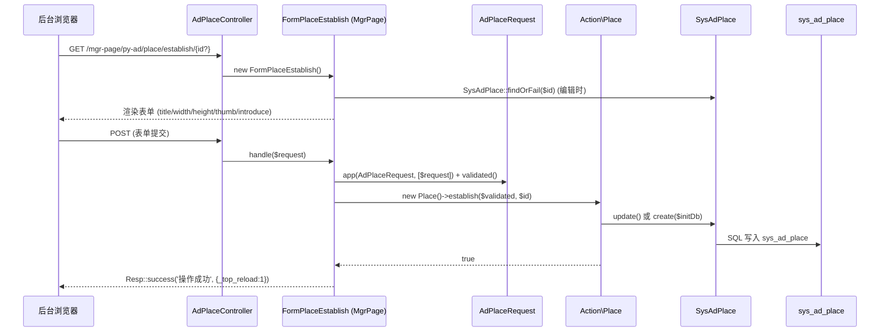
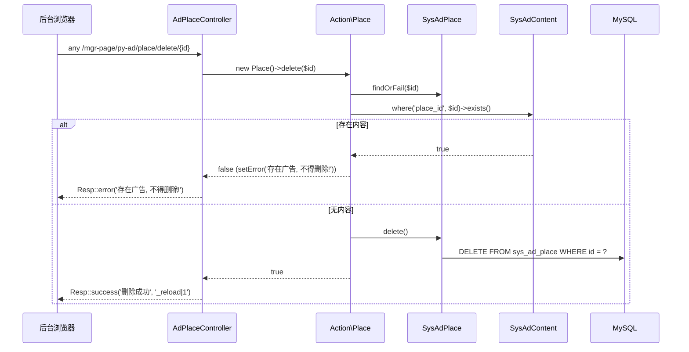
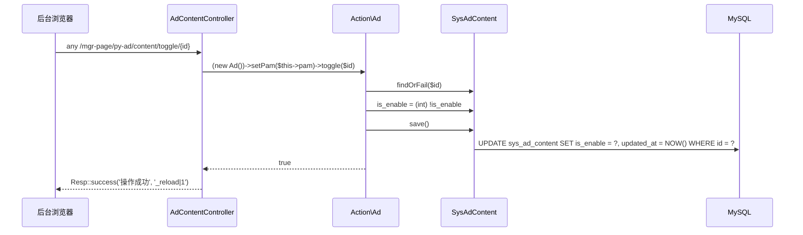
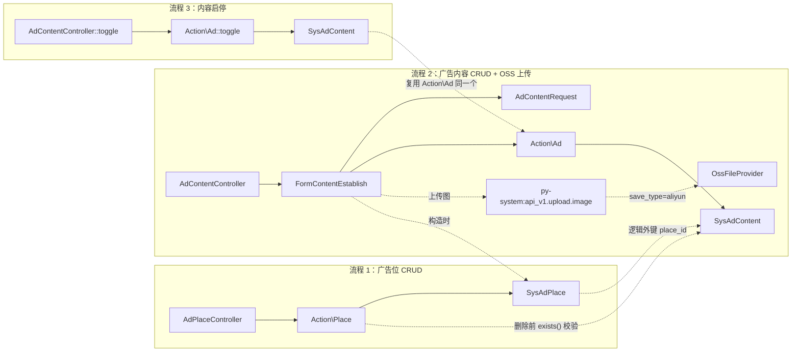

# 业务执行流程（ad 模块）

本文档展示 ad 模块的 3 个核心执行链路：广告位 CRUD、广告内容 CRUD（含 OSS 上传）、广告内容启停切换。
业务规则（为什么这么处理）见 [business.md](business.md)；对外契约（路由/权限/模型）见 [contracts.md](contracts.md)。

> 前缀约定：`{prefix}` = `config('poppy.framework.prefix') ?: 'mgr-page'`，下文写 `/mgr-page/py-ad/...`。
> 业务规则："删除广告位前必须无内容"、"title 唯一"、"is_enable 翻转"等在 [business.md](business.md) 中说明，本文件不重复。

---

## 流程 1：广告位（`SysAdPlace`）建立与删除

**触发入口**：
- 建立：浏览器访问 `GET /mgr-page/py-ad/place/establish`（新建）或 `GET /mgr-page/py-ad/place/establish/{id}`（编辑），由 `AdPlaceController@establish` 渲染表单。
- 删除：列表页 `ListSysAdPlace` 操作列的 `actions->delete(...)` 发起的 `DELETE 风格 any` 请求 → `/mgr-page/py-ad/place/delete/{id}`，由 `AdPlaceController@delete` 处理。
- 入口路由名：`py-ad:backend.place.establish` / `py-ad:backend.place.delete`。

**输出结果**：数据库 `sys_ad_place` 表新增/更新/删除一行；列表页通过 `Resp::success('删除成功', '_reload|1')` 或 `Resp::error(...)` 完成整个页面刷新。

### 执行序列（建立 / 编辑）



### 执行序列（删除）



### 步骤说明

| 步骤 | 组件                    | 动作                                          | 备注                                                        |
|----|-----------------------|---------------------------------------------|-----------------------------------------------------------|
| 1  | `AdPlaceController`  | 接收请求，调用 `FormPlaceEstablish` 或 `Action\Place`        | 后台 `backend-auth` 中间件确保已登录                                |
| 2  | `FormPlaceEstablish` | 构造时 `SysAdPlace::findOrFail($id)`；提交时显式 `app(AdPlaceRequest)` + `validated()` | `isValidate = false` 时跳过自动校验                              |
| 3  | `AdPlaceRequest`     | 验证 `title` 唯一（含编辑排除自身）、`width/height ≥ 1`、`thumb` URL 合法 | `Rule::unique($tbName, 'title')->where(...)`                |
| 4  | `Action\Place::establish` | 同步字段到 `$initDb` 后 `update()` / `create()`      | 不调用任何事件/Job                                              |
| 5  | `Action\Place::delete`   | 预检 `SysAdContent::where('place_id', $id)->exists()` | **删除位的前置业务规则**，由 `business.md` 详述                       |

### 异常处理

| 异常场景                       | 处理方式                                       | 影响范围         |
|----------------------------|--------------------------------------------|--------------|
| `AdPlaceRequest` 校验失败       | MgrPage 表单返回 `Resp::error($request->errors())` | 仅当前请求        |
| `SysAdPlace::findOrFail` 抛 `ModelNotFoundException` | MgrPage 表单走默认 404 渲染                  | 仅当前请求        |
| 删除时该位下仍有广告内容               | `setError('存在广告, 不得删除!')` + `Resp::error`    | 当前位不变        |
| 其它 DB 异常                   | `try/catch(Throwable)` 后 `setError($e->getMessage())` + `Resp::error` | 仅当前请求        |

### 关键影响点

修改以下地方会影响此流程：

- **`Action\Place`**：删除前置校验逻辑（`SysAdContent::where('place_id', $id)->exists()`）一旦改动，位与内容级联删除/保护策略都会变。
- **`AdPlaceRequest::rules()`**：`title` 唯一规则放宽/收紧会改变运营能否给多位同标题。
- **`FormPlaceEstablish::form()`** / **`ListSysAdPlace::columns()`**：表单/列表字段调整需同步 `AdPlaceRequest` 的 `attributes()` 与 `rules()`。
- **`configurations/menus.yaml`** + **`configurations/permissions.yaml`**：删菜单/权限会隐藏入口。
- **跨模块依赖**：`Poppy\System\Models\SysConfig`、`Poppy\System\Models\PamAccount`（来自 `poppy/system`）的 `kvYn()` 等行为若变化，需同步更新 `AdContentRequest` 的 `is_enable` 取值范围。

---

## 流程 2：广告内容（`SysAdContent`）建立（含图片上传）

**触发入口**：
- 表单页：`GET /mgr-page/py-ad/content/establish`（新建，必传 `?place_id=`）或 `GET /mgr-page/py-ad/content/establish/{id?}`（编辑）。
- 提交：MgrPage 表单 `FormContentEstablish::handle($request)`。
- 入口路由名：`py-ad:backend.content.establish`。

**输出结果**：`sys_ad_content` 表新增/更新一行；前端落地后通过 `_top_reload:1` 刷新整个列表。

### 执行序列

```mermaid
sequenceDiagram
    participant Browser as 后台浏览器
    participant Controller as AdContentController
    participant Form as FormContentEstablish (MgrPage)
    participant Upload as py-system:api_v1.upload.image
    participant Aliyun as OssFileProvider
    participant Request as AdContentRequest
    participant Action as Action\Ad
    participant ContentModel as SysAdContent
    participant PlaceModel as SysAdPlace
    participant DB as MySQL

    Browser->>Controller: GET /mgr-page/py-ad/content/establish/{id?}
    Controller->>Form: new FormContentEstablish()
    Form->>PlaceModel: SysAdPlace::findOrFail($placeId) (按 Route::input('id') 或 input('place_id'))
    Form-->>Browser: 渲染表单 (hidden place_id + image src + 其它字段)

    Note over Browser,Upload: 选图阶段(由 MgrPage Form/Field\File 触发)
    Browser->>Upload: POST /api_v1/system/upload/image
    Upload->>Aliyun: app('poppy.system.file') (save_type=aliyun → OssFileProvider)
    Aliyun-->>Upload: {url: ['https://.../xxx.jpg']}
    Upload-->>Browser: 写入 src 表单字段

    Browser->>Controller: POST 表单 (含 src URL + at 字符串 + ...)
    Controller->>Form: handle($request)
    Form->>Request: app(AdContentRequest, [$request]) + validated()
    Form->>Action: new Ad()->establish($validated, $id)
    Action->>Action: $at = 'start - end'; explode(' - ', $at)
    alt $id 为空
        Action->>ContentModel: create($initDb)
    else 编辑
        Action->>ContentModel: findOrFail($id).update($initDb)
    end
    ContentModel->>DB: INSERT/UPDATE sys_ad_content
    Action-->>Form: true
    Form-->>Browser: Resp::success('操作成功', {_top_reload:1})
```

### 步骤说明

| 步骤 | 组件                          | 动作                                                                                 | 备注                                                                |
|----|-----------------------------|------------------------------------------------------------------------------------|-------------------------------------------------------------------|
| 1  | `FormContentEstablish`     | 构造时按 `Route::input('id')` 或 `input('place_id')` 解析 `SysAdPlace`                | 强制要求位存在，否则 `findOrFail` 抛 404                                     |
| 2  | `Form\Field\File::image('src')` | 渲染前端上传控件，提交时 `POST /api_v1/system/upload/image`（`py-system:api_v1.upload.image`） | 路由定义见 `poppy/system/src/Http/Routes/api_v1_web.php`；中间件 `sys-jwt` |
| 3  | `UploadController::image` (`poppy/system`) | 调用 `app(FileContract::class)` → `poppy/system` 内部按 `py-system::picture.save_type` 选择 `DefaultFileProvider` 或 `OssFileProvider` | 当 `save_type=aliyun` 时进入 `OssFileProvider::saveFile()`        |
| 4  | `OssFileProvider::saveFile` (`poppy/aliyun-oss`) | 写入 OSS bucket、返回 `url_prefix + destination`                       | **本模块不感知**，仅消费 `src` URL 字符串                                       |
| 5  | `AdContentRequest`         | 验证 `title` 唯一、`place_id integer`、`action required`、`is_enable ∈ {0,1}`、`list_order ≥ 1` 等 | `isValidate = false`，由 `FormContentEstablish::handle()` 显式触发         |
| 6  | `Action\Ad::establish`     | 解析 `at` 字段、`update()` / `create()`                                                   | 依赖固定分隔符 `' - '`（见 [business.md](business.md) "待确认"）               |
| 7  | `SysAdContent`             | 持久化字段：包括 `place_id/src/title/introduce/start_at/end_at/action/value/list_order/is_enable` | `id` 由数据库自增                                                     |

### 跨模块调用

本流程涉及以下跨模块交互：

- **步骤 2-3** 调用了 `Poppy\System\Http\Request\ApiV1\UploadController::image`
  - 原因：图片上传是平台级能力，统一在 `poppy/system` 实现，本模块不重复造轮子。
  - 风险：若 `py-system:api_v1.upload.image` 改路径 / `poppy.system.file` 契约替换实现，`Form\Field\File::image()` 上传都会失败（本模块的 `src` 字段永远拿不到值）。
- **步骤 3-4** 间接调用 `Poppy\AliyunOss\Classes\Provider\OssFileProvider`（当 `save_type=aliyun`）
  - 原因：按运营在 `FormSettingUpload` 中的"存储位置"配置动态选择 Provider。
  - 风险：`OssFileProvider` 抛 `LoadConfigurationException`（OSS 凭证缺失）会冒泡到 `UploadController::image`，本模块无法捕获，前端看到的是 `Resp::error('...')`。
- **步骤 1** 调用 `Poppy\Ad\Models\SysAdPlace::findOrFail($placeId)`（模块内）
  - 原因：表单必须在"已知位"上下文中渲染（`divider('名称：xxx [ 宽度:xxxpx , 高度:xxxpx ]')`）。

### 异常处理

| 异常场景                              | 处理方式                                                              | 影响范围         |
|-----------------------------------|-------------------------------------------------------------------|--------------|
| `place_id` 缺失或位不存在                | `SysAdPlace::findOrFail` 抛 `ModelNotFoundException`                | 仅当前请求        |
| `AdContentRequest` 校验失败           | MgrPage 表单返回错误                                                     | 仅当前请求        |
| 图片上传失败（OSS 凭证错误 / 网络超时）          | `OssFileProvider` / `DefaultFileProvider` 返回 `false` + `getError()`，`UploadController` 返回 `Resp::error` | 仅当前请求，前端停留在表单 |
| 创建/更新时 DB 异常                    | 当前 `Action\Ad::establish` **未捕获**异常                                | 整页 500        |

### 关键影响点

修改以下地方会影响此流程：

- **`Action\Ad::establish()`**：时段字段（`at`）的解析逻辑、字段名映射均在此。`at` 拆分失败会导致 `start_at/end_at` 全部为空（`explode` 单元素时仅取一个，下标 1 为 `null`）。
- **`AdContentRequest::rules()`**：放宽 `title` 唯一或 `list_order ≥ 1` 会影响运营保存策略。
- **`FormContentEstablish::form()`**：字段调整需同步 `Action\Ad::establish()` 的 `$initDb` 数组。
- **`Form\Field\File::image()`（`poppy/mgr-page`）**：控件渲染逻辑变更会影响前端上传交互。
- **`OssFileProvider::saveFile()`（`poppy/aliyun-oss`）**：URL 生成规则、resize / watermark 策略变更会影响 `src` 的可用性（"待确认"：本模块不做图片尺寸与 `width/height` 校验）。

---

## 流程 3：广告内容启停切换

**触发入口**：列表页 `ListSysAdContent` 操作列根据 `is_enable` 当前值，渲染"禁用"或"启用"链接。
- 启用 → `actions->disable(route_url('py-ad:backend.content.toggle', [$id]), $title)`（注意：`disable()` 是 MgrPage 中"展示禁用样式"的操作按钮，最终请求的是 `toggle` 路由，详见 [business.md](business.md) 路由/分发规则）
- 禁用 → `actions->enable(route_url('py-ad:backend.content.toggle', [$id]), $title)`
- 入口路由名：`py-ad:backend.content.toggle`（`/mgr-page/py-ad/content/toggle/{id}`）。

**输出结果**：`sys_ad_content.is_enable` 在 `0` / `1` 之间翻转；列表页通过 `Resp::success('操作成功', '_reload|1')` 刷新。

### 执行序列



### 步骤说明

| 步骤 | 组件                  | 动作                                                       | 备注                                  |
|----|---------------------|----------------------------------------------------------|-------------------------------------|
| 1  | `AdContentController` | 调用 `Action\Ad::toggle($id)`（通过 `setPam()` 注入当前后台账号）    | **本流程不依赖 PAM**，仅是 Action 构造约定       |
| 2  | `Action\Ad::toggle` | 加载 `SysAdContent` 后翻转 `is_enable`                     | 无业务校验、无状态机；与 `business.md` 一致      |
| 3  | `SysAdContent::save` | Eloquent 自动写 `updated_at`                              | 依赖 `$fillable` 包含 `is_enable`（已确认） |
| 4  | 响应                   | `Resp::success('操作成功', '_reload|1')` 触发列表整页刷新         | MgrPage 通用约定                       |

### 异常处理

| 异常场景                | 处理方式                                              | 影响范围    |
|---------------------|---------------------------------------------------|---------|
| `findOrFail` 找不到记录  | Laravel 抛 `ModelNotFoundException`，MgrPage 转 404 渲染 | 仅当前请求   |
| DB 异常              | 当前 `Action\Ad::toggle` **未捕获**异常                  | 整页 500  |
| `setPam` 未执行但调用了 | Action 内部未读取 `$pam`，但 `setPam()` 是与其它 Action 一致的构造约定，**无实际影响**（不强制） | — |

### 关键影响点

修改以下地方会影响此流程：

- **`Action\Ad::toggle()`**：翻转算法（`(int) !$item->is_enable`）若改为带状态机或权限校验，需同步更新 MgrPage 列表的"启用/禁用"按钮文案。
- **`ListSysAdContent::columns()`**：操作列分支条件（`if ($item->is_enable)`）若改，需重新计算按钮展示。
- **`AdContentRequest::rules()`** 中 `is_enable` 的 `in` 约束：若加入更多值（如 `2=定时`），需要先扩展 `SysConfig::kvYn()`。

---

## 流程间关系（鸟瞰图）



- **流程 1 与流程 2 关系**：流程 2 的 `FormContentEstablish::__construct` 强依赖 `SysAdPlace`（"构造时按 `place_id` 加载"），流程 1 的 `Action\Place::delete` 强依赖 `SysAdContent`（"删除前预检"）——两者形成"位保护内容"与"内容依赖位"的双向约束。
- **流程 2 与流程 3 关系**：共享 `Action\Ad` 与 `SysAdContent` 模型，但入口路径（`establish` vs `toggle`）与 Action 方法（`establish()` vs `toggle()`）分离。
