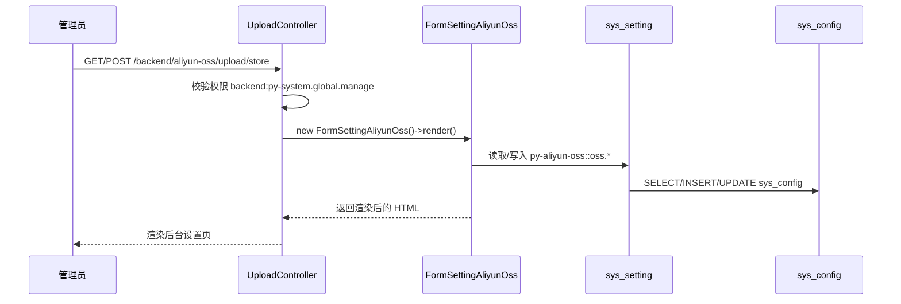
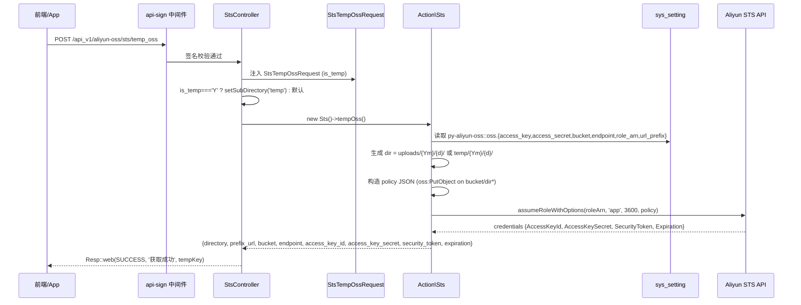
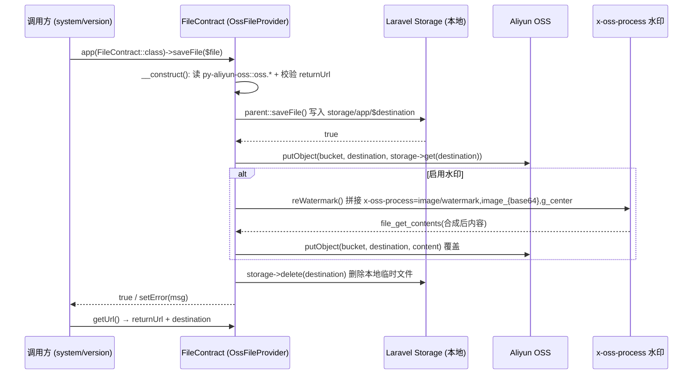

# 业务执行流程

## 流程 1：后台配置 OSS 接入参数

**触发入口**：后台管理员访问 `/{prefix}/aliyun-oss/upload/store`（GET / POST，`py-aliyun-oss:backend.upload.store`）
**输出结果**：将 OSS 接入参数写入 `sys_config` 表（命名空间 `py-aliyun-oss`，分组 `oss`），供后续 STS 签发和 `OssFileProvider` 实例化使用。

### 执行序列

### 步骤说明

| 步骤 | 组件                                       | 动作                                                  | 备注                                          |
|----|------------------------------------------|-----------------------------------------------------|---------------------------------------------|
| 1  | `UploadController::__construct`          | 设置 `permission['global'] = backend:py-system.global.manage` | 后台全局管理权限                                    |
| 2  | `UploadController::store`                | 实例化 `FormSettingAliyunOss` 并调 `render()`             | 渲染走 `poppy/mgr-page` 的表单引擎                 |
| 3  | `FormSettingAliyunOss::form`             | 注册 9 个文本字段 + 水印图字段                                | access_key / access_secret / endpoint / bucket / url_prefix / role_arn / temp_app_key / temp_app_secret / watermark |
| 4  | `FormSettingBase`（父类）                   | 提交后通过 `sys_setting('py-aliyun-oss::oss.*')` 落库          | 写入 `sys_config` 表                              |

### 异常处理

| 异常场景                  | 处理方式                                          | 影响范围         |
|-----------------------|-----------------------------------------------|--------------|
| `backend-auth` 中间件拦截 | 重定向到后台登录                                       | 仅影响当前请求      |
| `url_prefix` 格式不合法     | `Rule::url()` 校验失败 → 表单回显错误                     | 仅影响本次保存      |
| 写入数据库失败               | `sys_setting` 内部异常向上抛出                           | 仅影响本次保存      |

### 关键影响点

修改以下地方会影响此流程：

- **`FormSettingAliyunOss::form()`**：新增/删除字段需同步更新 `Action\Sts` 与 `OssFileProvider` 的字段映射
- **`UploadController::$permission`**：调整权限会改变后台访问门槛
- **`sys_setting('py-aliyun-oss::oss.*')` 配置键命名**：被 `Sts`、`OssFileProvider` 直接消费，重命名需同步多处

---

## 流程 2：前端请求 STS 临时授权

**触发入口**：前端/App 调用 `POST /api_v1/aliyun-oss/sts/temp_oss?is_temp=N|Y`（可选 body）
**输出结果**：返回 STS AssumeRole 凭证 + 限定目录，前端用此凭证 PUT 到 OSS 完成直传。

### 执行序列

### 步骤说明

| 步骤 | 组件                                  | 动作                                                | 备注                                                   |
|----|-------------------------------------|---------------------------------------------------|------------------------------------------------------|
| 1  | `api-sign` 中间件                     | 校验 API 签名（白名单 + 时间戳 + 签名）                       | 任何中间件失败 → 401                                        |
| 2  | `StsTempOssRequest`                 | 校验 `is_temp` ∈ `{Y, N}`                              | 默认 `N`                                               |
| 3  | `StsController::tempOss`            | 根据 `is_temp` 决定是否 `setSubDirectory('temp')`         | —                                                    |
| 4  | `Sts::__construct`                  | 从 `sys_setting` 读取 6 项配置                              | 任一缺失不会立刻报错，访问时再校验                                     |
| 5  | `Sts::tempOss()`                    | 组装 `{Ym}/{d}` 子目录 + 内联 policy                       | `Resource = acs:oss:*:*:{bucket}/{dir}*`               |
| 6  | `Sts::createClient()`               | 固定 endpoint `sts.cn-hangzhou.aliyuncs.com`         | 阿里云 STS 全国统一入口                                        |
| 7  | `assumeRoleWithOptions`             | `durationSeconds=3600`, `roleSessionName='app'`    | 临时凭证 TTL = 1 小时                                      |
| 8  | `Sts::tempOss()` 返回前               | 把 `AccessKeyId → access_key_id` 等字段做 `Str::snake()`  | 便于前端 camelCase/snake_case 兼容                     |
| 9  | `Resp::web(SUCCESS, '获取成功', $tempKey)` | 包装为标准 API 响应                                     | data 字段承载 STS 凭证                                    |

### 异常处理

| 异常场景                          | 处理方式                                              | 影响范围                |
|-------------------------------|---------------------------------------------------|---------------------|
| `api-sign` 签名失败                | 返回 401                                            | 当前请求                |
| `is_temp` 不合法                  | 返回 422                                            | 当前请求                |
| `AssumeRole` 失败（RAM 角色未授权等）   | 抛 `ApplicationException` → 500                       | 当前请求；前端需提示并停止上传      |
| `role_arn` / `access_*` 未配置     | 阿里云侧返回 InvalidParameter → 500                   | 当前请求；提示后台先完成 OSS 配置   |

### 关键影响点

修改以下地方会影响此流程：

- **`Sts::$durationSeconds`（默认 3600）**：调小更安全但增加换 token 频率；调大扩大权限暴露窗口
- **`Sts::createClient()` 中的 endpoint**：硬编码杭州，改动需评估多 region 兼容
- **`policy` 模板**：`Resource` 改为通配符将获得 bucket 全量写权限（含删除），**强烈不建议**
- **`sys_setting('py-aliyun-oss::oss.role_arn')`**：删除或改角色 ARN 必须同步 OSS 端的 RAM 策略
- **`sys_setting('py-aliyun-oss::oss.bucket')`**：切换 bucket 后所有未过期 token 仍指向旧 bucket，前端需重新换 token

### 跨模块调用

本流程涉及以下跨模块交互：

- **步骤 4** 通过 `sys_setting()` 调用 `poppy/system` 的 `SysConfig` 仓储
  - 原因：统一持久化设置项
  - 风险：若 `poppy/system` 移除/重命名 `sys_setting` 函数，本模块立即失效
- **步骤 1** 依赖 `poppy/system` 的 `api-sign` 中间件
  - 原因：API 签名鉴权统一管控
  - 风险：中间件签名算法变更需同步更新前端 SDK

---

## 流程 3：服务端通过 OssFileProvider 上传文件到 OSS

**触发入口**：`app(FileContract::class)->saveFile($uploadedFile)` 或 `saveInput($content)`（被 `poppy/system` 的 `UploadController` / `poppy/version` 的 `Version` Action 间接触发）
**输出结果**：文件从 Laravel 临时存储转写到 OSS Bucket，URL 通过 `getUrl()` 返回；本地临时文件被删除。

### 执行序列

### 步骤说明

| 步骤 | 组件                              | 动作                                                       | 备注                                            |
|----|---------------------------------|----------------------------------------------------------|-----------------------------------------------|
| 1  | `OssFileProvider::__construct`  | 读 `py-aliyun-oss::oss.{access_key,access_secret,endpoint,bucket,watermark,url_prefix}` | `returnUrl` 为空时抛 `LoadConfigurationException`    |
| 2  | `saveFile(UploadedFile $file)`  | 调 `parent::saveFile()` → 写本地 storage                     | `$destination` 由父类生成（默认按日期分目录）                  |
| 3  | `saveAli($deleteLocal=true)`   | 调 `$client->putObject(bucket, destination, content)`    | `client()` 用 `OssClient($ak, $sk, $endpoint, false)` |
| 4  | `reWatermark()`（若启用）          | 远程合成水印并覆盖原图                                            | 要求水印 URL 与 `returnUrl` 同域                       |
| 5  | `saveAli()` 末尾                 | `storage()->delete($destination)`                          | 避免本地临时文件堆积                                    |
| 6  | `getUrl()`                      | 返回 `$returnUrl . $destination`                          | 由父类 `DefaultFileProvider` 提供                   |

### 异常处理

| 异常场景                          | 处理方式                                              | 影响范围              |
|-------------------------------|---------------------------------------------------|-------------------|
| `returnUrl` 未配置               | 构造时抛 `LoadConfigurationException`                | 应用启动失败或单次实例化失败   |
| `putObject` 失败（OSS 端 403/网络） | `try/catch` 捕获后 `setError($msg)` 返回 false         | 仅影响当前文件，其他上传不受影响 |
| 水印图域名不匹配                     | 抛 `LoadConfigurationException('watermark_not_match')` | 仅影响当前文件           |
| 父类 `saveFile` 失败              | 提前 return false，不进入 OSS 上传阶段                    | 当前文件失败            |

### 关键影响点

修改以下地方会影响此流程：

- **`OssFileProvider::__construct()`**：调整字段映射需同步更新 `FormSettingAliyunOss` 与 `sys_setting` 键
- **`saveAli($deleteLocal)`**：将 `$deleteLocal` 改为 `false` 会导致本地临时目录堆积
- **`resizeLongDistrict = 30000`**：OSS 限制长边像素；调小会让前端超过限制的图片直接上传失败
- **`reWatermark()`**：水印算法/缩放比例修改会改变所有上传图片的最终效果
- **`getReturnUrl()`**：URL 前缀更换为 CDN 域名后所有历史图片路径不需迁移，但 CDN 自身缓存生效需要时间

### 跨模块调用

本流程涉及以下跨模块交互：

- **步骤 1** 通过 `sys_setting()` 调用 `poppy/system` 的 `SysConfig` 仓储
  - 原因：复用统一设置存储
  - 风险：`py-aliyun-oss::oss.*` 配置键被重命名/删除后 `OssFileProvider` 实例化即失败
- **步骤 2、6** 通过 `parent::saveFile()` / `getUrl()` 继承 `poppy/system` 的 `DefaultFileProvider`
  - 原因：复用 Laravel 存储、目录生成、URL 拼接等通用能力
  - 风险：父类签名或行为变更会直接影响 OSS 上传
- **步骤 3、4** 通过 `OssClient` 直接调用阿里云 OSS SDK
  - 风险：`aliyuncs/oss-sdk-php` 升级可能引入破坏性变更

---

## 待确认

- `OssFileProvider::__construct()` 签名 `function __construct()` 与父类 `DefaultFileProvider::__construct($config = [])` 不一致——`poppy/system` 的 `ServiceProvider` 仍传入 `$config`，当前实现忽略该参数；若未来父类改为强依赖 `$config`，需要更新本构造器（发现位置：`src/Classes/Provider/OssFileProvider.php:45`）
- `Action\Sts::tempOss()` 注释/文档提及 `is_temp=Y` 时子目录采用 `His{rand(8)}` 格式，但实际代码仅设置 `subDirectory='temp'`，**未生成 8 位随机串**——若需防目录枚举/防覆盖，应补齐随机串生成（发现位置：`src/Action/Sts.php:118-120`）
- `resources/config/aliyun-oss.php` 中 `url` 配置键默认空，代码中读取的是 `url_prefix`——`url` 键疑似废弃（发现位置：`resources/config/aliyun-oss.php:44`）
- `FormSettingAliyunOss` 暴露的 `temp_app_key` / `temp_app_secret` 字段未被 `Action\Sts` 或 `OssFileProvider` 消费——可能为预留字段或历史遗留（发现位置：`src/Http/MgrPage/FormSettingAliyunOss.php:44-48`）
