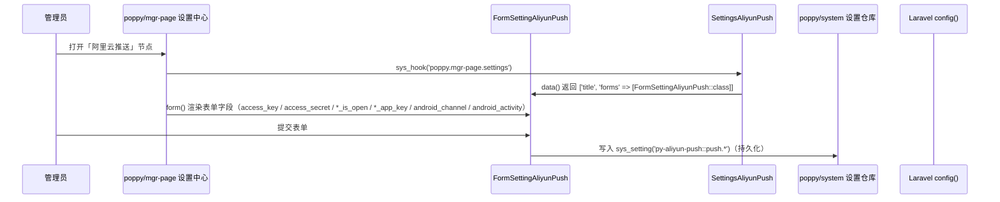
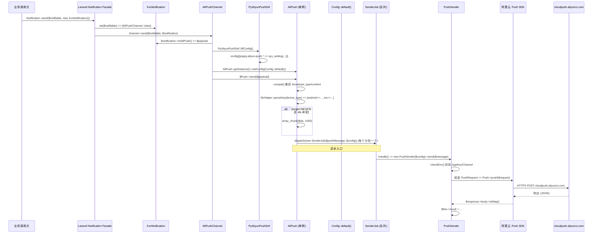
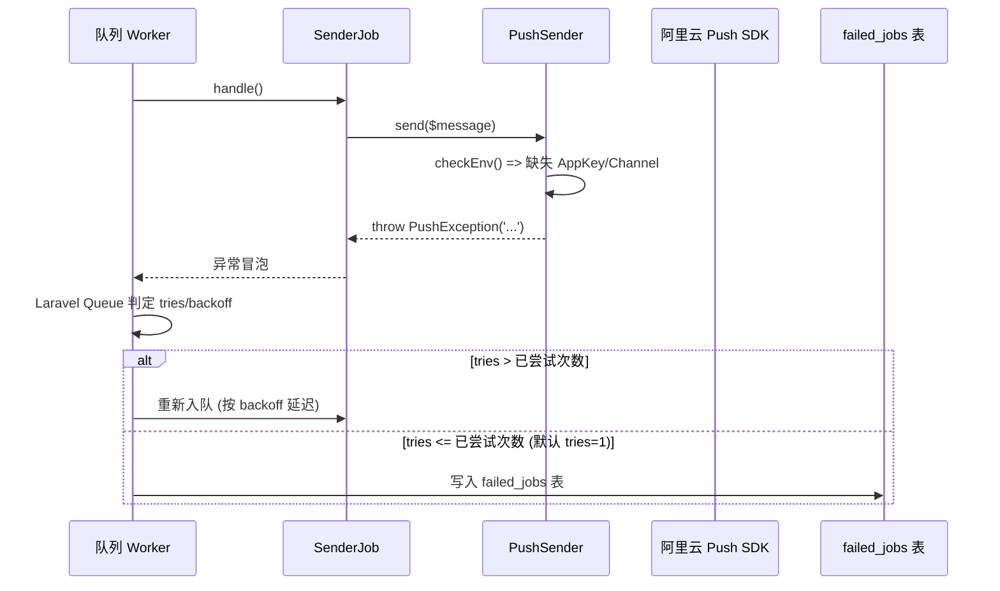

# 业务执行流程

## 后台配置推送参数

**触发入口**：管理员进入 `poppy/mgr-page` 后台设置中心，定位到 `poppy.aliyun-push` 节点（由 `Hooks\MgrPage\SettingsAliyunPush` 提供） → 渲染 `Http\MgrPage\FormSettingAliyunPush` 表单 → 提交后 `poppy/system` 的设置仓库写入 `py-aliyun-push::push.*` 命名空间下的 `sys_config` 表。
**输出结果**：阿里云 Push 的 AK/SK、AppKey、Channel、Activity、开关位全部入库，下次 `AliPushChannel::send()` 时由 `PyAliyunPushDef::fillConfig()` 实时同步到 `config('poppy.aliyun-push.*')`。

### 执行序列

### 步骤说明

| 步骤 | 组件                                | 动作                                                   | 备注                                          |
|----|-----------------------------------|------------------------------------------------------|---------------------------------------------|
| 1  | `poppy/mgr-page` 设置中心             | 触发 `sys_hook('poppy.mgr-page.settings')` 收集所有 `ServiceArray` | 框架级 Hook，所有模块挂载                          |
| 2  | `Hooks\MgrPage\SettingsAliyunPush` | 返回 `['key' => 'poppy.aliyun-push', 'title' => '阿里云推送', 'forms' => [FormSettingAliyunPush::class]]` | 实现 `Poppy\Core\Services\Contracts\ServiceArray` |
| 3  | `Http\MgrPage\FormSettingAliyunPush` | `form()` 构造 8 个字段（access_key、access_secret、android_is_open、android_app_key、android_channel、android_activity、ios_is_open、ios_app_key） | `$group = 'py-aliyun-push::push'`              |
| 4  | `poppy/system` 设置仓库                | 持久化表单提交到 `sys_config` 表                                | 设置组 `py-aliyun-push::push`                  |
| 5  | `Classes\PyAliyunPushDef::fillConfig()` | 下次发送推送时同步 8 个 `sys_setting('py-aliyun-push::push.*')` 到 `config('poppy.aliyun-push.*')` | **每次发送入口都执行**，确保最新                      |

### 异常处理

| 异常场景               | 处理方式                       | 影响范围                |
|--------------------|----------------------------|---------------------|
| 表单字段为空 / 格式错误      | 由 `FormSettingBase` 校验规则拦截  | 仅影响当前设置保存              |
| `access_key` / `access_secret` 缺失 | `Rule::nullable()` 允许为空 | **运行时** `PushSender::checkEnv()` 会抛 `PushException`，但当前**未在 `checkEnv()` 中校验 AK/SK**，仅校验 AppKey/Channel（详见 [business.md](business.md)） |

### 关键影响点

修改以下地方会影响此流程：

- **`Hooks\MgrPage\SettingsAliyunPush::data()`**：返回的 `title` 会显示在设置中心节点标题；`forms` 数组增减 Form 类会改变表单结构
- **`Http\MgrPage\FormSettingAliyunPush::form()`**：字段增删直接改变后台可配置项；**新增字段后必须同步在 `Classes\PyAliyunPushDef::fillConfig()` 中加 `sys_setting` 同步**，否则运行时取不到
- **`resources/config/aliyun-push.php`**：默认配置；新字段需加默认值
- **`py-aliyun-push::push` 配置组命名**：若改名 Form 的 `$group` 属性，存量 `sys_config` 数据会失效

---

## Laravel Notification 触发推送（Laravel Notification → AliPushChannel → SenderJob → 阿里云 Push）

**触发入口**：业务方调用 `Notification::send($notifiable, new XxxNotification())`，其中 `$notification` 实现了 `Contracts\AliPushChannel::toAliPush(): array`，并通过 `via($notifiable)` 返回 `[AliPushChannel::class]`。
**输出结果**：每个 `deviceType|pushType` × 设备号分批组合 → 一个 `SenderJob` 入队 → 异步下发到阿里云 Push → SDK 响应写入 `PushSender::$result`（仅内存）。

### 执行序列

### 步骤说明

| 步骤 | 组件                                 | 动作                                                                                                | 备注                                                  |
|----|------------------------------------|---------------------------------------------------------------------------------------------------|-----------------------------------------------------|
| 1  | `Illuminate\Notifications\Notification` (Facade) | 根据 `via()` 返回的 channels 选择 `AliPushChannel`                                                | Laravel 标准 Notification 流程                          |
| 2  | `Channels\AliPushChannel::send`     | 取 `$notification->toAliPush()`（空则 return），`PyAliyunPushDef::fillConfig()` 同步配置，调用 `AliPush::send()` | 见 `Channels\AliPushChannel.php`                          |
| 3  | `Classes\AliPush::send`             | `compat()` 兼容旧字段；`StrHelper::parseKey(device_type)` 拆出 ios/android × pushType；按 `*_is_open` 过滤；`toBatches()` 按 target 拆批 | `cutNum=1000` 设备号/批上限                                  |
| 4  | `Classes\AliPush::toBatches`        | 校验 `title` 必填；按 `pushType=MESSAGE` 强制 body=extras / `pushType=NOTICE` 校验 body 非空；`target=DEVICE` 时 `array_chunk($ids, 1000)`；`target=TAG` 时校验 `regTags`；`target=ALL` 时 `targetValue='ALL'` | 三个 target 分支均生成 `PushMessage`，分别 dispatch        |
| 5  | `Classes\AliPush::send` (尾)         | `dispatch(new SenderJob($message, $config))` 每个分批一个 Job                                       | 默认进入 Laravel 默认队列                                   |
| 6  | `Jobs\SenderJob::handle`            | 实例化 `PushSender($config)`，调用 `send($message)`                                              | 不返回结果、不捕获异常                                          |
| 7  | `Classes\Sender\PushSender::send`   | `checkEnv()`；组装 `PushRequest`（含 `appKey` / `pushType` / `deviceType` / `title` / `body` / `target` / `targetValue` / `query`）；iOS 附加 `iOSExtParameters` + `iOSApnsEnv`；Android + NOTICE 附加 `androidExtParameters` + 厂商通道等级 + `androidActivity`；调用 `Push->push($request)` | 见 `Classes/Sender/PushSender.php` 完整链路                  |
| 8  | `AlibabaCloud\SDK\Push\V20160801\Push` | 发送 HTTPS 请求到 `cloudpush.aliyuncs.com`                                                       | 端点固定在 `BaseClient::initClient()`                          |
| 9  | `Classes\Sender\BaseClient::$result` | 写入响应 `body->toMap()`                                                                           | 内存变量，未持久化                                            |

### 异常处理

| 异常场景                                                                | 处理方式                                                                                  | 影响范围                  |
|---------------------------------------------------------------------|---------------------------------------------------------------------------------------|-----------------------|
| `AliPush::send()` 返回 `false`（参数空 / 设备类型未指定）                            | `AliPushChannel::send()` 抛 `ApplicationException('请求参数为空, 无法发送通知' 或 '未指定发送设备以及发送类型')` 带 `notify` context | 当前 Notification 失败     |
| `toBatches()` 校验失败（title 空 / body 空 NOTICE 模式 / ids 空 DEVICE / regTags 空 TAG） | 抛 `PushException`，**绕过 channel 异常包装直接冒泡**（因为调用顺序在 `toBatches` 内部） | 当前 Notification 失败     |
| `PushSender::checkEnv()` 失败（AppKey/Channel 缺失）                          | 抛 `PushException`                                                                       | 队列任务失败（**默认 tries=1**，详见 [contracts.md](contracts.md)） |
| 阿里云 SDK 返回错误（如鉴权失败 / 设备号无效 / 限流）                                    | SDK 抛 `ClientException` / `ServerException`，**不被本模块捕获**，冒泡到队列 worker        | 队列任务失败                   |
| iOS 下发 `is_production()=true` 但证书未配置                                  | SDK 鉴权 / APNs 失败，**不在本模块处理**，依赖阿里云控制台证书                              | 队列任务失败                   |

### 关键影响点

修改以下地方会影响此流程：

- **`Channels\AliPushChannel::send()`**：入口逻辑变更会影响所有 Notification 触发方
- **`Classes\AliPush::send()` / `toBatches()`**：修改字段兼容表 / target 分支 / 切分数（`cutNum`）会影响**所有**推送调用方
- **`Classes\Sender\PushSender::send()`**：修改 iOS/Android 参数映射会影响**实际下发的 payload 结构**，进而影响到达率与点击行为
- **`Classes\Sender\PushMessage` 常量**：改动 `DEVICE_TYPE_*` / `PUSH_TYPE_*` / `TARGET_*` 常量值会让历史数据（持久化在队列中的 payload）失效
- **`Contracts\AliPushChannel::toAliPush()` 契约**：返回值结构变更需**通知所有业务方 Notification**
- **`poppy/system` 的 `sys_setting` 命名空间**：若 `py-aliyun-push::push.*` 改名，所有 `PyAliyunPushDef::fillConfig()` 同步会失效

### 跨模块调用

本流程涉及以下跨模块交互：

- **步骤 1** 由 Laravel `Illuminate\Notifications\Notification` Facade 触发（外部 Laravel 框架）
- **步骤 2** 通过 `poppy/framework` `AppTrait`（`AliPush` / `BaseClient` 引用）、`is_production()` 函数（`PushSender::send()` 派生 iOS ApnsEnv）
- **步骤 2** 通过 `poppy/core` `PoppyServiceProvider`（`ServiceProvider` 继承）
- **步骤 4** 通过 `poppy/framework` `Helper\StrHelper::parseKey()`（解析 `device_type` 字符串）
- **步骤 5** 通过 Laravel `dispatch()` 全局 helper 入队
- **步骤 7** 通过 `poppy/framework` 全局函数 `is_production()`

---

## 推送失败与重试

**触发入口**：`Jobs\SenderJob::handle()` 抛异常（来自 `PushSender::send()` 的 `PushException` 或阿里云 SDK 的 `ClientException` / `ServerException`）。
**输出结果**：Laravel 队列根据 `$tries` / `backoff` / `maxExceptions` 决定是否重试；当前 `SenderJob` **未显式声明**这些属性，**沿用 Laravel 默认**（`tries=1`，即失败一次即丢弃）。

### 执行序列

### 步骤说明

| 步骤 | 组件            | 动作                                  | 备注                                       |
|----|---------------|-------------------------------------|------------------------------------------|
| 1  | Laravel Queue | 根据 `queue.default` 配置取出 Job       | Worker 实现由部署决定（database/redis/sync）   |
| 2  | `SenderJob`   | `handle()` 实例化 `PushSender` 并调用 `send()` | 无 try/catch，异常直接抛出                          |
| 3  | `PushSender`  | 异常来源：`checkEnv()`（AppKey/Channel 缺失） / SDK 调用（鉴权/网络/限流） | `PushException` 继承 `BaseException`，SDK 异常来自 `AlibabaCloud` SDK |
| 4  | Laravel Queue | 异常冒泡后由队列驱动判定 `tries` / `backoff`     | **当前默认 `tries=1`**，失败即写 `failed_jobs`        |

### 异常处理

| 异常场景                | 处理方式                                                              | 影响范围                      |
|---------------------|-------------------------------------------------------------------|---------------------------|
| `PushException`（AppKey/Channel 缺失） | 不重试直接失败（**默认 `tries=1`**），需后台配置补齐后手工 `php artisan queue:retry` | **整个分批的设备号**都未送达，需重发整批       |
| SDK `ClientException`（请求非法）       | 默认不重试                                                            | 同上，需排查 payload 结构        |
| SDK `ServerException`（限流 / 5xx）    | **依赖运行时队列配置**（建议在生产环境通过子类化或运行时覆盖 `$tries=3, $backoff=[10,30,60]`） | 默认情况下同样不重试，影响范围同上         |

### 关键影响点

修改以下地方会影响此流程：

- **`Jobs\SenderJob` 显式声明 `$tries` / `$backoff` / `$maxExceptions`**：当前**未声明**，新增这三个属性会改变所有重试行为
- **`Classes\Sender\PushSender::checkEnv()`**：扩展校验项（如 AK/SK 缺失检测）会让更多失败被前置拦截
- **运行时 `queue.connections.*.retry_after`**：决定 worker 多久回收任务，影响重试可见性
- **失败任务 `failed_jobs` 表清理策略**：依赖宿主应用的调度；长期不清理会让表膨胀
- **`pushType=MESSAGE` 下发失败**：消息不展示在通知栏，**用户无感**，需主动监控 `failed_jobs`

---

## 待确认

- **实际重试次数**：未在 `SenderJob` 中显式声明 `$tries`，需要确认运行时队列驱动配置或子类化（发现位置：`Jobs\SenderJob.php`）
- **失败任务告警**：当前没有发现 `failed_jobs` 的监控或 Listener，依赖宿主应用自行处理（发现位置：本模块源码）
- **`AliPush::send()` 返回 `false` 是否需要重试**：从 `Channels\AliPushChannel::send()` 抛出 `ApplicationException`，**当前不进入队列**，**仅同步发送失败时影响**；若业务方通过 `dispatch()` 触发 Notification，失败由 Laravel Notification 系统接管（不在本模块内）
- **`BindTag::bindDevice()` 失败重试**：未发现队列封装，**失败即同步抛出**；若需要重试需业务方自行实现（发现位置：`Classes\BindTag.php`）