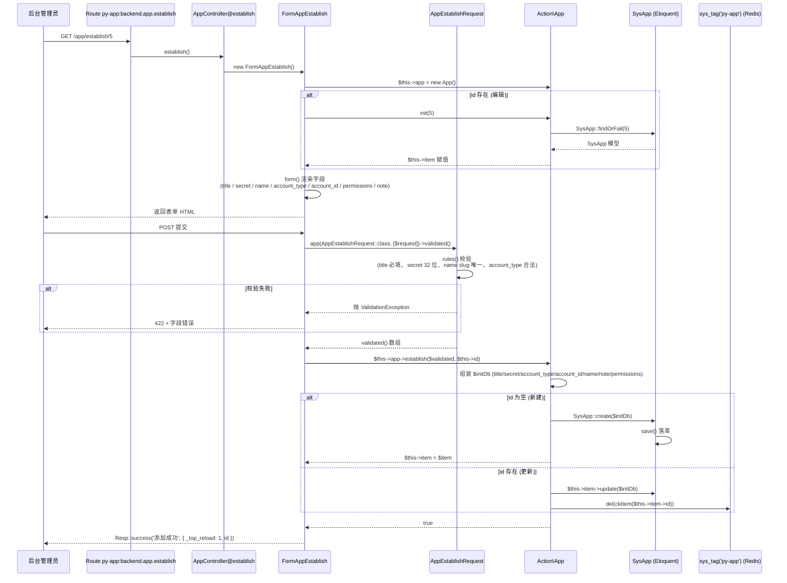
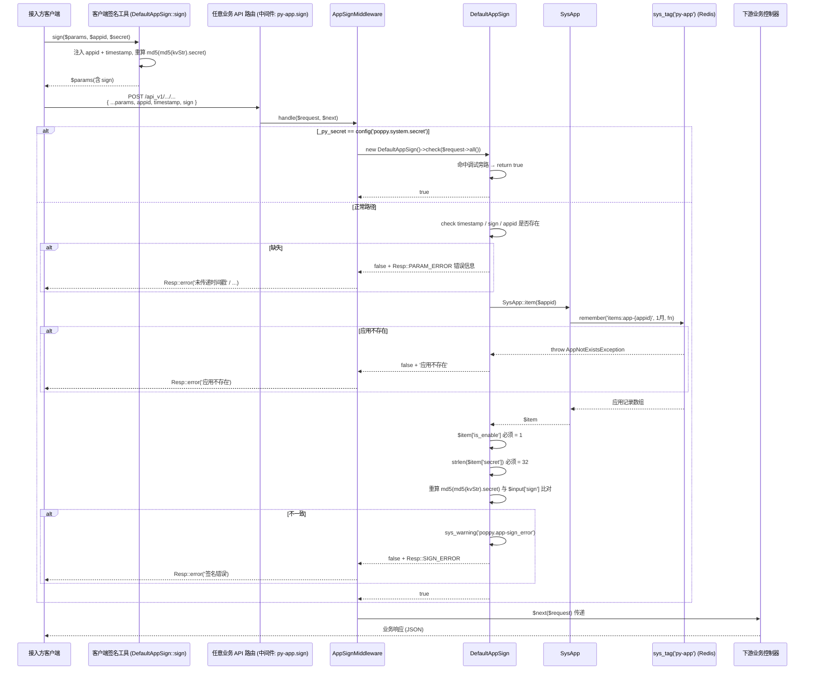

# 业务执行流程

## 流程 1：后台新建/编辑接入应用（含 secret 生成）

**触发入口**：后台管理员访问 `GET/POST /{prefix}/py-app/app/establish/{id?}`（`AppController@establish`）。
**输出结果**：`sys_app` 表新增或更新一行；新应用获得 32 位 secret（管理员手动录入或外部生成），并被绑定到指定 PAM 账号；返回成功后刷新父页面（`_top_reload`）。

### 执行序列

### 步骤说明

| 步骤 | 组件                          | 动作                                                                                  | 备注                                                            |
|----|-----------------------------|-------------------------------------------------------------------------------------|---------------------------------------------------------------|
| 1  | `AppController@establish`    | 实例化 `FormAppEstablish`，由其负责表单渲染 + 提交处理                                              | `AppController` 仅做转发                                            |
| 2  | `FormAppEstablish::__construct` | 解析路由 `id`；若存在则调用 `Action\App::init($id)` 加载现有应用                                    | 编辑模式预填                                                       |
| 3  | `FormAppEstablish::form()`   | 渲染表单字段：`title` / `secret`（32 位）/ `name`（slug）/ `account_type`（`PamAccount::kvType()` 下拉）/ `account_id` / `permissions`（仅 `type='app'`）/ `note` | 通过 `CoreTrait::corePermission()` 过滤权限点                          |
| 4  | `AppEstablishRequest`       | 校验输入：`title` 必填 1-50 字；`secret` 必填；`name` 5-16 位正则 + 唯一性（编辑时排除自身）；`account_type` 在合法枚举内；`account_id` 数字 | —                                                             |
| 5  | `Action\App::establish()`    | 创建/更新 `SysApp`；编辑模式主动 `sys_tag('py-app')->del(ckItem($id))` 清理缓存                  | 是缓存失效的**唯一入口**                                                |
| 6  | `SysApp` 模型                  | `create()`（带 `permissions` 数组经 `setPermissionsAttribute` 转 `,`-分隔）或 `update()` | `permissions` 字段在数据库以 `text` 存储                                |
| 7  | 响应                          | `Resp::success('添加成功', ['_top_reload' => 1, 'id' => ...])` 触发父页面刷新              | `_top_reload` 让用户回到 `AppController@index`（应用列表）                |

### 异常处理

| 异常场景                          | 处理方式                                            | 影响范围               |
|-------------------------------|-------------------------------------------------|--------------------|
| `AppEstablishRequest` 校验失败     | Laravel 抛 `ValidationException`，由 `FormWidget` 渲染 422 | 只影响当前提交            |
| `Action\App::establish()` 返回 false | `FormAppEstablish::handle()` 返回 `Resp::error($this->app->getError())` | 只影响当前请求            |
| 编辑模式下 `SysApp::findOrFail($id)` 找不到 | 抛 `ModelNotFoundException`（HTTP 404）            | 只影响当前请求            |

### 关键影响点

修改以下地方会影响此流程：

- **`Action\App::establish()`**：调整字段映射（特别是 `permissions` 的存取转换），会影响所有应用记录的写入。
- **`SysApp` 模型 `permissions` Accessor**：决定 `getPermissionsAttribute` 是数组 vs 字符串，会影响 `FormAppEstablish` 的回填和 `ListSysApp` 的展示。
- **`FormAppEstablish::form()`**：新增/移除字段（注意：表单字段是"全量"声明，创建/编辑共用），如果只希望编辑出现某字段，需要在 `data()` 里做条件渲染。
- **`AppEstablishRequest::rules()`**：修改 `secret` 长度限制会拒绝存量数据重新保存；`name` 正则变化会影响历史数据。
- **缓存清理逻辑**：`Action\App::establish()` 编辑分支调用 `sys_tag('py-app')->del(ckItem($id))` 是缓存失效的唯一时机；如果改成异步或新增其他写入入口，要记得同步清理。

---

## 流程 2：第三方应用通过 AppSignMiddleware 调用任意业务 API

**触发入口**：任意外部应用发起的 API 请求（**非本模块路由**，由其他模块挂载 `py-app.sign` 中间件后生效）。例如：`POST /api_v1/{any}/...`，请求体里带 `appid`、`timestamp`、`sign`。
**输出结果**：签名校验通过后，请求继续传递到下游业务控制器；签名校验失败返回 `Resp::SIGN_ERROR`。

### 执行序列

### 步骤说明

| 步骤 | 组件                          | 动作                                                                                                                                 | 备注                                              |
|----|-----------------------------|------------------------------------------------------------------------------------------------------------------------------------|-------------------------------------------------|
| 1  | `DefaultAppSign::sign()`     | 客户端在请求前将业务参数 + `appid` + `timestamp` 一起签名，得到 `sign`                                                                                       | 此函数本模块既给客户端参考也自带测试 (`tests/Classes/TestSign::testCheck`) |
| 2  | `AppSignMiddleware::handle`  | Laravel 中间件钩子入口；调用 `new DefaultAppSign()->check($request->all())`                                                                              | 失败时立即 `return Resp::error(...)` 中断链路             |
| 3  | `DefaultAppSign::check()`    | a) 调试旁路；b) 必传参数校验；c) `SysApp::item($appid)`；d) 状态 / secret 长度校验；e) `calcSign` 重算并比对                                                          | 比对失败会写 `poppy.app-sign_error` 警告日志              |
| 4  | `SysApp::item()`             | `sys_tag('py-app')->remember(ckItem($appid), SysConfig::MIN_ONE_MONTH, fn)` → 缓存优先，缓存未命中则读库                                                                  | 1 个月 TTL，应用条目变更后**必须主动清理**（见流程 1）           |
| 5  | `DefaultAppSign::calcSign()` | `except()`（丢弃 `_` 前缀 + `sign/image/file/appid`，数组原样 / 标量 trim）→ `ksort` → `ArrayHelper::toKvStr` → `md5(md5(kvStr).secret)`                                       | 与客户端 `sign()` 完全一致                              |
| 6  | 下游业务                          | 校验通过后由 `$next($request)` 进入挂载的 API 控制器                                                                                                   | 业务层可继续用 `SysApp::item($appid)` / `check($appid, $perm)` |

### 异常处理

| 异常场景                                  | 处理方式                                              | 影响范围                       |
|---------------------------------------|---------------------------------------------------|----------------------------|
| 调试旁路命中 `_py_secret`                    | 直接放行                                              | 仅限测试 / Clockwork 调试         |
| `timestamp` 缺失                         | `Resp::error('未传递时间戳')`（`PARAM_ERROR`）            | 只影响当前请求                   |
| `sign` 缺失                              | `Resp::error('未进行签名')`                              | 同上                        |
| `appid` 缺失或为 0                         | `Resp::error('请传入 Appid')`                          | 同上                        |
| `SysApp::item()` 抛 `AppNotExistsException` | 中间件返回 `Resp::error('应用不存在')`                         | 同上                        |
| 应用 `is_enable = 0`                     | `Resp::error('此应用已禁用')`                             | 同上（**注意** 缓存条目必须先失效）       |
| `secret` 长度 ≠ 32                       | `Resp::error('错误的密钥')`                             | 通常为历史脏数据                  |
| 签名比对失败                                | `sys_warning('poppy.app-sign_error', [], true)` 上报 + `Resp::error('签名错误')`（`SIGN_ERROR`） | 只影响当前请求；**会在监控里留下警告**      |

### 关键影响点

修改以下地方会影响此流程：

- **`DefaultAppSign::except()`**：调整排除规则（下划线前缀 / 显式 ignore 列表），客户端和服务端必须**同步修改**，否则会一边签名成功一边校验失败。
- **`ArrayHelper::toKvStr()` / `ksort` 顺序**：序列化格式变动（如增加 `urlencode`、改分隔符）会导致所有在用接入方签名失败。
- **`SysApp::item()` 的缓存键 `AppDef::ckItem($appid)`**：改键名后老缓存失效，可能造成应用瞬时压力上升；建议保持稳定。
- **`SysApp::item()` 的 TTL `SysConfig::MIN_ONE_MONTH`**：调小可以让禁用更"即时生效"，但会增加数据库读负载。
- **`AppSignMiddleware` 调用链顺序**：在多中间件链中，`py-app.sign` 应当**早于**业务级权限 / 计费中间件；否则会出现"业务校验通过但签名失败"这种不利于排查的情况。
- **`_py_secret` 旁路逻辑**：必须保证 `config('poppy.system.secret')` 在生产环境为空或不被外部知晓；**生产禁用需另行配置**。

### 跨模块调用

本流程涉及以下跨模块交互：

- **步骤 3-4** 调用了 `Poppy\App\Models\SysApp::item($appid)`（本模块内）。
- **步骤 5 之后**：下游业务控制器可继续调用 `Poppy\App\Models\SysApp::item($appid)` 或 `::check($appid, $permission)` 进行应用层权限校验。
  - 原因：业务模块可能按应用粒度再授权（`type='app'` 的权限点）。
  - 风险：如果本模块修改 `permissions` 字段存取格式，下游消费方需要同步修改反序列化逻辑。

---

## 待确认

- **`timestamp` 时间窗口校验**：`DefaultAppSign::check()` 当前**没有** `abs(now - timestamp) > N` 的判断，重放攻击防护可能由其他中间件 / API 网关负责，需要确认。**发现位置：`Poppy\App\Classes\Sign\DefaultAppSign::check()`**。
- **客户端 SDK 是否复用本模块的 `DefaultAppSign`**：服务端实现位于 `poppy/app`，但外部客户端（PHP SDK / JS / 其他语言 SDK）的实现位置与同步策略需要确认。**发现位置：仓库根目录 grep 未在扫描范围内验证**。
- **多中间件链中 `py-app.sign` 的实际挂载点**：扫描其他模块的路由组（例如 `poppy/system` / `poppy/api` 类模块）确认其是否挂载了 `py-app.sign`，以及位于 `backend-auth` 之前还是之后。