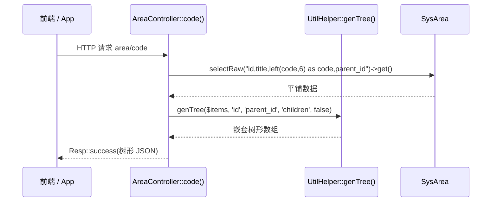
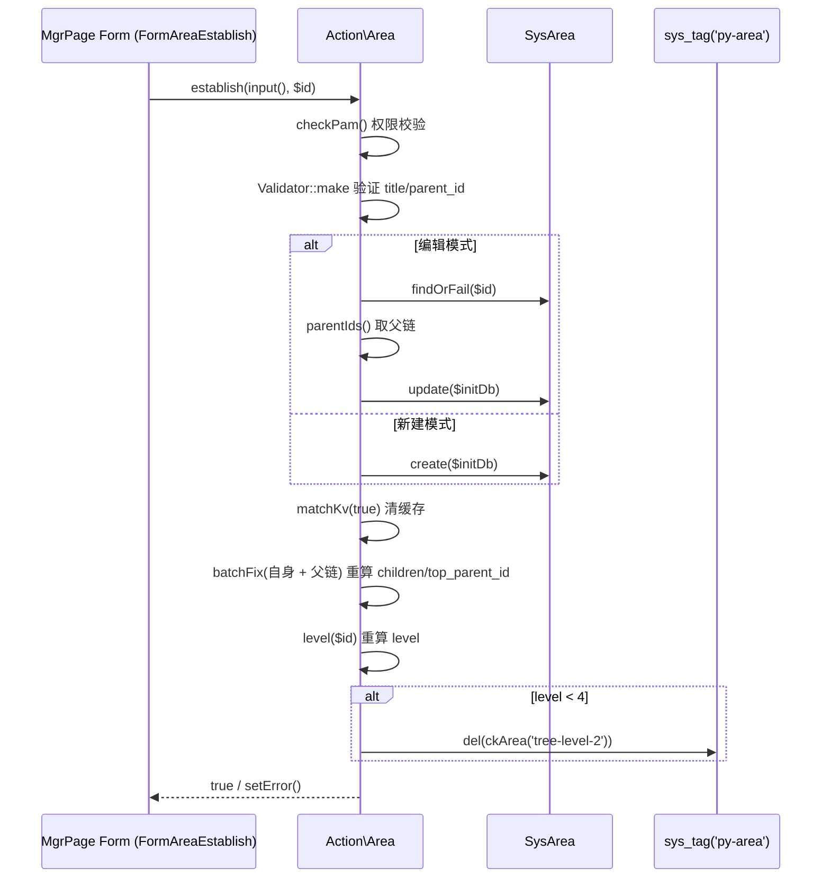
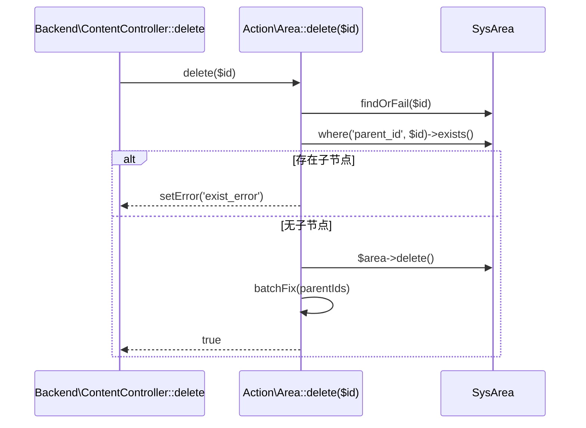
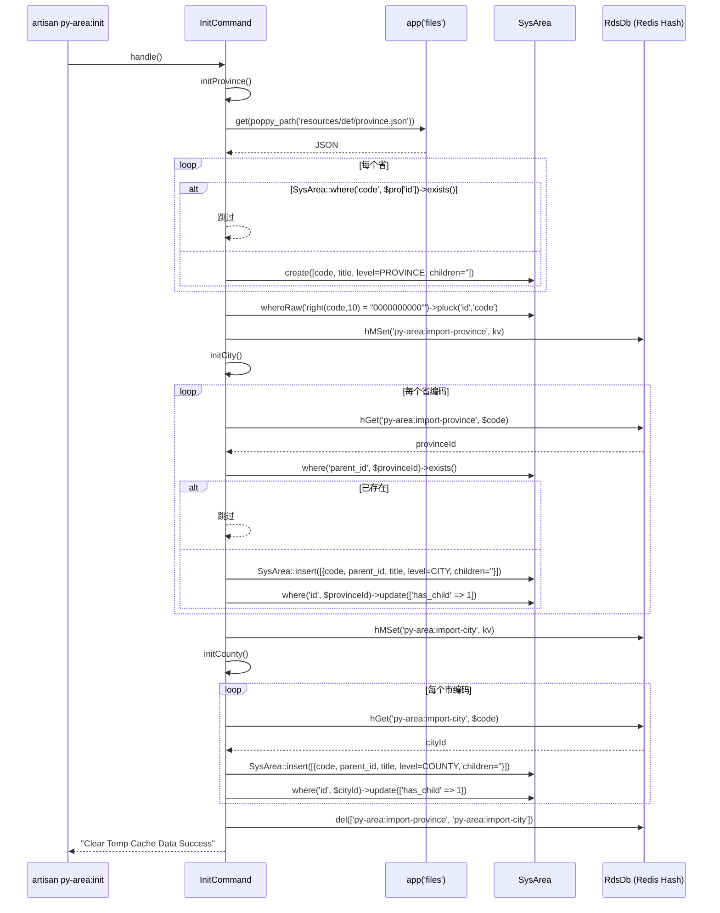

# 业务执行流程

## 流程一：地区树查询（带缓存）

**触发入口**：`POST/GET /api_v1/area/area/code`（任意 HTTP 动词，api-sign 校验通过即可）
**输出结果**：返回 JSON 树形结构（`id / title / code(left 6) / parent_id / children[]`）

### 执行序列

### 步骤说明

| 步骤 | 组件                            | 动作                                          | 备注                                                       |
|----|-------------------------------|---------------------------------------------|----------------------------------------------------------|
| 1  | api-sign 中间件                  | 校验签名                                         | 框架层处理，失败直接 401/400                                       |
| 2  | `AreaController::code()`       | 全表 SELECT 平铺数据集                              | **不命中** `cityTree` 的 30 天缓存，因为接口签名要求返回 `code = left(code, 6)` 而缓存版不带 code |
| 3  | `UtilHelper::genTree()`        | 平铺 → 树形                                      | `false` 表示不打平最外层数组                                         |
| 4  | `Resp::success()`              | 统一 JSON 响应封装                                  |                                                          |

### 异常处理

| 异常场景       | 处理方式                | 影响范围     |
|------------|---------------------|----------|
| 数据库查询异常    | Laravel 默认异常 → 500  | 当前请求失败   |
| 签名校验失败     | api-sign 中间件返回错误响应  | 当前请求失败   |

### 关键影响点

- **`AreaController::code()`**：若改为命中缓存版本，需同时调整 `SysArea::cityTree()` 的 SELECT 字段（补 `code`）。
- **`SysArea` 字段**：加减字段会影响返回 JSON 结构。
- **跨模块依赖**：`UtilHelper::genTree()` 是 `Poppy\Framework` 工具方法，签名变更需同步所有调用方。

> 说明：地区 KV 与级联选择接口（`SysArea::kvProvince()` / `kvCity()` / `cascader()`）走的是 **30 天 sys_tag 缓存**，本流程不展示；缓存清理依赖 `ClearCacheListener`（见流程二关联）。详见 [business.md](business.md) — 缓存策略。

---

## 流程二：地区 CRUD（后台建立 / 编辑 / 删除）

**触发入口**：
- 新建：`POST /backend/area/establish`（按钮 → `route('py-area:backend.content.establish')`）
- 编辑：`POST /backend/area/establish/{id}`
- 删除：`POST /backend/area/delete/{id}`
**输出结果**：成功返回 `Resp::success` 并刷新页面；删除成功返回 `_reload|1` 让前端刷新列表

### 执行序列（建立 / 编辑 `establish`）

### 执行序列（删除 `delete`）

### 步骤说明

| 步骤 | 组件               | 动作                                                  | 备注                                            |
|----|------------------|-----------------------------------------------------|-----------------------------------------------|
| 1  | `backend-auth`   | 后台登录态校验                                            |                                               |
| 2  | `ContentController` | PAM 权限校验 `backend:py-area.main.manage`           | 构造函数 self::$permission 配置                  |
| 3  | `FormAreaEstablish::handle()` | 接收 POST 参数 → `Action\Area::establish()`         | AJAX 模式 `$ajax = true`                       |
| 4  | `Action\Area::establish()` | `checkPam()` + `Validator` + `matchKv(true)` + `batchFix()` + `level()` + 条件清缓存 | 同一性校验：`$id === parent_id` 拒绝               |
| 5  | `Action\Area::delete()` | 校验无子节点 → 删除 → 修复父链                          | 拒绝有子节点的删除                                    |

### 异常处理

| 异常场景              | 处理方式                            | 影响范围       |
|-------------------|---------------------------------|------------|
| PAM 权限不足          | `checkPam()` 返回 false → Action 返回 false | 仅当前请求      |
| 字段校验失败            | `Validator::fails()` → `setError()` | 仅当前请求      |
| 编辑时 `$id === parent_id` | `setError(trans('py-system::action.area.same_error'))` | 仅当前请求 |
| 删除时存在子节点          | `setError(trans('py-system::action.area.exist_error'))` | 仅当前请求 |
| 修复 `fixHandle` 异常   | MgrPage `progress` 按钮会展示进度/失败    | 整张表修复中断    |

### 关键影响点

- **`Action\Area::establish()`**：修改字段校验逻辑、批次修复调用顺序都会影响最终一致性。
- **`SysArea.children` / `top_parent_id` / `level` 字段**：减字段需同步改 `fix()`、`level()`、`batchFix()`；加字段需补建迁移 + 重算逻辑。
- **缓存清理路径**：`level < 4` 才清 `tree-level-2`，新增第五级（街道等）需要扩展。
- **跨模块依赖**：`PamTrait::checkPam()` 来自 `poppy/system`，权限模型变更需同步。
- **修复命令**：`backend/area/fix` 走 `Action\Area::fixHandle()`，分页 section=100；改分页大小会改变锁粒度。

---

## 流程三：地区数据初始化（`py-area:init`）

**触发入口**：`php artisan py-area:init`
**输出结果**：`sys_area` 表灌入省/市/区/县，`py-area:import-province` / `py-area:import-city` 临时 Redis Hash 灌入并在最后清理

### 执行序列

### 步骤说明

| 步骤 | 组件                  | 动作                                            | 备注                                            |
|----|---------------------|-----------------------------------------------|-----------------------------------------------|
| 1  | `initProvince()`    | 读 `resources/def/province.json` 灌省级；末位匹配 `right(code,10)=0000000000` 写 Redis Hash | 跳过已存在 `code`                                   |
| 2  | `initCity()`        | 读 `resources/def/city.json`；以 `province_code` 为 key 查 Redis 拿 `provinceId`；插入市级；更新省级 `has_child=1`；末位匹配 `right(code,8)=00000000` 写 Redis Hash | 跳过已存在 `parent_id` 的省级                          |
| 3  | `initCounty()`      | 读 `resources/def/county.json`；以 `city_code` 为 key 查 Redis 拿 `cityId`；插入区/县；更新市级 `has_child=1` | 不写 Redis Hash                                |
| 4  | `handle()` 末尾清理     | `rds->del([ckProvince(), ckCity()])` 清临时 Hash    | 避免临时数据污染 Redis                                |

### 异常处理

| 异常场景           | 处理方式                       | 影响范围                            |
|----------------|----------------------------|---------------------------------|
| JSON 文件缺失     | `app('files')->get()` 抛 FileNotFoundException | 命令失败，数据库与 Redis 均未修改             |
| 数据源里 code 与已存在记录冲突 | `where exists` 跳过            | 仅跳过该条                          |
| Redis 不可用     | `hMSet/hGet` 抛 RedisException | 初始化中断（已写入的省/市记录不会回滚，需手动清理）        |
| 中途崩溃          | 无事务包裹                       | 需要根据已写入数据决定是重跑（幂等）还是手工清理           |

### 关键影响点

- **`SysArea::LEVEL_*` 常量**：升级到第 5 级（街道/乡镇）需要新增常量 + 修改 `level()` 推断。
- **`right(code, N)` 末位匹配规则**：若数据源格式变化（如不再以 `0` 结尾），需重写查询逻辑。
- **Redis Hash 临时映射**：若 `py-area:import-province/city` 因异常未清，会成为脏数据；后续排查以这两个 key 为线索。
- **跨模块依赖**：`RdsDb::instance()` 来自 `poppy/core`，连接配置变更会导致初始化失败。
- **完成后建议**：跑 `backend/area/fix` 走一遍 `fixHandle()`，补全 `children / top_parent_id / level / has_child`（初始化阶段未通过 Action 跑全表修复）。

---

## 跨流程关联：缓存清理

- 上述三个流程中，只有"建立/编辑（level < 4）"和"框架 `PoppyOptimized` 事件"会主动清缓存：
  - `Action\Area::establish()` 删除 `area-tree-level-2`（单 key）。
  - `Listeners\PoppyOptimized\ClearCacheListener::handle()` 调用 `sys_tag('py-area')->clear()`（整标签）。
- 数据初始化完成后未自动清缓存，**需手动触发 `PoppyOptimized` 事件**或 `backend/area/fix` 操作让缓存失效。