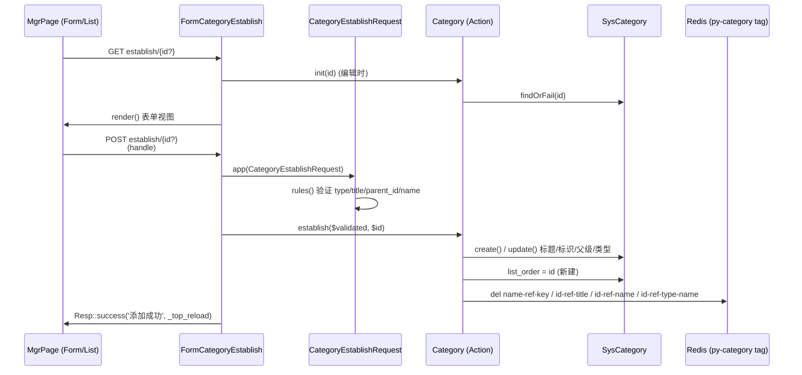
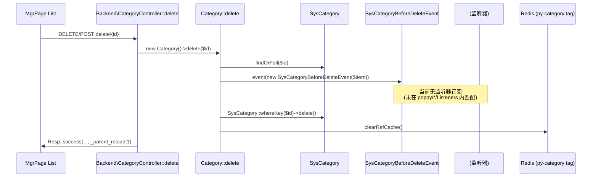
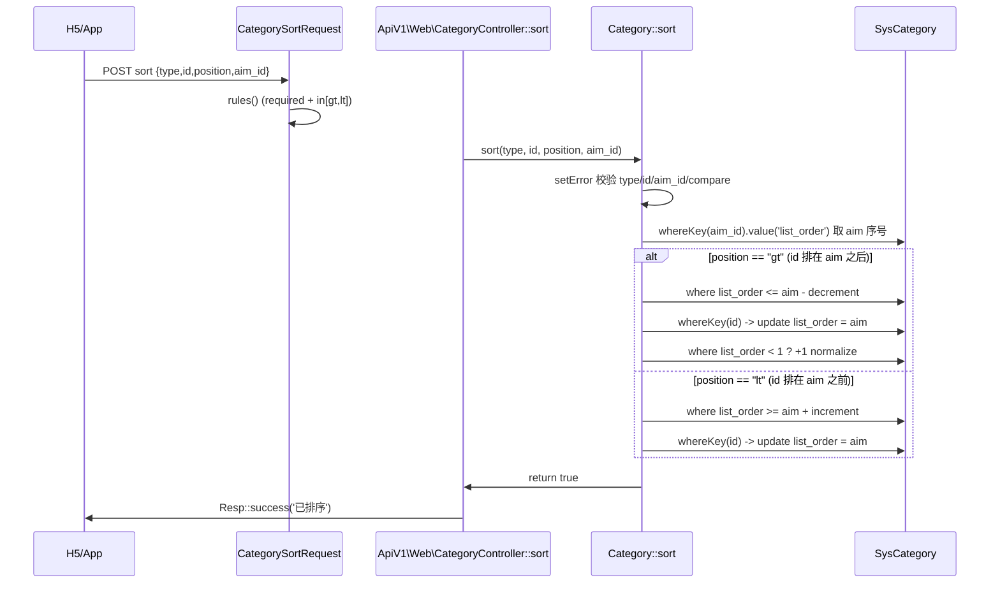

# 业务执行流程

## 流程 1：分类 CRUD（新建/编辑分类）

**触发入口**：
- 后台 `{prefix}/py-category/category/establish/{id?}`（命名路由 `py-category:backend.category.establish`，HTTP ANY）。
- 由 MgrPage `FormCategoryEstablish` 渲染表单，提交后回调 `FormCategoryEstablish::handle()`。
- 编辑时路径段含 `{id}`；新建时省略。

**输出结果**：在 `sys_category` 表插入或更新一条记录，并清空 `py-category` 缓存 Hash（id→title、id→name、name→id、id→type-name），返回成功响应让 MgrPage 父层重载。

### 执行序列

### 步骤说明

| 步骤 | 组件                                | 动作                                                                | 备注                                                                |
|----|-----------------------------------|-------------------------------------------------------------------|-------------------------------------------------------------------|
| 1  | `FormCategoryEstablish` 构造函数      | 读取 `input('type')`、`Route::input('id')`，编辑模式下 `init($id)` 取出 SysCategory | `type` 决定后续 `tree()` 与表单 `parent_id` 下拉来源                          |
| 2  | `FormCategoryEstablish::handle()` | 把 `type` merge 到 request -> `app(CategoryEstablishRequest::class)` | 强制 type 来自 URL 而非请求体，避免任意提交                                   |
| 3  | `CategoryEstablishRequest::rules`  | 验证 `type ∈ kvType`，`title`/`name` 在同 `type` 唯一，编辑时排除自身 | 唯一性 scope 仅限同 `type`                                           |
| 4  | `Category::establish($data, $id)` | `$id` 为空 → `SysCategory::create()`，并赋 `list_order = $item->id`；否则 `update()` | 返回 `bool`                                                       |
| 5  | `Category::clearRefCache()`       | `sys_tag('py-category')->del(...)` 四个缓存键                          | 防止新建/编辑后 `kvTitle/kvName/kvNameRefId` 读到旧值                      |
| 6  | `Resp::success`                    | 返回 `_top_reload => 1` 让 MgrPage 触发上层刷新                          | 不返回新 id 的字段在本流程仅编辑有；新建会随 `data.id` 一并返回（见源码 handle 实现）            |

### 异常处理

| 异常场景                | 处理方式                                              | 影响范围       |
|---------------------|---------------------------------------------------|------------|
| `type` 不在 `kvType` 内 | FormRequest 422 校验失败                            | 仅当前请求      |
| `(type, title)` 或 `(type, name)` 重复 | FormRequest 422 校验失败                            | 仅当前请求      |
| 编辑 `id` 不存在           | `findOrFail()` 抛 `ModelNotFoundException`，全局异常处理 | 当前请求中断     |
| Action 内部 `setError`   | 业务错误，返回 `Resp::error()`                          | 仅当前请求      |

### 关键影响点

修改以下地方会影响此流程：
- **`Models\SysCategory::$fillable`**：加减字段需要同步修改 `establish()` 写入、`CategoryEstablishRequest` 验证规则、`Migration` 加字段。
- **`Poppy\Category\Classes\PyCategoryDef`**：增减 `clearRefCache()` 内的键，需要同步在 `SysCategory` 的 KV 方法里新增/删除对应 `hMSet`。
- **`Hook FormCategorySelect`**：依赖 `SysCategory::tree($type)`，若树算法调整会一并影响 Hook 输出。
- **`config('poppy.category.types')`**：扩展类型需更新宿主项目配置；UI 范围、`kvType()` 都会因此变化。
- **跨模块依赖**：若第三方模块通过外键引用 `sys_category.id`，建议同时挂监听器到 `SysCategoryBeforeDeleteEvent`（虽然当前流程未触发此事件）。

---

## 流程 2：分类删除（含 BeforeDelete 事件）

**触发入口**：
- 后台 `{prefix}/py-category/category/delete/{id}`（命名路由 `py-category:backend.category.delete`），HTTP ANY。
- 由 MgrPage `ListSysCategory` 列表行的"删除"按钮触发，提交后回到 `Backend\CategoryController::delete($id)`。

**输出结果**：先 `findOrFail($id)` 加载分类实例 → 同步触发 `SysCategoryBeforeDeleteEvent`（**当前无监听器**）→ 物理删除 `sys_category` 中对应行 → 清空 `py-category` 缓存键 → 返回 `Resp::success('删除分类成功', '_parent_reload|1')`。

### 执行序列

### 步骤说明

| 步骤 | 组件                | 动作                                              | 备注                                              |
|----|-------------------|-------------------------------------------------|-------------------------------------------------|
| 1  | `Backend\CategoryController::delete` | 接收 `{id}` 路径参数                                 | `Response` 形态由 MgrPage 决定                  |
| 2  | `Category::delete($id)` | 调用 `init($id)` 加载 SysCategory 实例           | `findOrFail` 失败抛 404                                  |
| 3  | `event(new SysCategoryBeforeDeleteEvent($this->item))` | **同步**广播事件                       | 继承 `Poppy\Framework\Application\Event`，按 Laravel 默认同步调度 |
| 4  | （监听器）               | **当前注册监听器为 0**（已扫描）                       | 任何后续挂接的监听器都是同进程同步执行；若抛异常将中断后续步骤 |
| 5  | `SysCategory::whereKey($id)->delete()` | 真删物理行                                       | 不做"是否有子节点"、"是否被引用"检查                              |
| 6  | `clearRefCache()` | 删除 4 个 Redis Hash 键                          | 防止 KV 缓存持有已删除记录的引用                                  |
| 7  | `Resp::success(..., '_parent_reload|1')` | 通知 MgrPage 父层 reload                       |                                               |

### 异常处理

| 异常场景                        | 处理方式                     | 影响范围                                |
|-----------------------------|--------------------------|-------------------------------------|
| 路径参数 `$id` 不存在               | `findOrFail` 抛 404       | 当前请求                                |
| 监听器（若未来挂接）抛异常                | 中断删除；事件已广播但行未删；`clearRefCache` 也不会执行 | **关键**：当前没有监听器，所以该风险敞口为零 |
| `whereKey($id)->delete()` 数据库异常 | 异常上抛，进入宿主项目异常处理            | 事务性回滚取决于调用方（当前流程不在 DB 事务内）       |

### 事件级联

本流程触发的完整事件链：

`SysCategoryBeforeDeleteEvent` → （无 Listener，已扫描全部 `poppy/*/src/Listeners`）

说明：
- 任何挂载到 `SysCategoryBeforeDeleteEvent` 的监听器必须遵循 **"BeforeDelete" 语义**：在原始记录被删除前完成级联清理/校验/阻止删除。建议惯例：
  - 若需要"硬阻止"：监听器内抛业务异常，会同时终止 `whereKey($id)->delete()`。
  - 若需要"级联清理"：监听器内手动调整/删除关联数据。
  - 若需要"审计日志"：监听器内记录旧值。
- **修改此流程影响面**：
  - 修改 `Category::delete()`：影响所有依赖删除前置事件的业务模块。
  - 修改 `SysCategoryBeforeDeleteEvent` 携带数据（增加/删除属性）：影响所有监听器反序列化与字段访问。
  - 修改 `SysCategory` 表结构并加删除前置逻辑：需要在迁移后增加数据校验，否则历史脏数据无监听器兜底。

### 关键影响点

修改以下地方会影响此流程：
- **`Category::delete(int $id)`**：如果在事件前后增减逻辑，会改变"删除"原子动作的语义。
- **`SysCategoryBeforeDeleteEvent` 数据结构**：增删属性需要同步所有未来订阅者。
- **跨模块依赖**：本模块没有内置级联逻辑；未来若有第三方模块（如商品、内容）需要"删除分类时联动"，必须由它们自行挂监听器，否则删除后可能出现悬空外键。

---

## 流程 3：分类树查询 / 排序位置调整

**触发入口**（分两个分支）：

- **A. 树查询（读路径）**：
  - 后台 MgrPage `ListSysCategory` 列表筛选区调用 `SysCategory::tree($type, true)` 填充 `parent_id` 下拉。
  - 后台 MgrPage `FormCategoryEstablish` 表单 `parent_id` 调用 `SysCategory::tree($this->type)` 渲染下拉。
  - 任何已注册 `poppy.category.form_category_select` Hook 的后台表单通过 `Hooks\FormCategorySelect::builder` 拉取树。

- **B. 排序调整（写路径）**：
  - 前端 H5 / App `POST /api_v1/category/category/sort`（`api-sign` 中间件）→ `ApiV1\Web\CategoryController::sort` → `Category::sort($type, $id, $compare, $aim_id)`。

**输出结果**：
- A：返回当前 `type` 下"启用项"的邻接树数组（结构按 `parent_id` 嵌套、`list_order desc`）。
- B：原 `id` 条目 `list_order` 变成 `aim_id` 对应值；同 `type` 内受影响记录的 `list_order` 整体平移以让位；如发现 `min(list_order) < 1`，全局 +1 修正。

### 执行序列（排序写路径）

### 步骤说明（排序写路径）

| 步骤 | 组件                 | 动作                                                                              | 备注                                            |
|----|--------------------|---------------------------------------------------------------------------------|-----------------------------------------------|
| 1  | `CategorySortRequest` | 校验入参：type/id/aim_id 必填，position 仅 `gt/lt`                                      | 详见 [contracts.md](contracts.md) 验证表              |
| 2  | `CategoryController::sort` | 取 `type/id/position/aim_id`，实例化 `Category` 调用 `sort()`                          | 任何错误返回 `Resp::error()`                       |
| 3  | `Category::sort()` 预校验   | `type/id/aim_id` 缺失或 `compare ∉ {gt, lt}` → `setError(...)`                       | 中文错误通过 `setError` 与 `AppTrait` 管理          |
| 4  | `gt` 分支               | 同 `type` 内 `list_order <= aim` 的全部 -1；当前 id 设 `list_order = aim`；整体 normalize 到 >=1 | 涉及 3 条 SQL                       |
| 5  | `lt` 分支               | 同 `type` 内 `list_order >= aim` 的全部 +1；当前 id 设 `list_order = aim`                  | 涉及 2 条 SQL                       |
| 6  | 响应                    | `Resp::success('已排序')` 或 `Resp::error($Category->getError())`                       | 失败时不会回滚（上述 3/2 条 SQL 是直接 `decrement/increment/update`，非事务）        |

### 步骤说明（树读路径）

| 步骤 | 组件                                  | 动作                                                                | 备注                                       |
|----|-------------------------------------|-------------------------------------------------------------------|------------------------------------------|
| 1  | `SysCategory::tree($type, $replace_space)` | `where type & is_enable=ENABLE` 取 `id/title/parent_id`，`orderBy list_order desc` | keyBy('id') 后丢给 TreeHelper        |
| 2  | `TreeHelper`                       | `init($rows, 'id', 'parent_id', 'title')` → `getTreeArray(0)`        | 输出根节点的二级数组                              |
| 3  | 调用方                                  | MgrPage 的 `parent_id` 下拉、Hook `FormCategorySelect` 的 `select` 渲染           | 替换空格可选 `$replace_space=true`            |

### 异常处理（排序写路径）

| 异常场景                  | 处理方式                                            | 影响范围                |
|-----------------------|-------------------------------------------------|---------------------|
| `type/id/aim_id` 缺失    | `setError(...)` 返回业务错误                          | 仅当前请求；DB 不变         |
| `compare ∉ {gt,lt}`    | `setError('错误的对比信息')`                              | 仅当前请求；DB 不变         |
| 同 `type` 下找不到 `aim_id` | `value('list_order')` 返回 `null` 强转 `int` 后为 0，可触发后续`decrement` 在 `lo<=0` 区间整体 +1，但用户期望位置可能错乱（语义边界，无事务回滚） | 当前请求，不影响其他记录       |
| 并发排序                  | 多个 gt/lt 调整在同一 `type` 下交错执行，可能短暂出现 `list_order` 重复 | 缺少 `version/lock_version`，无法乐观锁；属于现状（待确认） |

### 关键影响点

修改以下地方会影响此流程：
- **`Category::sort()` 算法**：若调整 `(decrement/increment)` 上下界、normalize 阈值，会改变顺序语义。
- **`SysCategory::tree()` 排序/过滤条件**：若变更 `is_enable` 过滤或 `list_order desc` 顺序，会影响前端下拉与 Hook 输出。
- **`TreeHelper`**：来自 `poppy/framework`，升级框架可能改变根节点约定（当前约定根 `parent_id=0`）。
- **跨模块依赖**：`SysCategory.tree/establish/sort` 被 `poppy/content`、`FormCategorySelect` Hook 等多个调用方读取，行为变化会扩散。

## 待确认

- 排序并发安全：当前未发现乐观锁（`lock_version` 或 DB 事务）防护，并发排序是否引发 `list_order` 错乱？
- `parent_id` 是否允许跨 `type` 父子引用（没看到校验）？若允许会产生"跨 type 的混合树"。
- 树 `parent_id=0` 的根节点规约：是约定还是允许其他值？
- 路由文件中所有路径都是 `any()` 注册，是否有计划把管理后台改为 `GET/POST` 等严格方法（前端实际语义已通过 MgrPage AJAX 处理）。
