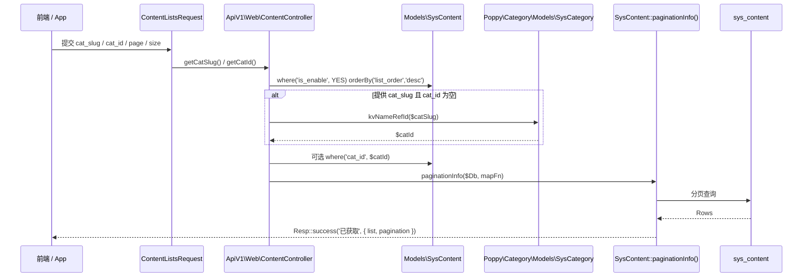
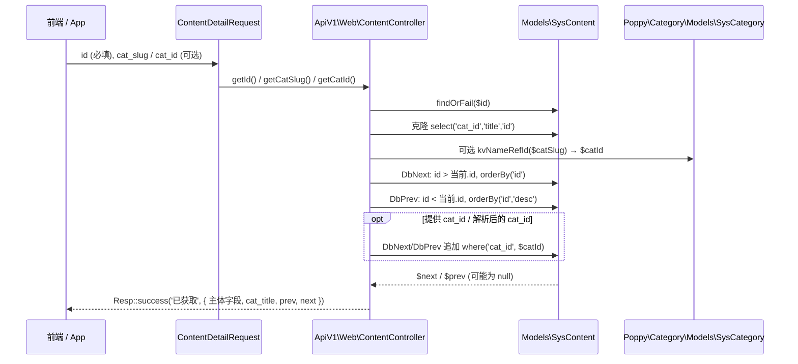

# 业务执行流程

## 1. 后台建立/编辑内容流程

**触发入口**：`POST {mgr-page}/py-content/content/establish/{id?}`（路由名 `py-content:backend.content.establish`，中间件 `backend-auth`）  
**输出结果**：在 `sys_content` 表中创建或更新记录；列表页 `_reload|1` 后立即看到结果。

### 执行序列

```mermaid
sequenceDiagram
    participant Admin as 后台运营
    participant Ctrl as Backend\ContentController
    participant Req as ContentRequest (Validation)
    participant Action as Action\Content
    participant Pam as Poppy\System\PamTrait/PamAccount
    participant SysConf as Poppy\System\SysConfig
    participant Db as sys_content (Eloquent)

    Admin ->> Ctrl: POST establish/{id?}
    Ctrl ->> Req: app(ContentRequest::class)
    Req ->> Req: rules() 校验 (含 title 唯一性, type/title 范围)
    Req -->> Ctrl: validated() data
    Ctrl ->> Action: establish($data, $id)
    Action ->> Pam: checkPam()
    Pam -->> Action: 鉴权结果
    Action ->> Action: strlen($content) > 65500 ?  setError
    alt 提供 $id
        Action ->> Db: init($id) → findOrFail
        Action ->> Db: item->update($initDb)
    else 未提供 $id
        Action ->> Db: $initDb['account_id'] = pam->id
        Action ->> Db: SysContent::create(...)
        Action ->> Db: list_order = id; is_enable = YES; create_at 兜底; save()
    end
    Action -->> Ctrl: true / false(+getError)
    Ctrl -->> Admin: Resp::success() / Resp::error()
```

### 步骤说明

| 步骤 | 组件 | 动作 | 备注 |
|------|------|------|------|
| 1 | `Backend\ContentController::establish()` | 读取入参，组装 ContentRequest（合并 `type=input('type')`） | 路由为 `any`，走 `is_post()` 分支才进入业务逻辑 |
| 2 | `ContentRequest::rules()` | 校验标题唯一性（`unique(title) where type=$type and id != $id`）、`create_at` 日期格式 | 业务规则见 [business.md](business.md) |
| 3 | `Action\Content::establish()` | `checkPam()`；超长内容截断校验；调用 `init($id?)` 或创建 | 鉴权失败直接 `false` |
| 4 | `Models\SysContent` | 更新或创建记录；补齐 `account_id/list_order/is_enable/create_at` | `is_enable = SysConfig::YES` 仅创建分支写 |
| 5 | `Poppy\Framework\Classes\Resp` | 控制器返回 `Resp::success('操作成功')` 或 `Resp::error($action->getError())` | 前端 MgrPage 弹层 + 列表 reload |

### 异常处理

| 异常场景 | 处理方式 | 影响范围 |
|----------|----------|----------|
| 标题在同 `type` 内重复 | ContentRequest 校验失败，前端表单层 422 | 仅当前请求 |
| `$content` 超过 65500 字节 | Action 返回业务错误，前端 Resp::error 提示清理 | 仅当前请求 |
| `checkPam()` 失败 | Action 返回 `false` 并经 `setError`，前端 Resp::error | 仅当前请求 |
| 编辑时 `$id` 不存在 | `SysContent::findOrFail()` 抛出 ModelNotFoundException | 全局 404 |

### 关键影响点

修改以下地方会影响此流程：

- **`Action\Content::establish()`**：调整 `account_id/list_order/is_enable/create_at` 的写入时机或默认值会直接改新建内容数据。
- **`ContentRequest::rules()`**：增加校验字段必须同步到 `establish.blade.php`；移除 `title` 唯一性会引入跨 `type` 同名冲突。
- **`Models\SysContent $fillable`**：后台表单字段未列入 fillable 不会写入。
- **跨模块依赖**：
  - 改动 `PamTrait::checkPam()` 会影响"是否允许写入"。
  - 改动 `SysConfig::YES` 的语义会使新建内容默认可见性反转。
  - 改动 `poppy.mgr-page` 的 Grid 表单约定会破坏编辑回显。

---

## 2. 前端内容列表流程（API v1）

**触发入口**：`api_v1/content/content/lists`（`ContentController@lists`，中间件 `api-sign`）  
**输出结果**：分页结果集，仅包含 `is_enable = YES` 的内容，按 `list_order desc` 排序。

### 执行序列



### 步骤说明

| 步骤 | 组件 | 动作 | 备注 |
|------|------|------|------|
| 1 | `ContentListsRequest` | 参数校验：`cat_slug`/`cat_id`/`page` ≥1 / `size` ∈ [1,100] | 见 [business.md](business.md) "路由/分发规则" 段 |
| 2 | `ApiV1\Web\ContentController::lists()` | 拼装基础 Query：`is_enable=YES`, `order=list_order desc` | `SysConfig::YES` 取自 `poppy.system` |
| 3 | 同上 | `cat_slug → cat_id` 反查（`SysCategory::kvNameRefId`） | `cat_id` 优先于 `cat_slug` |
| 4 | 同上 | 写入 `where('cat_id', $catId)` |  |
| 5 | `SysContent::paginationInfo($Db, $mapFn)` | 分页查询 + map 函数提取 `id/path/slug/title/thumb/description/author/create_at` | `description` 为空时回退到正文截断 150 字 |
| 6 | `Poppy\System\Http\OpenApi\BaseResponseBody` | 序列化到 OpenAPI 响应 schema | `PoppyContentContentListsResponseBody` |

### 异常处理

| 异常场景 | 处理方式 | 影响范围 |
|----------|----------|----------|
| `size > 100` 或 `page < 1` | ContentListsRequest 校验失败 → 422 | 仅当前请求 |
| `cat_slug` 在 category 模块中无法反查 | 控制器静默视为不过滤（`$catId = 0`），结果集是全量 | 仅当前请求 |
| 分页超出范围 | `paginationInfo` 返回空 `list` + 正确总页数 | 仅当前请求 |

### 关键影响点

- **`ApiV1\Web\ContentController::lists()`**：map 字段改动会破坏 OpenAPI schema 与前端契约。
- **`Models\SysContent $fillable`**：新增字段若需要在列表中返回，必须同步修改 map 闭包。
- **`SysContent::paginationInfo()`**：分页逻辑由 `poppy.framework` 提供；如果框架升级改变分页返回结构，前端分页 UI 会失效。
- **跨模块依赖**：
  - `SysCategory::kvNameRefId/kvSlug/kvTitle` 改名/返回值结构变动，会使列表响应字段错位。

---

## 3. 前端内容详情流程（API v1，含上下篇）

**触发入口**：`api_v1/content/content/detail`（`ContentController@detail`，中间件 `api-sign`）  
**输出结果**：当前文章详情 + 分类上下文内的 `prev`/`next` 导航。

### 执行序列



### 步骤说明

| 步骤 | 组件 | 动作 | 备注 |
|------|------|------|------|
| 1 | `ContentDetailRequest` | `id` 必填 + integer；`cat_slug`/`cat_id` 可选 |  |
| 2 | `ApiV1\Web\ContentController::detail()` | `findOrFail($id)` 取主体 | 不带 `is_enable` 过滤（详情可接受"运营下线但 URL 仍命中"？）— 待确认 |
| 3 | 同上 | 通过 `SysCategory::kvNameRefId($catSlug)` 解析 `cat_id` | 与列表流程共用同一规则 |
| 4 | 同上 | 构造 `DbNext`/`DbPrev`，明确按 id 排序，无 `is_enable` 过滤 | 上下篇可指向未启用内容；待确认 |
| 5 | 同上 | 任一方向为空返回 `(object) {}` | 前端可据此隐藏按钮 |
| 6 | `BaseResponseBody` | 序列化到 `PoppyContentContentDetailResponseBody` | 字段：`title/keyword/description/author/create_at/content/cat_title/prev/next` |

### 异常处理

| 异常场景 | 处理方式 | 影响范围 |
|----------|----------|----------|
| `id` 缺失/非整数 | ContentDetailRequest 422 | 仅当前请求 |
| `SysContent::findOrFail` 找不到 | 抛出 ModelNotFoundException | 全局 404 |
| `prev`/`next` 命中但 `cat_id=0` | 响应用字面量 `'content'` 作为 `slug/path` | 仅当前请求 |

### 关键影响点

- **`ApiV1\Web\ContentController::detail()`**：map 函数同时承担主体字段、cat_title、prev、next 拼装；任何字段调整都直接影响 OpenAPI schema。
- **上下篇查询**：当前实现只 select `cat_id/title/id`，但响应仍用了 `kvSlug($prev->cat_id)`，删 cat 列会导致报错。
- **跨模块依赖**：
  - `SysCategory::kvTitle/kvSlug` 改名会破坏 `cat_title` 与 prev/next slug 字段。
  - `PamAccount` 模型（虽然本流程未直接读取）若 `account_id` 字段被外部迁移破坏会影响 `pam` 关联展示（间接影响）。

---

## 4. 后台启用/隐藏切换流程（短流程）

**触发入口**：`POST {mgr-page}/py-content/content/toggle/{id}`（路由名 `py-content:backend.content.toggle`，中间件 `backend-auth`）  
**输出结果**：`is_enable` 取反，前端列表 `_reload|1`。

### 执行序列

```mermaid
sequenceDiagram
    participant Admin as 后台运营
    participant Ctrl as Backend\ContentController
    participant Action as Action\Content
    participant Db as sys_content
    Admin ->> Ctrl: POST toggle/{id}
    Ctrl ->> Action: toggle($id)
    Action ->> Db: init($id) → findOrFail
    Action ->> Db: is_enable = !(int) is_enable; save()
    Action -->> Ctrl: true
    Ctrl -->> Admin: Resp::success('操作成功','_reload|1')
```

### 关键影响点

- `Models\SysContent` 表无 `is_enable` 状态变更日志；下线/上线无时间戳记录。如需审计需扩展字段。
- 前端 ApiV1 列表 "只取 `is_enable=YES`"，这意味着切换是不可逆的运营影响。

## 待确认

- `configurations/module.yaml` 中 title/description 文案疑似复用了 `poppy.category` 的旧文案（实际菜单中显示为"内容管理"）。
- 第三方迁移 `slug` 字段：`2023_08_30` 迁移给 `slug` 建了索引 `k_slug`，但前面两个迁移都没有显式 `slug` 字段新增语句。可能由更早的迁移（不在本目录扫描范围）添加，或与 `poppy.system` 共享迁移路径。**待确认**。
- `ApiV1\Web\ContentController::detail()` 是否应该过滤 `is_enable = YES` —— 当前实现 `findOrFail($id)` 不带 `is_enable` 条件。**待确认**。
- 上下篇 prev/next 是否应该同样过滤 `is_enable = YES` —— 当前实现不过滤。**待确认**。
- 测试用例：`tests/Action/ContentTest.php` 已存在，但本次未读取其覆盖范围。**待确认**。
