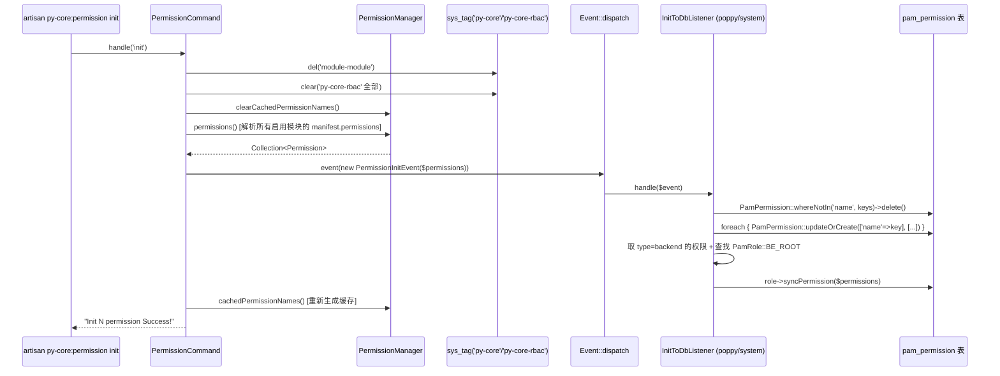
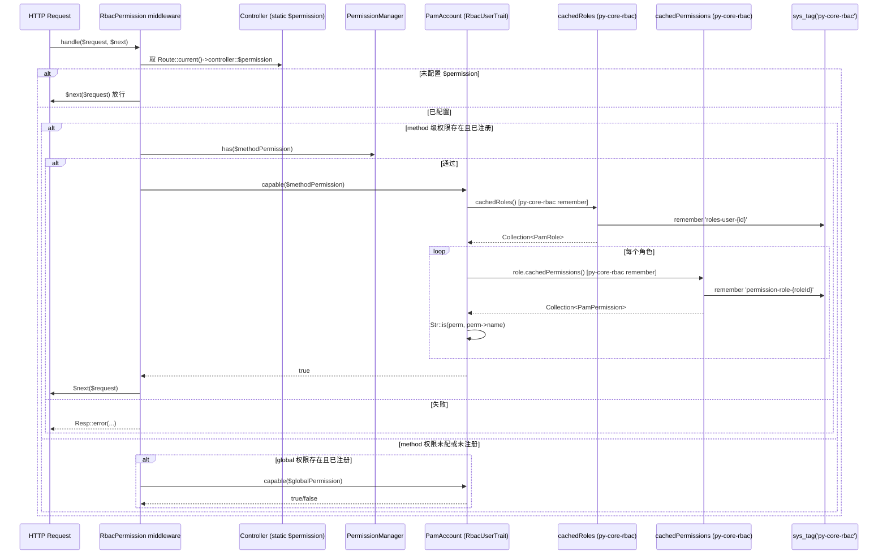
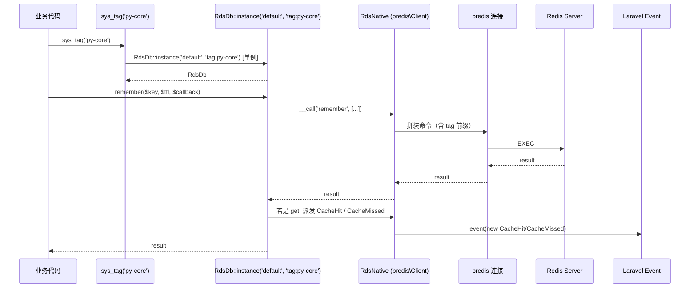
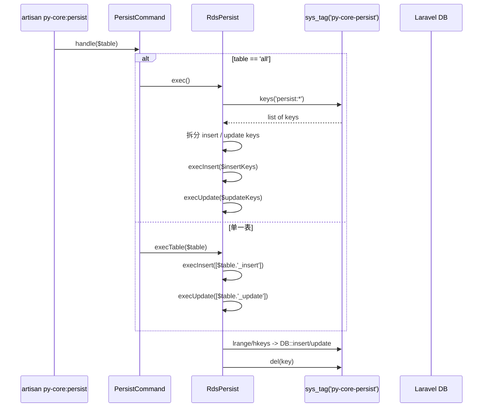

# 业务执行流程

## 流程一：模块安装 / 升级后初始化权限（py-core:permission init）

**触发入口**：`php artisan py-core:permission init`（运维 / 部署脚本手动触发，模块 install 或 upgrade 后必跑）
**输出结果**：
- 清空 `py-core` 标签下的 `module-module` 缓存（强制下次访问重新解析 manifest）
- 清空 `py-core-rbac` 标签下全部缓存（用户角色 / 角色权限）
- 重新生成 `py-core:permission-names` 与 `py-core:permission-kv` 缓存
- 派发 `Poppy\Core\Events\PermissionInitEvent`，由 `poppy/system` 的 `InitToDbListener` 同步到 `pam_permission` 表 + 给 root 角色赋全部权限

### 执行序列



### 步骤说明

| 步骤 | 组件 | 动作 | 备注 |
|---|---|---|---|
| 1 | `PermissionCommand` | 接收 `do=init` 分支 | 命令路径：`src/Commands/PermissionCommand.php:54` |
| 2 | `sys_tag('py-core')` | `del(PyCoreDef::ckModule('module'))` 删除 `module-module` 缓存 | `PyCoreDef::ckModule('module')` = `module-module` |
| 3 | `sys_tag('py-core-rbac')` | `clear()` 清空所有 `roles-user-*` 和 `permission-role-*` 缓存 | 下次用户/角色查询会强制回源 |
| 4 | `PermissionManager` | `clearCachedPermissionNames()` 删除 `permission-names` 缓存 | |
| 5 | `PermissionManager::permissions()` | 遍历 `app('poppy')->enabled()` 每个模块的 manifest `permissions` 字段，组装成 `Collection<Permission>` | key 形如 `mgr:home.index.list` |
| 6 | `PermissionCommand` | `event(new PermissionInitEvent($permissions))` 派发事件 | |
| 7 | `InitToDbListener::handle` | 先删除 `pam_permission` 中未在新清单的旧权限 | 避免遗留 |
| 8 | `InitToDbListener::handle` | `updateOrCreate` 每条权限 | 幂等 |
| 9 | `InitToDbListener::handle` | 取 `type=backend` 的权限，赋给 `PamRole::BE_ROOT` 角色 | `PamAccount::TYPE_BACKEND` 常量 |
| 10 | `PermissionManager` | `cachedPermissionNames()` 触发 remember，写回 `permission-names` | TTL = `config('cache.ttl', 600)` |

### 异常处理

| 异常场景 | 处理方式 | 影响范围 |
|---|---|---|
| `permissions()` 返回空（manifest 没配权限） | 命令打印 "No permission need import." 后直接 return | 不发事件、不写库 |
| `poppy/system` 未启用（无 `InitToDbListener`） | 事件无人监听，权限仅驻留在 `PermissionManager` 内存中 | 下次重启失效，`pam_permission` 为空 |
| `PamRole::BE_ROOT` 角色不存在 | `->first()` 返回 null → `->syncPermission()` 抛 NPE | 整个 init 失败；需先确保 system 模块初始化 |
| Redis 不可用 | `sys_tag(...)->del/clear/remember` 抛连接异常 | 命令整体失败，需先恢复 Redis |

### 跨模块调用

- **步骤 6** 派发 `PermissionInitEvent`，被 `poppy/system` 的 `InitToDbListener` 消费（`poppy/system/src/ServiceProvider.php:45-46` 中 `$listens` 绑定）。
- **风险**：若 `poppy/system` 修改了 `PamPermission` / `PamRole` 模型字段或 `BE_ROOT` 常量值，本流程需要同步更新（`InitToDbListener` 是 system 模块的私有类）。

### 事件级联

```
PermissionCommand::init()
    └── event(new PermissionInitEvent)
            └── InitToDbListener (poppy/system)
                    ├── PamPermission::whereNotIn(...)->delete()
                    ├── foreach { PamPermission::updateOrCreate(...) }
                    └── PamRole(BE_ROOT)->syncPermission(backend-perms)
```

---

## 流程二：RBAC 鉴权（请求进入受保护的后台控制器）

**触发入口**：HTTP 请求进入注册了 `sys-rbac` 中间件别名（或显式使用 `RbacPermission::class`）的路由
**输出结果**：放行（`$next($request)`）或返回 `Resp::error("用户无 [权限名] 权限, 无法访问")`

### 执行序列



### 步骤说明

| 步骤 | 组件 | 动作 | 备注 |
|---|---|---|---|
| 1 | `RbacPermission` | 校验 `$user` 是否有 `capable()` 方法；无则 `throw PermissionException` | 路径：`src/Rbac/Middlewares/RbacPermission.php:39` |
| 2 | `RbacPermission` | 读取 `Route::current()->controller::$permission` | 静态属性约定 |
| 3 | `RbacPermission` | 未配置 → 放行 | 配置缺失时按"开放"处理，避免阻塞未升级的 controller |
| 4 | `RbacPermission` | 取 `$method = Route::currentRouteAction()` 的 `@` 后部分 | 例如 `index` |
| 5 | `RbacPermission` | `$methodPermission = $permissions[$method] ?? ''` | |
| 6 | `PermissionManager::has($methodPermission)` | 校验权限 ID 是否已注册（避免给废弃权限做检查） | |
| 7 | `RbacUserTrait::capable($methodPermission)` | 先 `cachedRoles()` 取该用户所有角色 | key=`roles-user-{id}`，TTL=`config('cache.ttl')` |
| 8 | `RbacUserTrait::capable` 循环角色 | 调 `$role->cachedPermissions()` 取角色权限 | key=`permission-role-{roleId}`，同 TTL |
| 9 | `RbacUserTrait::capable` | `Str::is($permission, $perm->name)` 支持通配符 | |
| 10 | `RbacPermission` | `cachedPermissionKv($perm)` 取权限中文名填入错误消息 | `Resp::error("用户无独立 [权限名] 权限, 无法访问")` |
| 11 | `RbacPermission` | method 权限未命中或未注册 → 退回到 `global` 权限 | `$permissions['global']` |
| 12 | `RbacPermission` | 全都不命中 → 直接 `$next($request)` | 这里**不抛错**（业务上认为 global 默认值或不需要鉴权） |

### 异常处理

| 异常场景 | 处理方式 | 影响范围 |
|---|---|---|
| `$user` 未实现 `capable()` | `throw PermissionException('用户没有检测权限的方法, 无法使用此中间件')` | 该请求 500 |
| `methodPermission` 已配但未在 `PermissionManager` 注册 | 跳过 method 级校验，退回 global；global 也没配 → 放行 | 业务上等于"无权限保护"，需检查 manifest 是否遗漏 |
| `cachedRoles()` 缓存命中但角色被删除 | 由于 `Role::deleting` 触发 `clearCachedPermissions()` + 用户模型 `saved` 触发 `clearCachedRoles`，最差情况下读到旧角色 | 用户后续请求会回源 |
| `PamAccount` 类型非 `TYPE_BACKEND` | `RbacUserTrait::clearCachedRoles` 跳过清理 → 前台用户操作不影响后台缓存 | 设计上的优化，但若 `PamAccount` 模型被替换需注意 |

### 关键影响点

- **`Controller::$permission`（静态数组）**：增减 / 重命名 key 直接影响鉴权判定。
- **`PermissionManager::permissions()` 的 key 拼接规则**：`type:root.group.slug` 一旦变更，所有 controller 中写死的权限 ID 必须同步。
- **`RbacUserTrait::capable` 的匹配算法**：用 `Str::is()` 而非 `===`，新增权限字符串允许带通配符。
- **`RbacUserTrait::clearCachedRoles`**：依赖 `PamAccount::TYPE_BACKEND` 常量。若 `poppy/system` 改了类型定义需同步。

### 跨模块调用

- **步骤 7-9** 通过 `RbacUserTrait` / `RbacRoleTrait` 触达 `poppy/system` 的 `PamAccount` / `PamRole` / `PamPermission` 模型。若对应模型外键或表名变化，需要更新 `poppy.core.rbac.*` 配置。
- **步骤 10** 通过 `cachedPermissionKv` 走 `py-core` 标签缓存（与 RBAC 缓存分标签）。

---

## 流程三：Redis 缓存的写入 / 读取（典型 sys_tag 模式）

**触发入口**：业务代码调用 `sys_tag($tag)->{command}(...)`（如 `remember/get/setEx/del/hSet/zAdd` 等）
**输出结果**：命令通过 `RdsDb::__call` 转发到 `RdsNative`（基于 predis），结果透传上层；`get` 操作会额外派发 `CacheHit` / `CacheMissed`

### 执行序列



### 步骤说明

| 步骤 | 组件 | 动作 | 备注 |
|---|---|---|---|
| 1 | `Support/functions.php` | `sys_tag($tag, $db='')` 返回 `RdsDb::instance($db, 'tag:' . $tag)` | 路径：`src/Support/functions.php:50` |
| 2 | `RdsDb::instance` | 检查 `static $handleRepo[$db-$tag]` 缓存，存在则返回；否则 new | 保证同 tag/db 单连接 |
| 3 | `RdsDb::__construct` | 读取 `config('database.redis.' . $database)` 构造 `RdsNative` | 空 db 默认 `default` |
| 4 | `RdsDb::__call` | `$this->handler->$method(...$arguments)` | predis 方法直转 |
| 5 | `RdsDb::__call('get', ...)` | 命中 → `event(new CacheHit($key, $value))`；miss → `event(new CacheMissed($key))` | 让 Laravel Telescope/APM 可观察 |
| 6 | `RdsNative::get` / `set` 等 | predis 命令 + 内部 tag 前缀（`tag:{tag}:`） | tag 实际上只是 key 前缀，无 server-side group 语义 |

### 典型用法（业务代码视角）

```php
// 1. 写入并设置 TTL
sys_tag('py-core')->setEx('my-key', 600, 'value');
// 或
sys_tag('py-core')->put('my-key', 'value', 600);

// 2. 读
sys_tag('py-core')->get('my-key');

// 3. 带回调的缓存读
sys_tag('py-core')->remember('my-key', 600, function () {
    return DB::table('xxx')->get();
});

// 4. 删除
sys_tag('py-core')->del('my-key');
// 或清整 tag
sys_tag('py-core')->clear();   // 注意：clear() 是 Predis 原生接口，含义为 flushdb，仅当 predis 配置允许时执行
```

> 警告：`RdsDb` 是 `RdsNative` 的薄包装，`->clear()` 实际调用的是 predis `clear()`（即 `FLUSHDB`），**不是** Laravel `TaggedCache::clear()`。生产环境慎用，建议改用 `del()` 按 key 删除。

### 异常处理

| 异常场景 | 处理方式 | 影响范围 |
|---|---|---|
| Redis 连接失败 | `RdsDb::__call` 透传 predis 异常 | 调用方需自行捕获；本模块不重试 |
| `get` miss | 返回 `null` + 派发 `CacheMissed` 事件 | 由调用方决定是否走 fallback |
| 单例连接已断开 | `__destruct` 调 `disconnect()`；下次 `instance()` 会重建 | 无状态丢失 |
| predis 命令拼错 | predis 抛 `ServerException` 或 `CommunicationException` | 命令直接失败 |

### 关键影响点

- **`RdsDb::clear()`**：是 predis `FLUSHDB`，不要当作"清当前 tag 的缓存"用。清标签缓存请用 `sys_cache($tag)->flush()`（Laravel TaggedCache）。
- **`sys_tag` 单例**：`static $handleRepo` 静态缓存，跨请求常驻内存（PHP-FPM 进程生命周期内）。
- **`RdsNative` 的 tag 前缀**：仅作为 key 命名空间，不影响 TTL / 失效逻辑。

### 跨模块调用

- 本流程不涉及跨模块，仅是基础设施内部行为。

---

## 流程四（辅助）：持久化缓冲刷库（py-core:persist）

**触发入口**：`php artisan py-core:persist all` 或 `py-core:persist <table>`
**输出结果**：`persist:{table}_insert` / `persist:{table}_update` 中的缓冲数据被批量写入 MySQL 对应表，Redis key 同步删除

### 执行序列



### 步骤说明

| 步骤 | 组件 | 动作 | 备注 |
|---|---|---|---|
| 1 | `PersistCommand::handle` | 按 `table` 参数分流 | `all` → `RdsPersist::exec()`；否则 `execTable($table)` |
| 2 | `RdsPersist::exec` | `sys_tag('py-core-persist')->keys('persist:*')` 列举所有缓冲 key | |
| 3 | `RdsPersist::exec` | 按 `_insert` / `_update` 后缀分组 | |
| 4 | `execInsert` | 对每条 `persist:{table}_insert` key，`lrange` 全部数据 → `unserialize` → `DB::table($table)->insert()` → `del($rdsKey)` | 失败抛 `TransactionException` |
| 5 | `execUpdate` | 对每条 `persist:{table}_update` key，`hkeys` 取出 where JSON → `hget` 取计算后的值 → `DB::table($table)->where($where)->update($values)` → `hdel($rdsKey, [$where])` | 同上 |
| 6 | `PersistCommand::handle` | `try/catch Throwable`，失败打印 `sys_gen_mk(self::class, $e->getMessage())` | |

### 关键影响点

- **失败回滚**：当前实现是"逐条提交"，如果中途某条 update 失败，前面成功的不会回滚。需要调用方保证 where 正确。
- **数据一致性**：`update` 字段支持 `+` / `-` / `.` / `>` / `<` 运算符（`RdsPersist::calcUpdate`）；同一行多次 `update` 会按 Redis HSET 累加计算。
- **刷库时机**：当前是手动触发；`py-core:persist` 调度建议放在业务低峰期。

---

## 待确认

- 流程四的 `py-core:persist` 是否在 framework `Kernel` 中注册了定时调度（当前未在 `ServiceProvider::registerSchedule()` 中发现）。
- 流程一中 `poppy/system` 的 `InitToDbListener` 依赖 `PamRole::BE_ROOT` 必须先存在；若 system 模块也通过同一 `init` 流程创建角色，需要保证初始化顺序（当前由部署脚本顺序保证）。
- 流程二中 `RbacPermission` 中间件的"global 未配或未注册"分支直接 `$next($request)`——这是否是预期行为，还是应返回 403？需结合业务侧约定确认。
