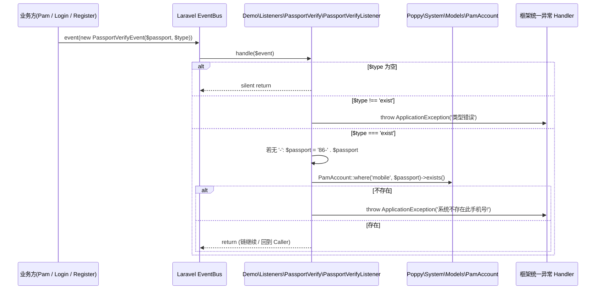
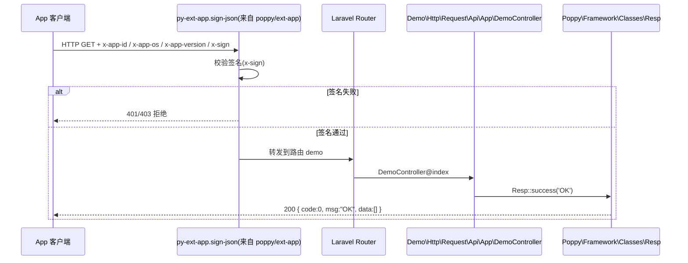
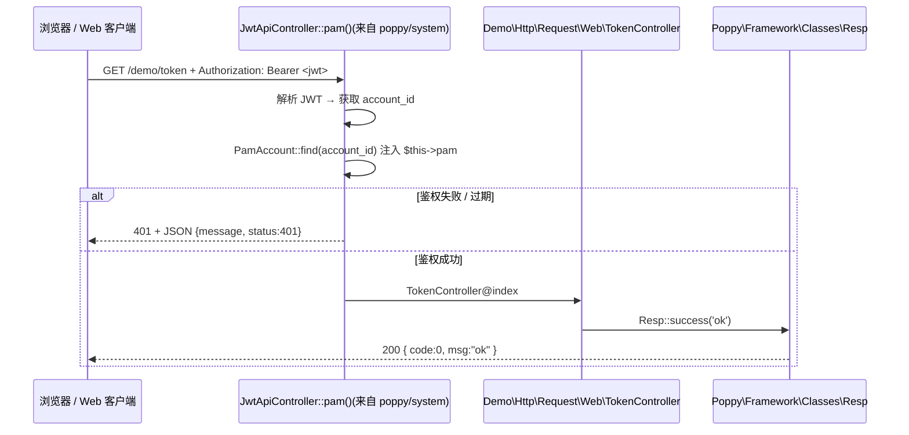

# 业务执行流程

> demo 模块是 poppy 框架的**示例/模板**。本文件挑选能展示 poppy 关键模式（事件监听、中间件链、JWT 鉴权）的 3 条流程，演示"一个请求 / 一个事件从入口到出口是如何串联的"。
>
> 真实业务规则的细节请回 [business.md](business.md)；类名 / 路由名请回 [contracts.md](contracts.md)。

---

## 流程 1 — PassportVerify 事件消费（手机号存在性校验）

**触发入口**：其它模块 / 业务代码调用 `event(new Poppy\System\Events\PassportVerifyEvent($passport, $type))`。
**输出结果**：如果校验通过，监听链 return；不通过则抛 `ApplicationException`，由异常 Handler 接管返回 `code=1` 的统一错误响应。

### 执行序列

### 步骤说明

| 步骤 | 组件                                | 动作                                                       | 备注                                |
|----|-----------------------------------|----------------------------------------------------------|-----------------------------------|
| 1  | 业务方                              | `event(new PassportVerifyEvent($passport, $type))`       | 触发事件；`$passport` / `$type` 由调用方传入 |
| 2  | `PassportVerifyListener`          | 类型分流：empty / 非 'exist' / 'exist'                     | `$type` 严格校验，仅支持 `'exist'`        |
| 3  | `PassportVerifyListener`          | 区号前缀补全：`'86-' + $passport`（前提是不含 `-`）              | 见 [business.md §2](./business.md)  |
| 4  | `Poppy\System\Models\PamAccount` | `where('mobile', $passport)->exists()`                    | 仅 exists 查询，不取全字段                |
| 5  | `PassportVerifyListener`          | exists=false 抛 `ApplicationException('系统不存在此手机号!')` | 由框架全局 Handler 接管                |
| 6  | `ApplicationException`            | 异常被抛出后 framework 返回 `Resp::error` JSON              | 仅影响本次调用，不修改任何状态                |

### 异常处理

| 异常场景              | 处理方式                                        | 影响范围              |
|-------------------|---------------------------------------------|-------------------|
| `$type` 非空且非 `'exist'` | `throw new ApplicationException('类型错误')`   | 仅影响本次事件             |
| 手机号在 `PamAccount` 中不存在 | `throw new ApplicationException('系统不存在此手机号!')` | 仅影响本次事件             |
| 事件链中没有更多 Listener     | Laravel EventBus 收尾                            | 事件完成              |

### 关键影响点

修改以下地方会影响此流程：

- **`Demo\Listeners\PassportVerify\PassportVerifyListener`**：
  - 修改 `handle()` 的判断顺序会改变 `$type` 为空时的行为（现状是 silent return）。
  - 修改区号补全逻辑会改变所有不带 `-` 的手机号请求——通常不应改动。
- **`Demo\ServiceProvider::$listens`**：
  - 增减 Listener 数组项会让事件多/少走一条链；删了 `PassportVerifyListener` 等于关闭手机号校验。
- **`Poppy\System\Events\PassportVerifyEvent`**（跨模块）：
  - 加减事件字段（`passport` / `type`）需要同步更新**所有** Listener，包括本模块这一个。
- **`Poppy\System\Models\PamAccount`**（跨模块）：
  - 若 `mobile` 字段被重命名或加前缀策略变更，会影响 `where('mobile', ...)` 查询。

### 事件级联

本流程触发的事件链非常短：

`PassportVerifyEvent` → `PassportVerifyListener::handle()`（无新事件 dispatch，无 Job）

> demo 模块不向下游 dispatch 任何事件/任务；本 Listener 是链路终点。

---

## 流程 2 — App 健康检查（移动端签名中间件 → 控制器）

**触发入口**：`GET /api/app/demo/demo/index`（移动端发出的请求），由 `Http/RouteServiceProvider::mapApiRoutes()` 中给 `api-app.php` 的组装配 `prefix => 'api/app/demo'` 与 `middleware => 'py-ext-app.sign-json'`。
**输出结果**：验证签名后控制器返回 `Resp::success('OK')`，前端得到 `{code:0, msg:"OK", data:[]}`。

### 执行序列

### 步骤说明

| 步骤 | 组件                                       | 动作                                                       | 备注                                 |
|----|------------------------------------------|----------------------------------------------------------|------------------------------------|
| 1  | App 客户端                                  | 携带 `x-app-id` / `x-app-os` / `x-app-version` / `x-sign` 头  | 需 App 端按 `poppy/ext-app` 协议生成 `x-sign` |
| 2  | `py-ext-app.sign-json`                   | 校验 `x-sign`；失败则直接 return 中间件错误响应                | 中间件由 `poppy/ext-app` 提供，不在本模块实现       |
| 3  | Laravel Router                           | 按前缀 `api/app/demo` 匹配 `api-app.php` 中的 `demo/index`     | RouteServiceProvider 已装配           |
| 4  | `Demo\Http\Request\Api\App\DemoController` | `@OA\Get` 标注，进入 `index()`                              | 命名空间 `Demo\Http\Request\Api\App`     |
| 5  | `Poppy\Framework\Classes\Resp`           | `Resp::success('OK')`                                     | 标准 `{code,msg,data}` 响应结构            |
| 6  | App 客户端                                  | 解析响应，判定签名链路是否稳定                                       | 常作为上线后健康检查调用                       |

### 异常处理

| 异常场景               | 处理方式                        | 影响范围                  |
|--------------------|-----------------------------|-----------------------|
| `x-sign` 不合法       | `py-ext-app.sign-json` 拒绝  | 仅影响本次请求              |
| 路由未匹配（无控制器方法）      | Laravel 默认 404              | 不落到本模块               |
| 控制器抛业务异常           | 由 `Poppy\Framework` 全局异常 Handler 接管 | 返回 `code=1` 的 JSON   |

### 关键影响点

修改以下地方会影响此流程：

- **`Demo\Http\Routes/api-app.php`**：
  - 增加路由会扩展示例；删除 `demo/index` 等于去除健康检查入口。
- **`Demo\Http\RouteServiceProvider::mapApiRoutes()`**：
  - 修改 `prefix` / `middleware` 会影响 App 接口的最终 URL 与鉴权链。
- **`Demo\Http\Request\Api\App\DemoController`**：
  - 改 controller 写法不会影响中间件行为；但改了 `Resp::success` 的 data 形状会让 App 端解析失败。
- **`Poppy\Ext\App`（跨模块）**：
  - 修改签名协议需要联动更新 App 端 SDK 与本控制器注释。

---

## 流程 3 — JWT Web 鉴权（web/token 演示）

**触发入口**：`ANY /demo/token`（带 JWT），由 `Http/RouteServiceProvider::mapWebRoutes()` 注入前缀 `demo`；对应控制器 `Demo\Http\Request\Web\TokenController`，路由名 `demo:web.token.index`。
**输出结果**：JWT 中间件验证通过后将 `PamAccount` 注入 `$this->pam()`；控制器直接回 `Resp::success('ok')` 给前端。

### 执行序列

### 步骤说明

| 步骤 | 组件                                          | 动作                              | 备注                                 |
|----|---------------------------------------------|---------------------------------|------------------------------------|
| 1  | Web 客户端                                     | 携带 `Authorization: Bearer <jwt>` | 由 `poppy/system` 的 `auth.php` 配置 JWT guard |
| 2  | `Poppy\System\Http\Request\ApiV1\JwtApiController::pam()` | 解析 JWT，根据 payload 找到对应 `PamAccount` 并注入属性 | 框架封装，业务无需自己解析                 |
| 3  | `Demo\Http\Request\Web\TokenController`     | `index()` 直接 `Resp::success('ok')`     | 不再做业务校验，目的就是"鉴权后能否走到控制器"演示      |
| 4  | `Poppy\Framework\Classes\Resp`              | 标准化响应                          | `{code, msg, data}`                  |

### 异常处理

| 异常场景        | 处理方式                                       | 影响范围     |
|-------------|--------------------------------------------|----------|
| JWT 无效/过期    | `JwtApiController` 抛 `AuthenticationException` 等，由全局 Handler 接管 | 仅影响本次请求 |
| `PamAccount` 不存在 | 同样返回 401                                  | 仅影响本次请求 |

> 注意：在 `routes/web.php` 中，`'middleware' => 'sys-auth:jwt_web'` 已被注释掉——demo 不强制 JWT 守卫，**刻意把鉴权解耦**让客户端可以选择走/不走；演示的是"在控制器侧仍然能拿到 `$this->pam`"的接入方式。

### 关键影响点

修改以下地方会影响此流程：

- **`Demo\Http\Routes/web.php`**：
  - 解除注释 `'middleware' => 'sys-auth:jwt_web'` 会强制 JWT 鉴权；保持注释则鉴权完全可选。
- **`Demo\Http\Request\Web\TokenController::index`**：
  - 改成返回错误就破坏"演示走通"的核心价值。
- **`Poppy\System\Http\Request\ApiV1\JwtApiController`**（跨模块）：
  - 修改 `pam()` 的注入字段会直接改变 demo 控制器的可读属性。
- **`Poppy\System\Models\PamAccount` 的 JWT 实现**（跨模块 `JWTSubject`）：
  - 改 JWT 载荷字段需要联动 App / Web 端解析。

---

## 总结：三条流程的对照

| 流程                | 入口           | 关键模式                                       | 受影响最深的本模块文件                                |
|-------------------|--------------|--------------------------------------------|---------------------------------------------|
| 1. PassportVerify | `event(...)` | 跨模块事件消费 + Listener 类型分支                  | `Listeners/PassportVerify/PassportVerifyListener.php` |
| 2. App 健康检查       | `GET /api/...` | 中间件签名 → 控制器 → Resp                          | `Http/Routes/api-app.php`、`Http/Request/Api/App/DemoController.php` |
| 3. JWT Web 鉴权     | `ANY /demo/token` | JWT 注入 → 控制器读取 `$this->pam`                | `Http/Routes/web.php`、`Http/Request/Web/TokenController.php` |

## 待确认

- `PassportVerifyListener::handle()` 在 `$type` 为空时 silent return，是否符合上游调用方预期（取决于 `Pam` 注册模块）——上游隐式契约需要再读 `poppy/system` 的 `Pam*` 流程确认（发现位置：`Demo\Listeners\PassportVerify\PassportVerifyListener::handle`）。
- `routes/web.php` 中 `sys-auth:jwt_web` 的注释化是否就是该路由"鉴权不可用"的最终意图，还是说在某些部署模式下其它全局中间件会兜底鉴权——需要进一步看 `poppy/framework` 的全局 `Kernel.php` 中间件定义（发现位置：`Http/Routes/web.php`）。
