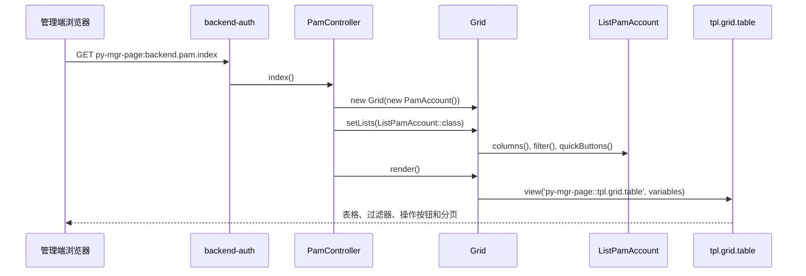
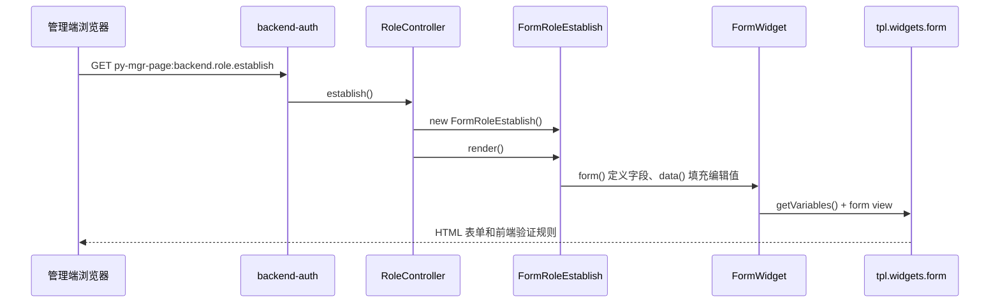
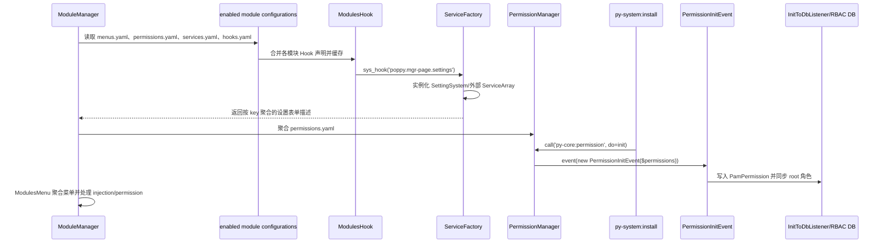
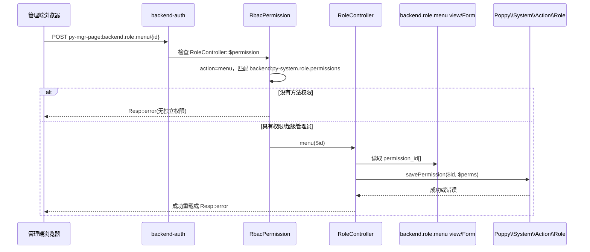

# 业务执行流程

## 后台页面渲染：列表页与表单页

**触发入口**：管理端 GET 路由 `py-mgr-page:backend.pam.index` 或 `py-mgr-page:backend.role.establish`。

**输出结果**：列表页返回 Grid 表格 HTML；表单页返回带字段、验证规则和按钮的管理端表单视图。

### 列表页执行序列（账号管理）

### 表单页执行序列（角色建立/编辑）

### 步骤说明

| 步骤 | 组件 | 动作 | 备注 |
|---:|---|---|---|
| 1 | `backend-auth` | 完成 Web、backend guard/session、封禁、RBAC 和生命周期检查 | 未通过时不会进入控制器 |
| 2 | `BackendController` | 初始化 backend execution context，向视图共享当前用户及页面公共变量 | 规则见 [business.md](business.md) |
| 3 | `PamController`/`RoleController` | 分别创建 `Grid` 或 `FormWidget` 子类 | 控制器不直接拼接字段 HTML |
| 4 | `Grid`/`FormWidget` | 组织模型查询或字段定义、排序/过滤/验证数据 | 列表与表单的具体规则由代表类声明 |
| 5 | Blade view | 渲染 `py-mgr-page` 命名空间下的表格/表单模板 | 输出 Content 或完整页面布局 |

### 关键影响点

- 修改 `BackendController` 构造器或 `backend-auth` 组会影响所有模块继承它的后台页面。
- 修改 `Grid::setLists()`、`Grid::render()` 或默认视图会同时影响所有 `ListBase` 页面。
- 修改 `FormWidget::render()` 会改变所有 FormWidget 页面的 GET/POST 分支、Ajax 响应和验证行为。
- 修改 `poppy.framework.prefix` 只改变 URL 前缀；路由名称必须保持不变，否则菜单、视图和跨模块链接会失效。

## 模块启用后的菜单、权限与设置注册

**触发入口**：模块加载/启用；权限初始化通常由 `py-system:install` 调用 `py-core:permission init`。

**输出结果**：Core 得到聚合后的菜单、Hook 服务和权限集合；System 将权限写入 RBAC 存储，后台设置页能够发现各模块注册的表单。

> 当前实现没有 `PyCoreMenuHook`/`PyCorePermissionHook`/`PyCoreSettingHook` 类。菜单和权限是 YAML 配置聚合；设置和 HTML 扩展才使用 PHP Hook。以下按实际代码展示注册链。

### 步骤说明

| 步骤 | 组件 | 动作 | 备注 |
|---:|---|---|---|
| 1 | `ModuleManager`/`Modules` | 仅收集启用模块的配置 | 配置文件来自每个模块的 `configurations` |
| 2 | `ModulesHook` | 按服务类型合并 Hook 类；数组服务要求 Hook 实现 `ServiceArray` | `poppy.mgr-page.settings` 包含系统及外部设置表单 |
| 3 | `ServiceFactory` | 将数组 Hook 的 `key()`/`data()` 转成服务结果 | HTML Hook 则拼接 `output()` |
| 4 | `ModulesMenu` | 解析菜单路由、`injection` 和权限字段 | 普通用户菜单会按 `PamAccount::capable()` 裁剪 |
| 5 | `py-core:permission init` | 发布权限初始化事件并由 System 写入权限表 | 该命令不是 mgr-page 自有命令 |
| 6 | `SettingView` | 后台设置页读取 Hook map，实例化 `FormSettingBase` 表单 | 设置页渲染/提交链路见下一流程的 FormWidget 分支 |

### 跨模块调用

本流程涉及以下跨模块交互：

- **Core → 所有启用模块**：读取和缓存菜单、Hook、服务、权限配置；模块配置变化后需要清理对应 Core 缓存。
- **System → Core**：`py-system:install` 调用 `py-core:permission init`，并由 System 监听权限初始化事件写入 `PamPermission`。
- **外部模块 → mgr-page**：例如 `Poppy\AliyunPush\Hooks\MgrPage\SettingsAliyunPush` 追加 `poppy.mgr-page.settings`，其表单必须继承 `FormSettingBase`。

### 关键影响点

- 改动服务 ID、`ServiceArray::key()` 或 Hook `data()` 结构会影响设置页分组和表单实例化。
- 改动菜单中的 `route` 或 `permission` 会影响导航显示与 RBAC 检查；`py-core:permission menus` 可用于发现缺失权限。
- 改动权限 YAML 后必须重新执行权限初始化，否则数据库中的权限集合可能落后于代码。

## 表单提交与权限检查

**触发入口**：POST `py-mgr-page:backend.role.menu`（角色权限表单）；同一权限检查机制也覆盖 `py-mgr-page:backend.role.establish`、账号和设置表单。

**输出结果**：权限不足返回错误响应；通过检查后保存角色权限并返回前端重载指令。FormWidget 表单则在 RBAC 通过后继续执行字段验证和 `handle()`。

### 角色权限表单执行序列

### FormWidget 提交分支

以 `py-mgr-page:backend.role.establish` 的 `FormRoleEstablish` 为例：

1. `backend-auth` 中的 `sys-rbac` 先从 `RoleController::$permission` 找不到 `establish` 独立权限时，回退检查 `backend:py-system.role.manage`。
2. `RoleController::establish()` 创建 FormRoleEstablish；POST 时 `FormWidget::render()` 重新建立字段并运行字段 Validator。
3. 验证失败：Ajax 表单返回 `Resp::error`；非 Ajax 表单回退并保留输入/错误。
4. 验证通过：`FormRoleEstablish::handle()` 调用 `PamRoleRequest` 验证并交给 `Poppy\System\Action\Role::establish()`；成功返回顶层重载指令，失败返回领域错误。

### 步骤说明

| 步骤 | 组件 | 动作 | 备注 |
|---:|---|---|---|
| 1 | `backend-auth` | 认证、Session、封禁和生命周期检查 | 未登录或被封禁请求在 RBAC 前结束 |
| 2 | `RbacPermission` | 读取 `Route::current()->controller::$permission`，优先方法权限、再全局权限 | 权限键必须已被 Core PermissionManager 收录 |
| 3 | Controller/FormWidget | 读取输入，执行字段规则和请求类验证 | FormWidget 会清除 `_form_`、`_token` 后再调用 handle |
| 4 | System Action | 写入角色/账号/设置领域数据 | mgr-page 只负责页面编排 |
| 5 | `Resp` | 返回错误或成功后的 reload/location 指令 | Ajax 与页面包装由表单属性决定 |

### 异常处理

| 异常场景 | 处理方式 | 影响范围 |
|---|---|---|
| 未认证、Session 失效或被封禁 | `sys-auth`/`sys-auth_session`/`sys-ban` 拦截 | 当前请求 |
| 方法或全局权限不足 | `RbacPermission` 返回 `Resp::error` | 当前请求，不进入控制器 |
| 字段/请求验证失败 | Ajax 错误响应；非 Ajax `back()->withInput()->withErrors()` | 当前表单 |
| System Action 保存失败 | 控制器/表单将 Action error 转成 `Resp::error` | 当前操作，不产生成功重载 |
| 权限集合未初始化 | 角色权限页可能提示没有权限信息；需先初始化权限 | 权限管理页及菜单显示 |

### 关键影响点

- **`RoleController::$permission`**：改变 `menu` 或 `global` 的 key 会改变请求允许条件；必须同步 System 权限定义。
- **`RbacPermission`**：改变方法权限优先级会影响所有继承 `BackendController` 的模块。
- **`FormWidget::render()`**：改变验证、Ajax 或 POST 分支会影响所有管理端表单。
- **System Action/Policy**：角色、账号和设置的真正保存规则位于 `Poppy\System`；修改其方法会影响本流程。
- **`backend.role.menu` 视图**：checkbox 字段名 `permission_id[]` 是 `RoleController::menu()` 的输入契约。

## 待确认

- “模块安装”在不同部署脚本中可能指模块启用缓存刷新，也可能特指 `py-system:install`；源码把 Hook/菜单加载和权限初始化分成两条链，实际发布顺序需结合部署脚本确认。
- `PamTokenBanEvent`、`BePamLogoutEvent` 的下游监听可能由宿主应用追加；当前模块扫描只确认发布点，未确认完整跨模块监听链。
