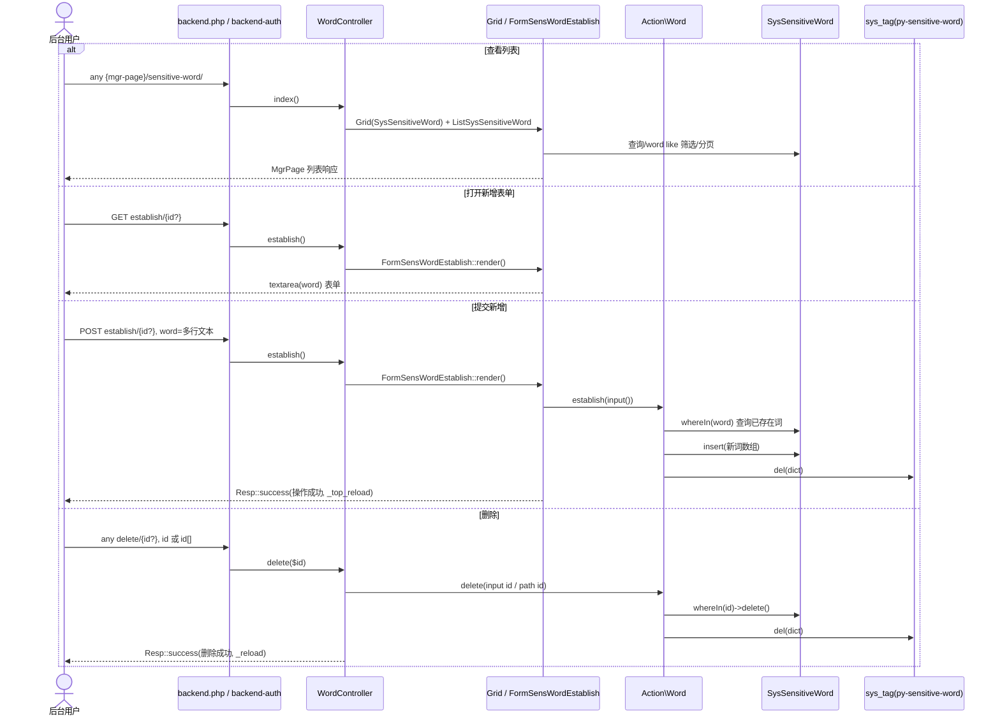
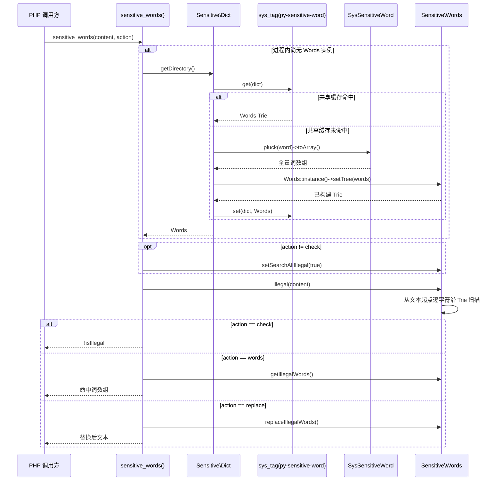
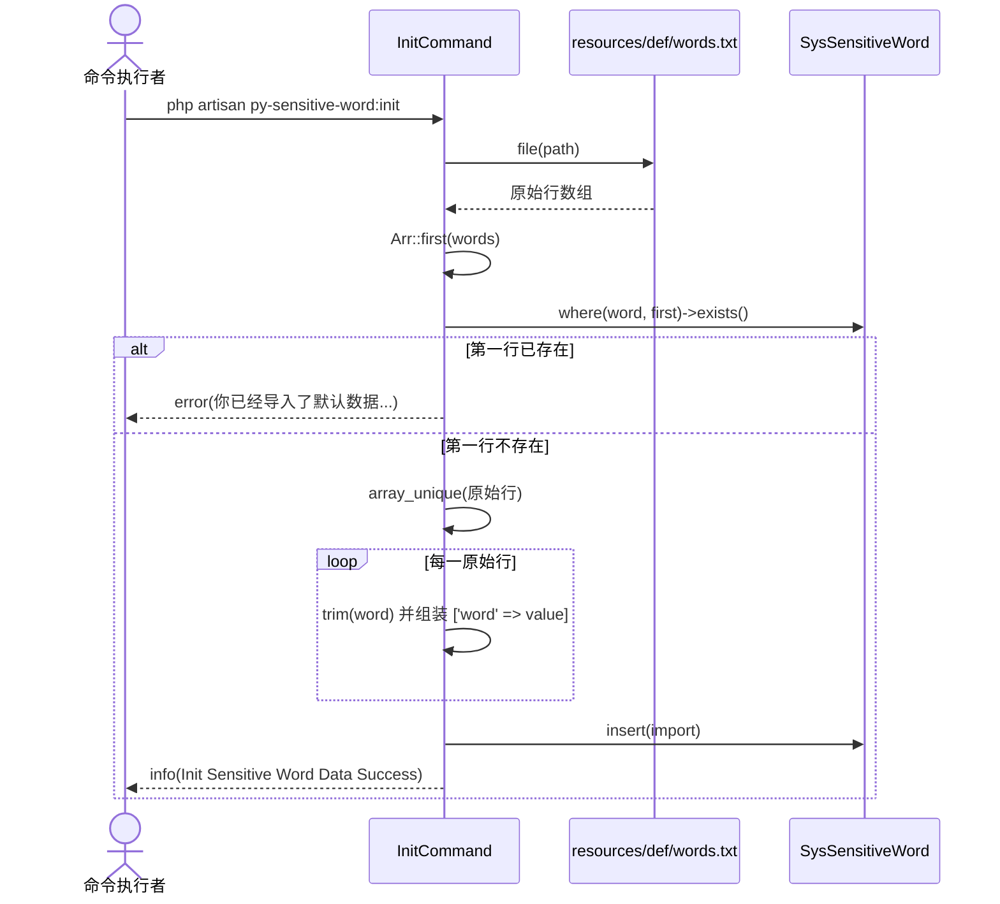

# 业务执行流程

## 敏感词管理 CRUD 流程

**触发入口**：后台用户访问 `py-sensitive-word:backend.word.index`、`py-sensitive-word:backend.word.establish` 或 `py-sensitive-word:backend.word.delete`。  
**输出结果**：展示/筛选 `sys_sensitive_word` 列表，新增一行或多行敏感词，或物理删除单条/多条记录；写成功后删除共享 Trie 缓存。  
**说明**：当前实现只有 Create、Read、Delete，没有 Update；新增与去重规则见 [business.md](business.md)“词库维护策略”。

### 执行序列

### 步骤说明

| 步骤 | 组件 | 动作 | 备注 |
|---:|---|---|---|
| 1 | `RouteServiceProvider` | 注册前缀 `{mgr-page}/sensitive-word` 并应用 `backend-auth` | `{mgr-page}` 默认是 `mgr-page` |
| 2 | `WordController@index` | 以 `SysSensitiveWord` 创建 `Grid` 并挂载 `ListSysSensitiveWord` | 列表支持 `id` 排序、`word like` 筛选和行选择 |
| 3 | `WordController@establish` | 将 GET/POST 都交给 `FormSensWordEstablish::render()` | `FormWidget` 仅在 POST 调用 `handle()` |
| 4 | `FormSensWordEstablish::handle` | 把完整 `input()` 交给 `Action\Word::establish()` | 表单字段及返回结构见 [contracts.md](contracts.md) |
| 5 | `Action\Word::establish` | 校验、分行、查询已存在词、批量插入差集 | 涉及 `sys_sensitive_word.word` |
| 6 | `WordController@delete` | 请求参数 `id` 优先，否则使用路径 ID | MgrPage 批量删除提交 `id[]` |
| 7 | `Action\Word::delete` | `whereIn('id', $id)->delete()` | 删除不存在 ID 仍走成功响应 |
| 8 | `Action\Word` | 新增/删除成功后 `del(PySensitiveWordDef::ckDict())` | 下一次检测时惰性重建 |

### 异常处理

| 异常场景 | 处理方式 | 影响范围 |
|---|---|---|
| `word` 缺失或不是字符串 | `Action\Word` 保存 `Resp::PARAM_ERROR`，表单返回错误 | 不写数据库、不清缓存 |
| 分行后没有词 | 返回“没有需要添加的敏感词” | 不写数据库、不清缓存 |
| 所有提交词均已存在 | 返回重复数据错误 | 不写数据库、不清缓存 |
| 批量 `insert()` 抛出数据库异常 | `establish()` 未捕获，异常向上交给框架 | 当前请求失败；是否部分写入取决于数据库执行语义 |
| 删除抛出 `Exception` | `Action\Word::delete()` 捕获并经 `Resp::error()` 返回 | 不执行后续缓存删除 |
| `backend-auth` 不通过 | 中间件在进入控制器前拦截 | 不访问词库 |

### 关键影响点

- **`Poppy\SensitiveWord\Action\Word::establish()`**：决定新增校验、分隔、数据库去重和缓存失效；修改会影响单条及批量新增。
- **`Poppy\SensitiveWord\Action\Word::delete()`**：同时服务行删除和 MgrPage 批量删除。
- **`Poppy\SensitiveWord\Http\MgrPage\ListSysSensitiveWord`**：定义列表筛选、行删除、批量删除和新增按钮的路由绑定。
- **`Poppy\SensitiveWord\Models\SysSensitiveWord` / `sys_sensitive_word.word`**：字段长度或唯一约束变化会影响后台新增和命令导入。
- **缓存键 `py-sensitive-word:dict`**：若更换键名，必须同步 `Dict` 与两个 Action 写方法。

---

## 敏感词检测流程

**触发入口**：PHP 调用方执行 `sensitive_words($content)`，或显式传入 `Words::TYPE_WORDS` / `Words::TYPE_REPLACE`。  
**输出结果**：返回是否合法的布尔值、命中词数组或星号替换后的文本；返回契约见 [contracts.md](contracts.md)“PHP 运行时契约”。

### 执行序列

### 步骤说明

| 步骤 | 组件 | 动作 | 备注 |
|---:|---|---|---|
| 1 | `sensitive_words()` | 读取函数内静态 `$Sensitive` | 同一 PHP 进程中已设置时不再访问 `Dict` |
| 2 | `Dict::getDirectory()` | 从 `py-sensitive-word:dict` 读取 Trie | 缓存键由 `PySensitiveWordDef::ckDict()` 返回 |
| 3 | `Dict::build()` | 缓存未命中时全表 `pluck('word')` | 将结果传给 `Words::instance()->setTree()` |
| 4 | `Words::setTree()` | 按 UTF-8 字符创建 `HashMap` 子节点并设置 `ending` | 空词库抛 `DirectoryNotFoundException` |
| 5 | `Words::illegal()` | 从文本位置开始向 Trie 深处查找 | `check` 可短路；其他模式先开启全量记录 |
| 6 | `sensitive_words()` | 按 action 分派返回值 | 三种模式及类型见 [contracts.md](contracts.md) |

### 异常处理

| 异常场景 | 处理方式 | 影响范围 |
|---|---|---|
| 数据库词库为空且缓存未命中 | `Words::setTree()` 抛 `DirectoryNotFoundException('词库不存在')` | 当前检测调用失败；helper 不捕获 |
| 缓存/数据库访问异常 | 沿 `Dict::getDirectory()` 调用栈向上抛出 | 当前检测调用失败 |
| 文本无命中 | `check` 返回 `true`；`words` 返回当前对象记录数组；`replace` 返回基于当前内容的替换结果 | 不写数据库 |
| 传入未知 action | `switch` 默认按 `check` 返回 | 调用能完成，但属于未声明用法 |

### 关键影响点

- **`src/Support/functions.php::sensitive_words()`**：所有调用方的统一入口，控制对象生命周期和返回模式。
- **`Poppy\SensitiveWord\Classes\Sensitive\Dict`**：改变缓存策略会影响首次检测延迟与词库刷新。
- **`Poppy\SensitiveWord\Classes\Sensitive\Words::illegal()` / `searchIllegalWords()`**：改变扫描推进或终止条件会改变所有命中结果。
- **`Poppy\SensitiveWord\Classes\Sensitive\Words::$illegalWords`**：命中明细和替换依赖该对象状态。
- **`Poppy\SensitiveWord\Classes\Sensitive\HashMap`**：Trie 每个字符节点的数据结构；序列化兼容性会影响共享缓存中已有对象。

---

## 默认词库批量导入流程

**触发入口**：运维或开发人员手动执行 `php artisan py-sensitive-word:init`。  
**输出结果**：将 `resources/def/words.txt` 批量插入 `sys_sensitive_word`，或在判断已导入/发生异常时输出 Console 错误信息。

### 执行序列

### 步骤说明

| 步骤 | 组件 | 动作 | 备注 |
|---:|---|---|---|
| 1 | `ServiceProvider::register()` | 注册 `InitCommand` | 命令签名 `py-sensitive-word:init` |
| 2 | `InitCommand::handle()` | 通过 `poppy_path('poppy.sensitive-word', 'resources/def/words.txt')` 定位文件 | 当前文件 5,705 行 |
| 3 | `file()` / `Arr::first()` | 读取全部原始行并取第一行 | `file()` 默认保留行尾换行符 |
| 4 | `SysSensitiveWord` | 用第一行查询是否已导入 | 命中则提前返回 |
| 5 | `array_unique()` | 对原始行去重 | 随后逐行 `trim` |
| 6 | `SysSensitiveWord::insert()` | 一次性插入组装后的全部数组 | 无逐行 Action 校验、无事务包装 |
| 7 | Console | 输出成功或错误消息 | 命令不触发事件/Job，也不删除 Trie 缓存 |

### 异常处理

| 异常场景 | 处理方式 | 影响范围 |
|---|---|---|
| 文件不存在/不可读 | `Throwable` 被捕获，Console 输出异常消息 | 不导入 |
| 第一行数据库查询命中 | 输出“已经导入”并返回 | 不修改数据库 |
| 批量插入失败 | `Throwable` 被捕获并输出错误 | 命令失败；无显式事务补偿 |
| 导入前已经存在共享 Trie | 命令不清缓存 | 数据已入库，但检测仍可能读取旧 Trie，直到其他机制失效缓存 |

### 关键影响点

- **`resources/def/words.txt`**：文件格式、换行风格、空行和重复行直接影响导入数组。
- **`Poppy\SensitiveWord\Commands\InitCommand::handle()`**：幂等判断、去重、trim、批量写入和错误处理均集中在此方法。
- **`sys_sensitive_word.word`**：数据库长度和未来唯一索引会决定整批插入能否成功。
- **缓存键 `py-sensitive-word:dict`**：当前流程不失效它；若导入后要立即生效，调用方需要额外清理或重建。

## 待确认

- `InitCommand` 的第一行幂等查询使用 `file()` 返回的原始行（通常包含换行），而插入值会 `trim`；需确认生产环境中该判断是否实际命中。
- 默认词库包含空行和原始重复项；需确认导入时是否应在 `trim` 后再次过滤空值与去重。
- 词库写入后，是否要求长驻 PHP 进程中的 `sensitive_words()` 静态实例即时刷新；当前新增/删除只删除共享缓存，命令导入连共享缓存也不删除。
