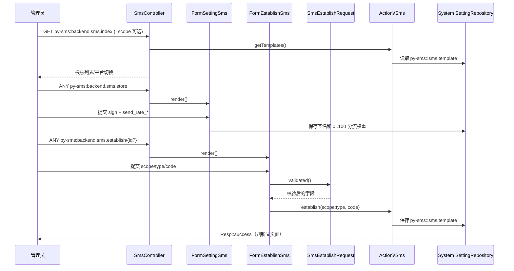
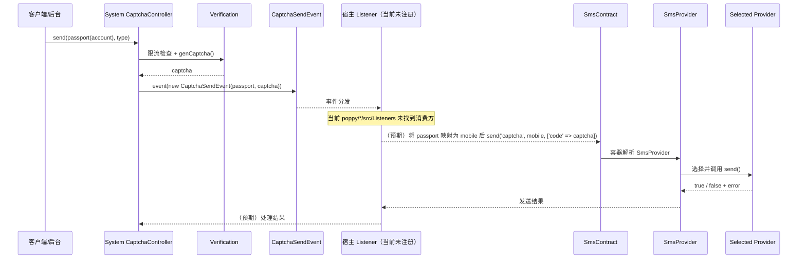
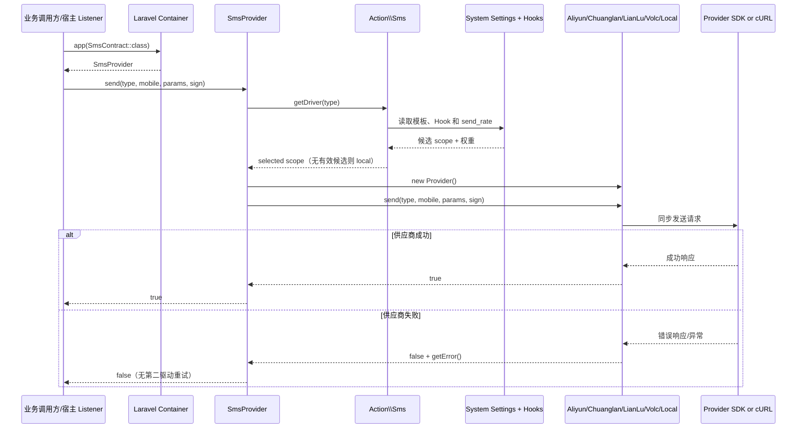

# 业务执行流程

## 1. 管理员配置短信模板与签名

**触发入口**：管理后台短信模板页（`py-sms:backend.sms.index`），再进入总设置（`py-sms:backend.sms.store`）或模板建立/编辑（`py-sms:backend.sms.establish`）。
**输出结果**：短信签名、平台分流权重和 `{scope}:{type}` 模板写入 `poppy.system` 系统设置，下一次发送读取新配置。

### 执行序列



### 步骤说明

| 步骤 | 组件 | 动作 | 备注 |
|---:|---|---|---|
| 1 | `SmsController::index()` | 读取 `_scope`，默认展示 `local` 模板 | 全部后台路由先经过 `backend-auth`，控制器权限为 `backend:py-sms.global.manage` |
| 2 | `FormSettingSms` | 渲染签名、每个平台分流输入和供应商设置链接 | `handle()` 先将 `send_rate_*` 转为整数并限制在 `0..100`，再交给父表单保存签名等设置 |
| 3 | `FormEstablishSms` | 建立时读取 `_scope`，编辑时从 `{scope}:{type}` 初始化 | 编辑既有模板时平台选择被禁用，避免改变设置键 |
| 4 | `SmsEstablishRequest` | 校验 `type`、`scope`、`code` | `type` 必须在 `Sms::kvType()` 的配置类型中，`scope` 仅要求非空 |
| 5 | `Action\Sms::establish()` | 组装 `scope/type/code` 并保存模板集合 | 保存键为 `py-sms::sms.template` 下的 `{scope}:{type}` |
| 6 | `System SettingRepository` | 持久化系统设置 | 本模块没有 Model 或独立数据库表 |

### 异常处理

| 异常场景 | 处理方式 | 影响范围 |
|---|---|---|
| 未通过后台认证/权限 | 由 `backend-auth` 或后台控制器权限拦截 | 仅当前管理请求 |
| `type` / `scope` / `code` 校验失败 | Form 请求验证失败，表单不保存 | 仅当前管理请求 |
| 分流比例不在 `0..100` | `FormSettingSms::handle()` 返回 `Resp::error('错误的分流比例')` | 签名/权重本次提交不继续 |
| 编辑 ID 不含 `:` 或不存在 | `FormEstablishSms` 初始化时由 `Sms::init()` 抛出 `HintException` | 仅当前编辑页 |
| 系统设置仓储拒绝写入 | `SettingKeyNotMatchException` 或 `SettingValueOutOfRangeException` 向上抛出 | 配置未完成，后续发送仍读旧配置 |

### 关键影响点

修改以下地方会影响此流程：

- **`Poppy\Sms\Http\Routes\backend.php`**：改变路由名会破坏菜单、模板页和供应商设置链接；必须保留 `py-sms:backend.*` 名称。
- **`FormSettingSms`**：改变权重或签名字段会影响所有 Provider 的运行时设置。
- **`SmsEstablishRequest`**：改变类型/平台/代码校验会改变可配置模板集合。
- **`Action\Sms::establish()` / `PySmsDef::ckTemplate()`**：改变设置键或模板结构会影响所有驱动读取。
- **`poppy.system` 设置仓储**：设置格式或键名变化会影响模板、签名、权重和供应商凭据读取。

---

## 2. 系统验证码事件到短信发送（当前仓库缺少 Listener）

**触发入口**：`Poppy\System\Http\Request\ApiV1\CaptchaController::send()` 或 `Poppy\MgrPage\Http\Request\Backend\CaptchaController::send()` 生成验证码后发布 `Poppy\System\Events\CaptchaSendEvent`。
**输出结果**：当前仓库的真实结果是事件发布后没有找到 SMS Listener，因此链路在事件分发处结束；若宿主注册了外部 Listener，预期由其调用 `SmsContract::send()` 后才会发送短信。

### 执行序列



### 步骤说明

| 步骤 | 组件 | 动作 | 备注 |
|---:|---|---|---|
| 1 | `System\Http\Request\ApiV1\CaptchaController::send()` | 校验账号类型并执行请求限流、验证码发送节流 | 后台 `MgrPage` 控制器另有后台账号存在性检查；这些规则属于系统模块 |
| 2 | `Verification` | 生成 `captcha` | 事件只携带 `passport` 和 `captcha` 两个公共属性；API 请求的 `passport` 可为手机号或邮箱 |
| 3 | `System\Events\CaptchaSendEvent` | 作为跨模块通知发布 | 该事件不属于 SMS 模块，SMS 没有事件类或 Listener |
| 4 | 宿主 Listener | 当前代码未实现；预期先把事件中的通行证映射为 SMS 的 `$mobile`，再把事件数据转换为短信接口参数 | `['code' => $captcha]` 是根据默认 `captcha` 模板描述推导的适配方式，不是仓库内已存在的调用；邮箱通行证不能直接作为手机号发送 |
| 5 | `SmsContract` / `SmsProvider` | 若 Listener 存在，按统一 `send()` API 进入驱动选择 | 具体选择规则见 `business.md` 和流程 3 |
| 6 | 供应商 Provider | 执行同步 SDK/cURL 请求并返回结果 | 没有模块内队列或异步任务 |

### 异常处理

| 异常场景 | 处理方式 | 影响范围 |
|---|---|---|
| 请求频繁或验证码节流失败 | 系统控制器直接返回错误，不发布事件 | 当前验证码请求 |
| 验证码事件无 Listener | 当前仓库没有短信调用，事件之后不会产生 SMS Provider 请求 | 验证码不会由本仓库发送 |
| Listener 调用 SMS 返回 `false` | 需由宿主 Listener 决定如何转换为响应；SMS 只提供 Provider 错误 | 当前验证码请求 |
| Provider 抛出异常 | 需由调用方处理；不同 Provider 的 JSON/SDK 异常行为不完全一致 | 当前验证码请求 |

### 关键影响点

修改以下地方会影响此流程：

- **`Poppy\System\Events\CaptchaSendEvent`**：改变 `passport`/`captcha` 字段会影响所有宿主 Listener 的适配。
- **两个验证码控制器**：改变事件发布时机会影响验证码生成与短信发送的先后关系。
- **宿主 Listener 注册配置**：目前 `poppy/system/src/ServiceProvider::$listens` 没有该事件；部署环境需明确注册位置。
- **`SmsContract` 签名**：改变 `$type/$mobile/$params/$sign` 约定会影响事件适配器和所有业务调用方。
- **`Sms::kvType()` / `captcha` 模板**：类型名或参数键变更会影响事件到模板参数的映射。

### 跨模块调用

本流程涉及以下跨模块交互：

- **验证码控制器 → `Poppy\System\Events\CaptchaSendEvent`**：系统模块发布事件，SMS 模块当前没有注册消费方。
- **宿主 Listener → `Poppy\Sms\Classes\Contracts\SmsContract::send()`**：这是预期的适配边界；当前仓库没有实际调用代码，无法确认最终发送方、失败响应或是否发送邮件。

### 事件级联

当前仓库可证实的事件链只有：

```text
CaptchaController::send()
  → Poppy\System\Events\CaptchaSendEvent
  → （未发现 SMS Listener，链路停止）
```

如果部署项目在仓库外注册 Listener，才会扩展为：

```text
CaptchaSendEvent → 宿主 Listener → SmsContract::send() → SmsProvider → Provider → 供应商
```

---

## 3. 驱动选择与故障回退（当前没有发送后 Failover）

**触发入口**：业务方解析 `app('poppy.sms')` 或 `app(Poppy\Sms\Classes\Contracts\SmsContract::class)` 后调用 `send($type, $mobile, $params, $sign)`。
**输出结果**：一次同步发送返回 `true` 或 `false`。无有效候选时会在发送前使用本地驱动；被选驱动发送失败时只返回错误，不会自动切换到其他供应商。

### 执行序列



### 步骤说明

| 步骤 | 组件 | 动作 | 备注 |
|---:|---|---|---|
| 1 | Laravel Container | 将 `SmsContract` 解析为 `SmsProvider` | 由 `Poppy\Sms\ServiceProvider` 注册绑定和 alias |
| 2 | `SmsProvider::getDriver($type)` | 委托 `Sms::rateSmsDriverByType()` 获取驱动标识 | 选择器同时检查该类型在平台下是否有模板 |
| 3 | `Action\Sms` + 系统设置/Hook | 读取 `py-sms::sms.template`、平台 Hook 和权重 | 选择细则见 `business.md` |
| 4 | `SmsProvider` | 实例化被选中的 `provider` 类 | Hook 缺少 Provider 时默认 `LocalSmsProvider` |
| 5 | `BaseSms` | 检查手机号、类型、平台模板和签名 | 任一前置条件缺失时不触达远端 SDK |
| 6 | 具体 Provider | 将统一参数转换为供应商协议并同步请求 | 阿里云 SDK、创蓝/联麓 cURL、火山云 SDK、本地日志 |
| 7 | `SmsProvider` | 成功返回 `true`，失败调用 `setError()` 后返回 `false` | 没有重试计数、Job 或备选 Provider 循环 |

### 异常处理

| 异常场景 | 处理方式 | 影响范围 |
|---|---|---|
| 没有模板/签名/手机号/类型 | `BaseSms::checkSms()` 设置错误并返回 `false` | 当前发送调用，不发远端请求 |
| 阿里云 SDK 未安装 | `AliyunSmsProvider` 抛出并转换 `SmsException` 错误 | 当前发送调用 |
| 远端返回非成功码 | 各 Provider 将供应商消息放入错误并返回 `false` | 当前发送调用，不会自动换平台 |
| JSON 解码或设置异常 | 按具体 Provider/设置 API 向上抛出或返回错误 | 调用方必须处理异常边界 |
| 被选平台故障 | 当前实现只结束本次发送 | 不会自动尝试另一个有权重的平台 |

### 关键影响点

修改以下地方会影响此流程：

- **`SmsContract::send()`**：所有系统事件适配器、测试和业务调用方的入口契约。
- **`SmsProvider::getDriver()` / `Sms::rateSmsDriverByType()`**：决定模板过滤、权重选择和发送前本地回退。
- **`poppy.sms.send_type` Hook**：决定平台标识、Provider 类和后台设置页；标识必须与模板 `scope` 和权重设置键一致。
- **`BaseSms::checkSms()`**：决定哪些请求在调用供应商前被拒绝。
- **各 Provider 的响应判断**：供应商成功码变化会直接改变统一 `bool` 结果。
- **错误处理策略**：若未来增加故障转移，应同时定义重复发送、验证码失效和跨供应商幂等行为。

### 当前实现与“Failover”需求的差异

- **已实现**：发送前按模板和权重选择；没有有效权重时选择 `local`。
- **未实现**：被选 Provider 的网络/业务失败后，按候选列表再尝试其他 Provider。
- **未实现**：失败重试次数、退避、熔断、恢复探测、发送去重和供应商回执补偿。

因此本流程的“回退”只能描述为配置缺失时的本地默认路径，不能承诺供应商故障转移。

## 待确认

- 宿主是否存在未纳入当前仓库的 `CaptchaSendEvent` Listener；若存在，需要确认它调用哪个 SMS 契约、如何处理失败，以及是否有邮件备用通道。
- `CaptchaSendEvent::$captcha` 映射到短信模板参数的正式字段名是否为 `code`；当前仓库没有实际适配实现。
- 产品是否要求供应商失败后的真正 Failover；若要求，需要明确是否允许同一验证码向多个供应商重复提交。
- 供应商 API 的重试是否应由 SMS 模块统一实现，或继续由宿主调用方负责。

> 业务规则（分流、签名、限流、重试和日志）见 [business.md](business.md)；路由、事件字段和接口签名见 [contracts.md](contracts.md)。
