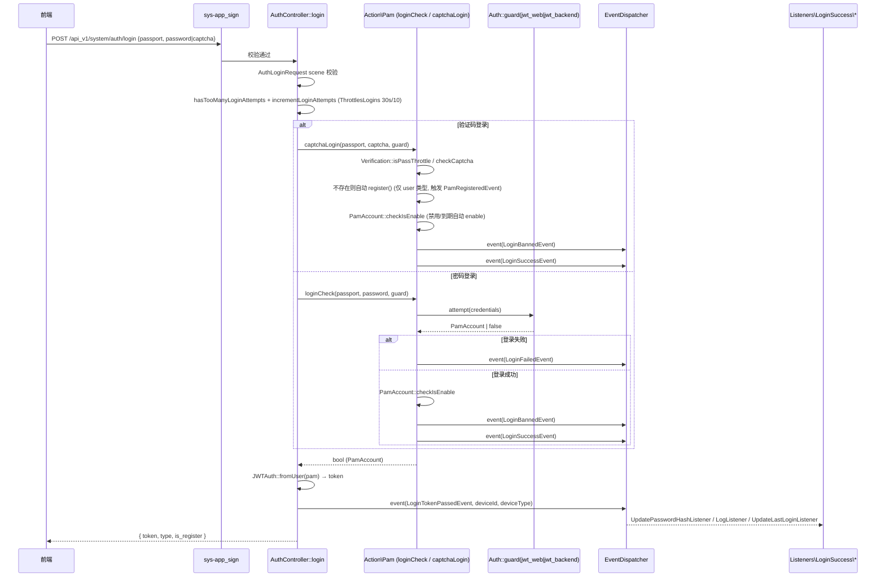
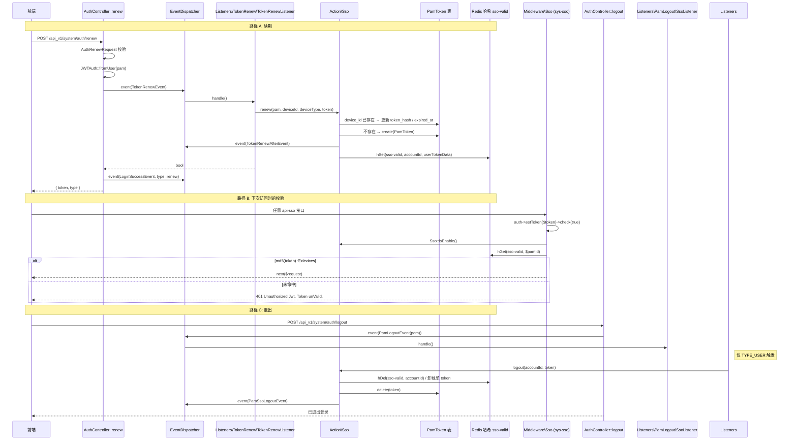
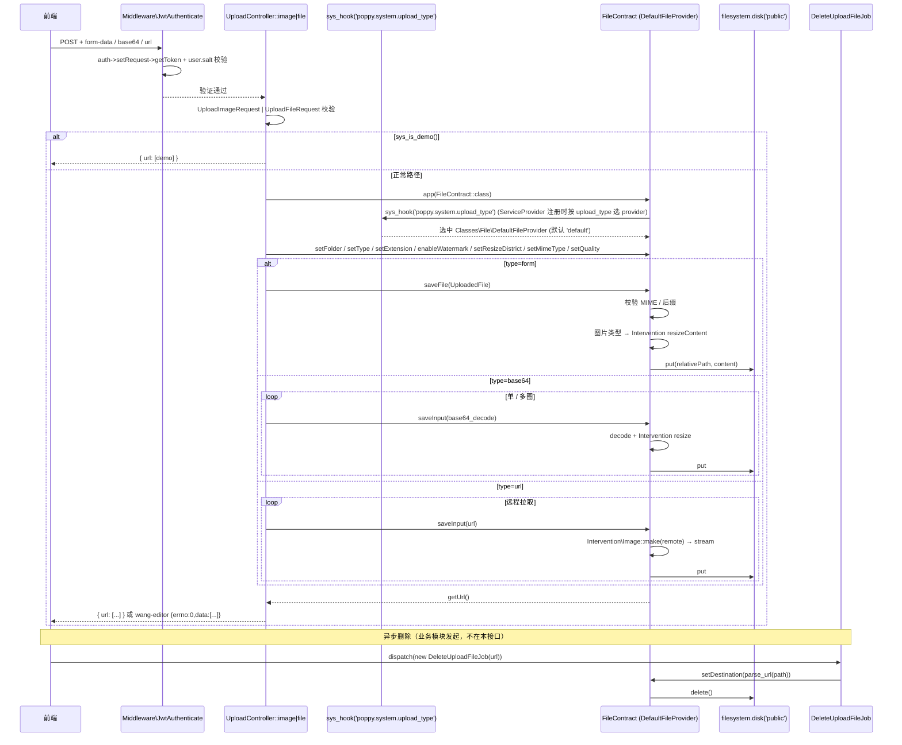
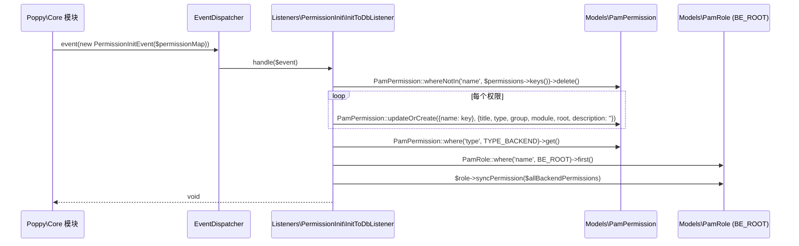
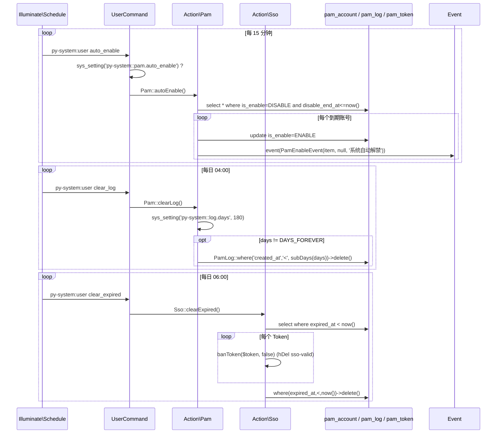

# 业务执行流程

> 序列图按核心入口展开：登录、SSO、上传、权限初始化、定时维护。每个流程涉及的事件级联 / 跨模块调用在子节"事件级联"与"跨模块调用"中独立列出。

---

## 一、用户登录（密码 / 验证码）

**触发入口**：`POST /api_v1/system/auth/login`（中间件 `api-sign`）
**输出结果**：颁发 JWT + 触发账号登录事件级联 + SSO Token 登记。

### 执行序列



### 步骤说明

| 步骤 | 组件                                          | 动作                                                                      | 备注                                                 |
|------|---------------------------------------------|-------------------------------------------------------------------------|----------------------------------------------------|
| 1    | `Middleware AppSign`                        | 校验接口签名（`ApiSignContract::check`）                                     | 见 business.md "中间件规则"                                |
| 2    | `ThrottlesLogins`                           | 30 秒 / 10 次 (可被 `THROTTLES_MAX_ATTEMPTS` 覆盖)                          | 触发后 `sendLockoutResponse`                           |
| 3    | `AuthController::login`                     | 路由名 `py-system:pam.auth.login`                                         | scene 分 `passport` / `captcha` / `password` 三段          |
| 4    | `Action\Pam::captchaLogin`                  | 校验频率 + 真实验证码 + 自动注册 + 启停状态                                       | 后台账号不允许自动注册                                       |
| 5    | `Action\Pam::loginCheck`                    | `Auth::guard->attempt` → 失败触发 `LoginFailedEvent`                          | —                                                  |
| 6    | `Action\Pam::checkIsEnable`                 | `disable_end_at < now()` 自动调用 `enable()`                                 | 详见 business.md "账号封禁状态机"                            |
| 7    | JWTAuth::fromUser                           | 生成 JWT（含 `user.salt` claim）                                              | 加盐方式见 `PamAccount::getJWTCustomClaims`            |
| 8    | `event(LoginTokenPassedEvent)`              | 进入 SSO 监听（详见"二、SSO 入口与踢人"流程）                                      | —                                                  |

### 事件级联

```
LoginSuccessEvent (Pam::captchaLogin / loginCheck)
    ├── Listeners\LoginSuccess\UpdatePasswordHashListener
    │       └─ 写 password_hash_* 至 Session（与 sys-auth_session 联动）
    ├── Listeners\LoginSuccess\LogListener
    │       └─ 写 PamLog（含 area_text → poppy.ext.ip_store）
    └── Listeners\LoginSuccess\UpdateLastLoginListener
            └─ 更新 logined_at / login_times / login_ip

LoginBannedEvent (登录前)        —— 给宿主扩展 hook
LoginFailedEvent (密码失败时)     —— 给宿主扩展 hook
PamRegisteredEvent (仅 user 自动注册时) —— 给宿主发欢迎消息等
LoginTokenPassedEvent (颁发 JWT 后) →  Listeners\LoginTokenPassed\SsoListener  →  进入"SSO 入口"流程
```

### 异常处理

| 异常场景                  | 处理方式                              | 影响范围         |
|-----------------------|-----------------------------------|--------------|
| 签名错误                  | `ApiSignContract::check` 失败 → `Resp::web()` | 仅当前请求       |
| `hasTooManyLoginAttempts` | 触发 `sendLockoutResponse` 直接返回      | 期间同 IP 名额耗尽 |
| 验证码错误                 | `Verification::checkCaptcha` 抛自定义错误 | 仅当前请求       |
| 账号已禁用 (`is_enable=NO`) | `setError('该账号因 ... 被封禁至 ...')`   | 仅当前请求       |
| 业务流程中异常 (`checkIsEnable`) | 调用 `Pam::enable` 自动解禁，事件链继续      | 仅当前请求       |

### 关键影响点

- **`Action\Pam::loginCheck` / `captchaLogin`**：所有登录分支（密码 / 验证码 / 自动注册）经过此；修改会同时影响 `AuthController::login` 路径
- **`Action\Pam::register`**：自动注册路径会创建账号并触发 `PamRegisteredEvent`；改事务逻辑会影响所有自动注册行为
- **`LoginTokenPassedEvent` 数据结构**：增删字段必须同步更新 `Listeners\LoginTokenPassed\SsoListener` + `Action\Sso::handle`
- **`sys-auth_session` 中间件**：依赖 `UpdatePasswordHashListener` 写入 session，否则改密后不会强制旧 session 退出

---

## 二、SSO Token 颁发 / 续期 / 退出

**触发入口**：`LoginTokenPassedEvent`（来自登录）、`TokenRenewEvent`（来自 `POST /api_v1/system/auth/renew`）、`PamLogoutEvent`（来自登出）
**输出结果**：`PamToken` 表 + Redis `sso-valid` 哈希对齐；超出模式的旧设备被踢。

### 执行序列



### 步骤说明

| 步骤 | 组件                                          | 动作                                          | 备注                                                                     |
|------|---------------------------------------------|---------------------------------------------|------------------------------------------------------------------------|
| 1    | `AuthController::renew`                     | JWTAuth::fromUser 重新颁发 Token              | 路由名 `py-system:pam.auth.renew`                                          |
| 2    | `Listeners\TokenRenew\TokenRenewListener`   | 调 `Action\Sso::renew()`                     | 校验 device_id / device_type 白名单                                         |
| 3    | `Action\Sso::renew`                         | 维护 `PamToken` + 写 Redis                    | `expired_at = now + jwt.ttl`                                            |
| 4    | `Action\Sso::handle`（来自登录）               | 按 SSO 模式踢掉旧设备                             | `SSO_DEVICE_NUM` 按数量上限淘汰；`SSO_GROUP` 同组互踢                            |
| 5    | `Middleware\Sso` (sys-sso)                  | 校验 token md5 是否在 `sso-valid` 中             | `GROUP_UNLIMITED` 设备类型跳过校验                                              |
| 6    | `Action\Sso::logout`                        | 删除 PamToken + Redis hDel                   | 仅 `TYPE_USER` 触发                                                       |
| 7    | `Action\Sso::banUser`                       | `PamPasswordModifiedEvent` 触发，所有 Token 清空     | 改密 → SSO 强制重登                                                              |

### 事件级联

```
LoginTokenPassedEvent                          TokenRenewEvent
    └─ Listeners\LoginTokenPassed\SsoListener      └─ Listeners\TokenRenew\TokenRenewListener
         └─ Action\Sso::handle                          └─ Action\Sso::renew
              ├─ 写入/更新 PamToken                            ├─ 写入/更新 PamToken
              ├─ 超量 → event(PamSsoEvent)                    └─ event(TokenRenewAfterEvent)
              └─ syncRedis(sso-valid)                        └─ syncRedis(sso-valid)

PamLogoutEvent (仅 TYPE_USER)
    └─ Listeners\PamLogout\SsoListener
         └─ Action\Sso::logout
              ├─ Redis hDel(sso-valid)
              ├─ PamToken::delete
              └─ event(PamSsoLogoutEvent)

PamPasswordModifiedEvent (仅 TYPE_USER)
    └─ Listeners\PamPasswordModified\SsoListener
         └─ Action\Sso::banUser
              ├─ PamToken::where('account_id')->delete()
              └─ Redis hDel(sso-valid, accountId)
```

### 异常处理

| 异常场景                        | 处理方式                                       | 影响范围 |
|-----------------------------|--------------------------------------------|------|
| SSO 未启用 (`SSO_NONE`)        | `Sso::handle()` / `renew()` 直接放行           | 仅本次  |
| `device_id` 或 `device_type` 为空 | `setError('开启单一登录必须传递设备ID/设备类型')` 并抛出 `ApplicationException` | 仅本次  |
| `device_type` 不在白名单           | `setError('设备类型必须是 ... 中的一种')`           | 仅本次  |
| 登录后设备类型命中 `GROUP_UNLIMITED` | `sys-sso` 中间件直接放行，不校验 hash                       | 仅本次  |
| `expired_at < now()` 的 Token   | `py-system:user clear_expired` 每日 06:00 清理 | 定时    |

### 关键影响点

- **`Action\Sso::handle`**：登录时唯一的 Token 写入口；修改驱逐逻辑会直接影响"同设备 / 同分组 / 超数量"用户体验
- **`Action\Sso::renew`**：续期的唯一入口；JWT 自定义 claim 的 `salt` 与 PamToken.md5 一致
- **`Middleware\Sso`**：所有 `api-sso` 路由的看门人；调用密集，逻辑变化需注意缓存一致性
- **`Action\Sso::banUser` / `logout` / `banToken`**：Redis 与 `PamToken` 同时清理；任何一个漏改都会导致幽灵 Token

---

## 三、文件上传（多 Provider + Hook 派发）

**触发入口**：`POST /api_v1/system/upload/image` 与 `/upload/file`（中间件 `sys-jwt`）
**输出结果**：本地磁盘 + 异步删除支持；Type 选择 Provider（默认 `DefaultFileProvider`）。

### 执行序列



### 步骤说明

| 步骤 | 组件                                          | 动作                                                  | 备注                                  |
|------|---------------------------------------------|-----------------------------------------------------|-------------------------------------|
| 1    | `Middleware\JwtAuthenticate`                | 校验 JWT + 比对 `user.salt` 与最新密码                        | 旧 Token 在改密后无法通过                    |
| 2    | `UploadImageRequest` / `UploadFileRequest`  | form / base64 / url 校验；mimes + 后缀白名单                       | 默认从 `poppy.system.upload.*` 取         |
| 3    | `ServiceProvider::registerContracts`        | `app()->bind('poppy.system.file', fn)` 中按 `sys_setting('py-system::picture.save_type')` + Hook 选 Provider | 详见 business.md "文件上传"           |
| 4    | `DefaultFileProvider::saveFile`             | 写入 `'public'` disk，路径 `{dev/?}uploads/{Ym/d/H/...}.ext`   | —                                   |
| 5    | `Intervention\Image`                        | 短边 / 长边压缩 (`FileManager::resizedSize`)                   | `gif` 不压缩                            |
| 6    | wang-editor 上传来源                          | 返回 `{errno:0,data:[...]}` 兼容前端编辑器                       | —                                   |

### 事件级联

本流程**不直接触发**模块自有 Event；仅在 `FileContract` 由第三方模块实现时（如 `aliyun-oss` 替换 hook provider），由第三方模块发事件。

### 异常处理

| 异常场景                | 处理方式                                                  | 影响范围              |
|---------------------|-------------------------------------------------------|-------------------|
| 系统 demo 模式          | `sys_is_demo()` 直接返回 demo URL                              | 仅本次              |
| 后缀 / MIME 不匹配        | `DefaultFileProvider::setError` 返回 `Resp::error()`          | 仅本次              |
| 图片源格式错误              | `Intervention\Image\Exception\NotReadableException` 捕获       | 仅本次              |
| 上传环节异常（base64 / url） | 包在 `try/catch` 中 continue 或 `Resp::error`                  | 仅本次              |

### 关键影响点

- **`ServiceProvider::registerContracts`** 中的 `poppy.system.file` binding：决定使用哪个 Provider；修改 `poppy.system.upload_type` hook 数据会整体替换上传实现
- **`Hooks/System/UploadTypeDefault`**：默认 Provider 注册入口；可被宿主或第三方模块注册新条目覆盖
- **`DefaultFileProvider::saveFile` / `saveInput`**：图片 / 文件落盘 + 压缩的全部逻辑集中处
- **`Files\Upload` 常量 `ALLOW_*_EXTENSIONS` / `ALLOW_IMAGE_MIMES`**：作为 `poppy.system.upload.allow_*` 的默认值

---

## 四、权限初始化（PermissionInitEvent → InitToDbListener）

**触发入口**：`Poppy\Core\Events\PermissionInitEvent`（由 `poppy/core` 在 `py-core:optimize` 阶段触发）
**输出结果**：`pam_permission` 表与全 `root` 角色同步；多模块权限点统一入库。

### 执行序列



### 步骤说明

| 步骤 | 组件                          | 动作                                                  | 备注                                |
|------|-----------------------------|-----------------------------------------------------|-----------------------------------|
| 1    | `Poppy\Core\Events\PermissionInitEvent` | 携带 `Collection<Permission>` 权限点集合 | 跨模块事件                              |
| 2    | `InitToDbListener`          | `whereNotIn` 删除孤儿权限                                  | `pam_permission` 表按 `name` 唯一          |
| 3    | `PamPermission::updateOrCreate` | name/title/type/group/module/root + description=''  | description 默认空，业务模块可在 Permission 子类补 |
| 4    | `PamRole::syncPermission`   | 把"所有 `TYPE_BACKEND` 权限"绑到 `root` 角色                  | 注意：所有管理员继承 `root` 角色                 |

### 事件级联

```
PermissionInitEvent (poppy/core)
    └─ Listeners\PermissionInit\InitToDbListener
         ├─ PamPermission sync
         └─ PamRole(BE_ROOT)->syncPermission(...)
```

### 异常处理

| 异常场景                         | 处理方式        | 影响范围     |
|------------------------------|-------------|----------|
| 某模块没注册 PermissionInitEvent    | 该模块权限不会入表   | 仅本模块     |
| PamRole `BE_ROOT` 行不存在         | `findOrFail` 抛异常 | 全监听失败，调度中断 |
| 数据库连接异常                      | 直接抛 PDOException | 后续事件不触发 |

### 关键影响点

- **`Listeners\PermissionInit\InitToDbListener`**：唯一同步 `Permission` 对象到本模块表的入口；修改字段映射影响所有模块的权限展示
- **`PamRole::BE_ROOT`**：被假定必须存在；若无，`syncPermission` 会抛异常（业务模块初始化角色顺序需保留 `init_role`）
- **`Poppy\Core\Events\PermissionInitEvent`** 的数据结构（`permissions` 的 `key`）：所有 Permission 子类的 `key()` 必须保持字符串稳定

---

## 五、用户定时维护（auto_enable / clear_log / clear_expired）

**触发入口**：`Illuminate\Console\Scheduling\Schedule`（注册于 `ServiceProvider::registerSchedule()`）
**输出结果**：账号自动解禁、登录日志清理、过期 SSO Token 清理。

### 执行序列



### 步骤说明

| 步骤 | 组件                | 动作                                       | 备注                             |
|------|-------------------|------------------------------------------|--------------------------------|
| 1    | `Schedule`        | 每 15 分钟 / 04:00 / 06:00 触发                | 由 `ServiceProvider::registerSchedule()` 注册 |
| 2    | `UserCommand::handle` | switch `do` → `auto_enable` / `clear_log` / `clear_expired` | 同名 `py-system:user` 命令分发           |
| 3    | `Action\Pam::autoEnable` | 扫到期禁用账号，`is_enable = ENABLE` + 触发 `PamEnableEvent` | 自解禁原因写 `'系统自动解禁'`               |
| 4    | `Action\Pam::clearLog`   | 删除 N 天前登录日志，`N = py-system::log.days`（180）   | `FormSettingLog::DAYS_FOREVER` 时跳过   |
| 5    | `Action\Sso::clearExpired` | 删过期 PamToken + 清 `sso-valid` 哈希             | 双写一致                            |

### 事件级联

```
PamEnableEvent (autoEnable 时触发)         —— 给宿主通知 / 业务联动
```

### 异常处理

| 异常场景                          | 处理方式                                                          | 影响范围 |
|-------------------------------|---------------------------------------------------------------|------|
| `py-system::pam.auto_enable=N` | `auto_enable` 子命令直接 info 退出                                       | 当次循环 |
| `log.days == DAYS_FOREVER`    | `clearLog` 直接返回 true                                              | 当次循环 |
| `log.days` 为空或 0              | 取默认 180 天                                                       | 当次循环 |
| PamToken 表不存在 / 数据库断开        | Sso::clearExpired 在 DB::table 时抛异常，由 Laravel task 捕获，下一轮再跑        | 当次循环 |

### 关键影响点

- **`ServiceProvider::registerSchedule`**：调度项只挂了这 3 条；`init_role` / `ban_init` 等需要手动
- **`Action\Pam::autoEnable`**：依赖 `py-system::pam.auto_enable=Y`；如关闭则不会启用自动解禁
- **`Action\Sso::clearExpired`**：清 PamToken 之后必须清 `sso-valid` 哈希中对应键；否则中间件 `sys-sso` 仍会接受该 token 的 md5（在哈希中找到），但 DB 中已无对应账号记录 → 401

---

## 跨模块调用速查（本模块流程涉及的模块边界）

| 流程          | 目标模块                                       | 目标类 / 方法                                                  | 原因                          |
|-------------|--------------------------------------------|-----------------------------------------------------------|-----------------------------|
| 用户登录 (1)    | `poppy/core`                              | `PermissionInitEvent`（启动时被 `Listenenrs\PermissionInit\InitToDbListener` 消费） | 框架权限初始化                    |
| 用户登录 (1)    | 宿主扩展                                       | `poppy.ext.ip_store->area($ip)` （`Listeners\LoginSuccess\LogListener`） | 登录日志地区反查                  |
| 验证码发送 (1)  | 宿主扩展                                       | 宿主监听 `CaptchaSendEvent`                                    | 短信 / 邮件真正下发                |
| SSO 入口 (2)  | `poppy/core`                              | `pam_token` 表 + `py-system-persist:sso-valid` 哈希              | SSOToken 双写                 |
| 权限初始化 (4)  | `poppy/core`                              | `Poppy\Core\Events\PermissionInitEvent::permissions`         | 框架收集所有模块的权限               |
| 定时维护 (5)   | `poppy/mgr-page`                          | `Poppy\MgrPage\Http\MgrPage\FormSettingLog::DAYS_FOREVER`    | 清理登录日志的兜底常量 |

> 跨模块引用的合规性约束见 `.claude/rules/cross-module.md`（同步给出的"被引用"清单见 contracts.md）。
