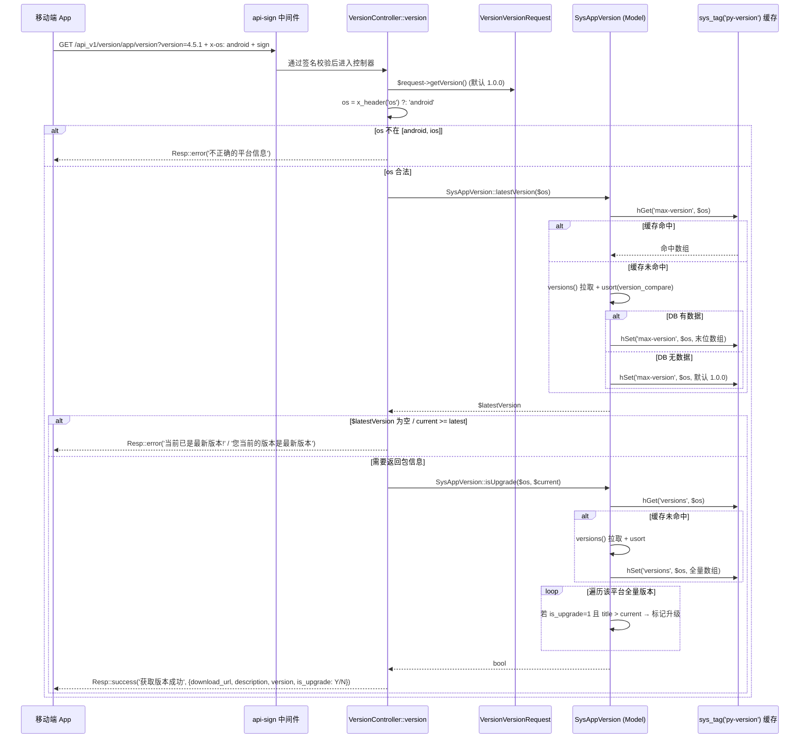
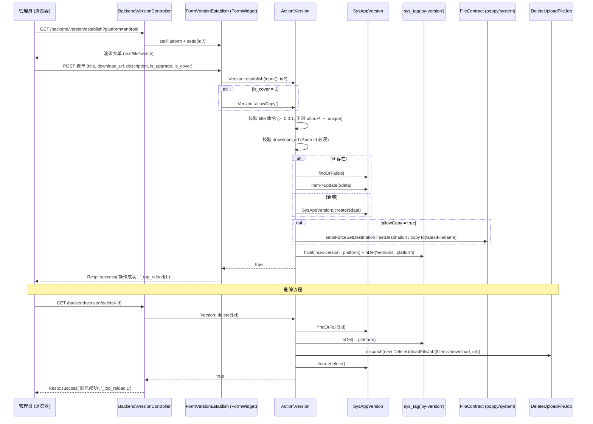

# 业务执行流程

## 客户端版本自检 API

**触发入口**：移动端 App 发起 `GET /api_v1/version/app/version`（通过 `api-sign` 中间件），请求头 `x-os` 携带平台（`android` / `ios`），query 参数 `version` 携带当前客户端版本号。
**输出结果**：返回最新版本号、更新描述、下载地址、是否需要强制升级（`Y` / `N`）。客户端据此决定是否弹出"去更新"提示或拦截式强制升级。

### 执行序列

### 步骤说明

| 步骤 | 组件                              | 动作                                                              | 备注                                       |
|----|---------------------------------|-----------------------------------------------------------------|------------------------------------------|
| 1  | `api-sign` 中间件                  | 校验请求签名                                                          | 失败由中间件直接返回，不进入控制器                        |
| 2  | `VersionVersionRequest`         | `getVersion()`：读取 `version` 参数，默认 `1.0.0`                       | 仅做 `nullable` + `string` 校验               |
| 3  | `VersionController::version`    | 读取请求头 `x-os`，缺省 `android`                                          | 平台识别                                     |
| 4  | `SysAppVersion::kvType($os, true)` | 校验平台合法性                                                       | 返回 `null` 时即拒绝                           |
| 5  | `SysAppVersion::latestVersion`  | 取最新版本（先查 hash 缓存 `max-version/<platform>`，未命中回查 DB 并写缓存）           | DB 无数据时返回 `1.0.0` 默认版本（**仍写缓存**）        |
| 6  | `version_compare`               | `$current >= $latestVersion['title']` 视为最新，跳过数据返回                    | 跳过 `is_upgrade` 判定                       |
| 7  | `SysAppVersion::isUpgrade`      | 遍历 `versions/<platform>` 缓存（未命中查 DB），命中任一 `is_upgrade=1 && title>current` 即返回 `true` | 与 `latestVersion` 走两个独立缓存键，可能不同步        |
| 8  | 响应                                | 返回 `download_url`、`description`、`version`、`is_upgrade`              | `is_upgrade` 以 `Y/N` 字符串返回                |

### 异常处理

| 异常场景                       | 处理方式                                                                 | 影响范围                  |
|----------------------------|----------------------------------------------------------------------|-----------------------|
| `x-os` 非法                    | 返回 `不正确的平台信息`                                                     | 仅本次请求                 |
| `latestVersion` 为空           | 返回 `当前已是最新版本!`                                                    | 仅本次请求                 |
| 客户端已是最新版本                  | 返回 `您当前的版本是最新版本`                                                  | 仅本次请求                 |
| 缓存不可用（Redis 故障）           | `SysAppVersion::versions()` 直接查 DB 后写回缓存，不抛异常                       | 性能下降但功能正常              |
| `versions()` 中数据缺失或不规范     | `isUpgrade` 走空循环，返回 `false`                                          | 仅本次请求，App 不会强制升级       |

### 关键影响点

修改以下地方会影响此流程：

- **`Models/SysAppVersion::latestVersion`**：改变最新版本选取策略（如改用 `created_at` 排序而非 `version_compare`）。
- **`Models/SysAppVersion::isUpgrade`**：改变强制升级判定逻辑（如增加最小强制版本号）。注意其与 `latestVersion` 共用 `versions()` 但走不同缓存键 (`versions` vs `max-version`)，要分别清理。
- **`Models/SysAppVersion::kvType`**：增减平台常量（如新增 `harmonyos`）会扩大 API 接受的 `x-os` 取值。
- **`ApiV1/Web/VersionController::version`**：改变响应字段、错误文案或响应顺序，会影响所有依赖此接口的客户端版本。
- **`Classes/PyVersionDef`**：修改缓存键字面量会导致历史缓存无法命中/无法清理，必须同步更新所有清理点（`Action/Version::clearCache`、`Backend/VersionController::clearCache`）。
- **`Http/MgrPage/FormVersionEstablish`**：限制版本号格式（如强制 `x.y.z` 三段）会影响 `establish` 校验。
- **跨模块依赖**：`Poppy\System\Jobs\DeleteUploadFileJob` 的调度策略变更不影响自检流程。

---

## 后台版本 CRUD（建立 / 编辑 / 删除）

**触发入口**：管理员在后台 `py-version:backend.version.index` 列表页点击"新增 Android 版本" / "新增 iOS 版本" → 进入 `py-version:backend.version.establish`，提交表单；或在列表行点击"删除"触发 `py-version:backend.version.delete`。
**输出结果**：数据库写入 / 更新 / 删除版本记录，清理该平台缓存，可选把当前 `download_url` 文件复制到"最新包"路径，删除时同时调度旧文件清理 Job。

### 执行序列

### 步骤说明（建立 / 编辑）

| 步骤 | 组件                          | 动作                                                              | 备注                                |
|----|-----------------------------|-----------------------------------------------------------------|-----------------------------------|
| 1  | `Backend\VersionController::establish` | 接收 `id`（可空）、`platform`，构造 `FormVersionEstablish` 实例并 `render()`         | `platform` 来自 query（列表页快速按钮传入）   |
| 2  | `FormVersionEstablish::form`  | 渲染字段：`title`、`download_url`（开关 `is_upload` 时为 file，否则为 text）、`description`、`is_upgrade`、`is_cover` | iOS 平台不显示 file 字段也允许 URL 为空         |
| 3  | `FormVersionEstablish::handle` | `is_post()` 时调用 `Version::establish(input(), (int) input('id'))`        | POST 提交前若 `is_cover` 开启 `allowCopy`    |
| 4  | `Action\Version::establish`  | 命名校验 + 正则 + 唯一性 + URL 校验 + 平台强制约束                                     | 任一失败 `setError` 返回                   |
| 5  | `Action\Version::establish`  | 编辑：`findOrFail + update`；新建：`SysAppVersion::create`                       | 模型 `fillable` 限制写入字段                |
| 6  | `Action\Version::copyTo`     | 若 `allowCopy=true`，把 `download_url` 文件复制到 `SysAppVersion::path($platform)`（默认 `static/app/latest.apk` / `latest.ipa`） | 失败 `setError($Upload->getError())` 返回 false |
| 7  | `Action\Version::clearCache` | `hDel(max-version)` + `hDel(versions)`                                  | 仅清当前平台                             |
| 8  | `FormVersionEstablish::handle` | `Resp::success('操作成功', '_top_reload\|1')`                              | 前端跳转刷新                             |

### 步骤说明（删除）

| 步骤 | 组件                                  | 动作                                                  | 备注                          |
|----|-------------------------------------|-----------------------------------------------------|-----------------------------|
| 1  | `Backend\VersionController::delete` | 接收 `$id`，调用 `Action\Version::delete((int)$id)`         | 无 form 渲染，直接处理                |
| 2  | `Action\Version::init`              | `SysAppVersion::findOrFail($id)`                     | 记录不存在抛异常                    |
| 3  | `Action\Version::clearCache`        | 清空该平台两个缓存键                                         |                             |
| 4  | `dispatch(DeleteUploadFileJob)`     | 把 `$item->download_url` 推入删除队列                          | **异步**，不等任务完成                |
| 5  | `$item->delete()`                   | 真删除数据库记录                                            | 失败时 `setError($e->getMessage())` |

### 异常处理

| 异常场景                         | 处理方式                                              | 影响范围                  |
|------------------------------|---------------------------------------------------|-----------------------|
| `title` 不符合正则 / `unique` 冲突  | `Validator::fails()` 或显式 `setError('版本号格式不正确')` 返回 false | 仅影响单次提交               |
| `platform=android` 但 `download_url` 为空 | `setError('请输入下载地址')` 返回 false                       | 仅影响单次提交               |
| 编辑时 `findOrFail` 抛 `ModelNotFoundException` | 由 Laravel 异常处理                                       | 仅影响单次编辑               |
| `copyTo` 文件复制失败                | `setError($Upload->getError())` 返回 false，但**DB 已写入**    | 数据脏：DB 有记录但 latest 文件缺失 |
| `dispatch` 队列故障               | 异常被 catch，返回 `setError($e->getMessage())`，**DB 也不删除** | 数据脏：文件残留 + DB 仍存在     |
| `clearCache` 失败（Redis 故障）     | 当前代码未捕获，下一次 API 调用会读到旧缓存                            | 用户体验：可能短暂看到旧版本号        |

### 关键影响点

修改以下地方会影响此流程：

- **`Action/Version::establish`**：业务规则集中地，校验顺序、强制度、复制策略、缓存清理任一改动都会影响"建立/编辑"的成败与副作用。
- **`Models/SysAppVersion::clearCache` → `Action/Version::clearCache`**：缓存清理键名与 `Classes/PyVersionDef::ck*` 常量必须一致；改键名需同步两处。
- **`Http/MgrPage/FormVersionEstablish`**：表单字段增减会改变提交 payload，可能需要同步调整 `Action\Version::establish` 的 `sys_get` 调用。
- **`Http/MgrPage/FormSettingVersion`**：修改 `path` / `latest_name` 会影响后续 `SysAppVersion::path()`，但**已经存在的 latest 文件不会自动迁移**（待确认：是否需要迁移脚本）。
- **`Models/SysAppVersion::fillable`**：限制可写字段；新增字段需同步加入 `Action\Version::establish` 的 `initDb`。
- **`poppy/system` 的 `DeleteUploadFileJob`**：若该 Job 行为变更（同步执行、改路径等），会影响删除版本的实际副作用。
- **`poppy/system` 的 `FileContract::copyTo`**：若文件存储驱动或签名 URL 规则变更，会影响"覆盖最新文件"是否成功。

---

## 跨模块调用说明

本流程涉及以下跨模块交互：

- **步骤 4 / 6** 调用了 `Poppy\System\Classes\Contracts\FileContract::copyTo()`
  - 原因：复用系统层"上传文件管理"能力，避免本模块重复实现文件复制与路径管理。
  - 风险：若系统层改动 `FileContract` 接口或 `latestFilename` 命名规则，本模块"覆盖最新文件"会失效。
- **步骤 4（删除）** 触发 `Poppy\System\Jobs\DeleteUploadFileJob`
  - 原因：异步删除旧安装包，不阻塞 HTTP 响应。
  - 风险：Job 失败 / 队列不可用时旧文件会残留（当前未做补偿）。
- **步骤 2（API）** 调用 `Poppy\System\Http\Request\ApiV1\WebApiController` 基类
  - 原因：统一响应格式、签名中间件、异常处理。
  - 风险：基类签名变更需同步升级。
- **步骤 2（API）** 通过 `BaseResponseBody` 注入 OpenAPI schema
  - 原因：自动生成 Swagger 文档。
  - 风险：基类 schema 字段变更需同步本模块 `VersionVersionResponseBody`。

## 事件级联

本模块**不发布、不监听任何事件**（`src/Events` 与 `src/Listeners` 目录均不存在）。
两个核心流程均为"请求 → Action → Model → 缓存"的同步链路，无异步事件级联。

## 待确认

- `Action\Version::copyTo` 失败但 DB 已写入的场景，是否需要回滚 DB？（发现位置：`Action/Version::establish`）
- 删除版本时 `dispatch(DeleteUploadFileJob)` 失败是否需要补偿机制？（发现位置：`Action/Version::delete`）
- `SysAppVersion::path()` 与 `platformUrl()` 在 iOS 平台默认返回 `latest.ipa` 路径，但通常 iOS 走 AppStore——是否需要禁用 iOS 的"覆盖最新文件"？（发现位置：`MgrPage/FormVersionEstablish`）
- `Action\Version::clearCache` 当前未捕获异常，是否需要降级处理？（发现位置：`Action/Version::clearCache`）